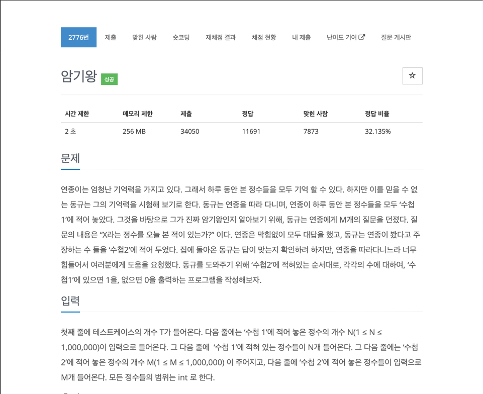

# [암기왕](https://www.acmicpc.net/problem/2776)

## 풀이

문제를 보면 해당 문제는 탐색 알고리즘을 사용해서 해결하라는 것을 알 수 있다.
어떤 탐색 알고리즘을 사용하냐는 시간제한과 실제 탐색해야할 개수를 보고 선택해야 한다.
내가 생각한 건 2가지 방식이다.
하나는 순회하면서 직접 탐색하여 해결하는 방식과 나머지 하나는 이분 탐색으로 해결하는 방식이다.
직접 탐색에 경우는 

