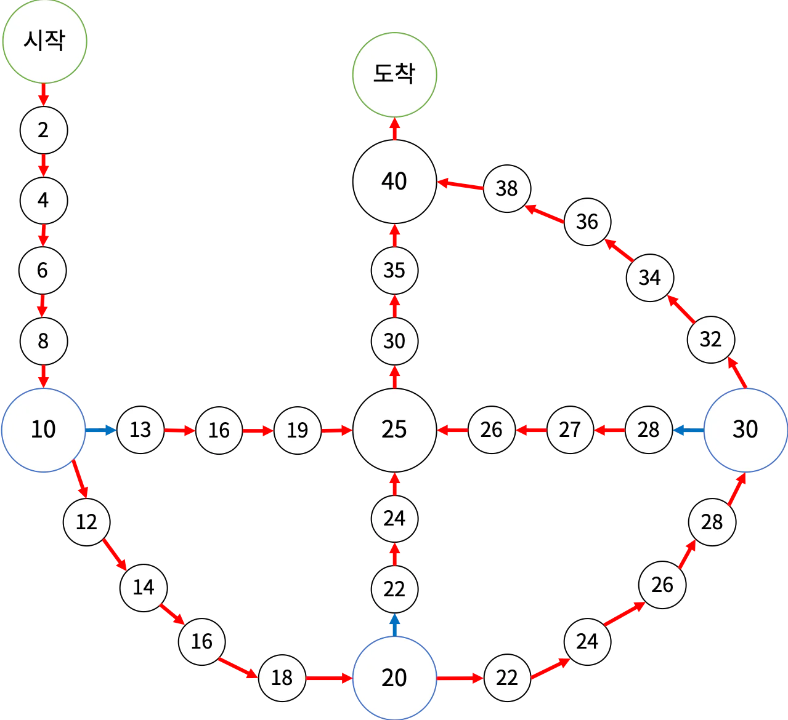

## 주사위 윷놀이

[백준 17825번 주사위 윷놀이](https://www.acmicpc.net/problem/17825)

| 시간 제한 | 메모리 제한 | 제출     | 정답    | 맞힌 사람 | 정답 비율   |
|:------|:-------|:-------|:------|:------|:--------|
| 2 초   | 512 MB | 15687 | 7048 | 4386 | 41.740% |

### 문제

주사위 윷놀이는 다음과 같은 게임판에서 하는 게임이다.<br>



- 처음에는 시작 칸에 말 4개가 있다.
- 말은 게임판에 그려진 화살표의 방향대로만 이동할 수 있다. 말이 파란색 칸에서 이동을 시작하면 파란색 화살표를 타야 하고, 이동하는 도중이거나 파란색이 아닌 칸에서 이동을 시작하면 빨간색 화살표를 타야 한다. 말이 도착 칸으로 이동하면 주사위에 나온 수와 관계 없이 이동을 마친다.
- 게임은 10개의 턴으로 이루어진다. 매 턴마다 1부터 5까지 한 면에 하나씩 적혀있는 5면체 주사위를 굴리고, 도착 칸에 있지 않은 말을 하나 골라 주사위에 나온 수만큼 이동시킨다.
- 말이 이동을 마치는 칸에 다른 말이 있으면 그 말은 고를 수 없다. 단, 이동을 마치는 칸이 도착 칸이면 고를 수 있다.
- 말이 이동을 마칠 때마다 칸에 적혀있는 수가 점수에 추가된다.

주사위에서 나올 수 10개를 미리 알고 있을 때, 얻을 수 있는 점수의 최댓값을 구해보자.

### 입력

첫째 줄에 주사위에서 나올 수 10개가 순서대로 주어진다.

### 출력

얻을 수 있는 점수의 최댓값을 출력한다.

---

## 풀이

주사위 윷놀이는 4개의 말을 주어진 경로를 따라 이동시키면서 최대 점수를 얻는 조합을 찾는 문제이다. 
매 턴마다 주사위를 굴려 나온 수만큼 말을 이동시키며, 도착 칸에 도달하면 이동을 종료하고 해당 칸의 점수를 합산해야 한다. 
이 과정에서 같은 칸에 두 개의 말이 존재할 수 없으며, 파란색 칸에서는 특정 경로로 분기해야 하는 제약이 존재한다. 
이를 해결하기 위해 완전 탐색과 백트래킹을 활용하여 모든 이동 조합을 탐색하고 최적의 점수를 찾는 방식으로 접근한다. 
먼저, 10번의 주사위 값에 대해 이동할 말을 선택하는 순열을 생성하고, 이를 바탕으로 게임을 시뮬레이션하면서 점수를 계산한다. 
이동한 칸에 이미 다른 말이 존재하면 해당 조합을 무효화하고, 도착 칸에 도달한 말은 이후 이동에서 제외한다.
또한, 현재까지 얻은 점수가 최고 점수보다 낮다면 더 이상 진행할 필요가 없으므로 가지치기를 수행하여 탐색 시간을 단축한다. 
게임판은 배열과 해시맵을 활용하여 이동 경로와 점수를 빠르게 참조할 수 있도록 구성하며, 각 말의 상태를 관리하여 이동 가능 여부를 판단한다.

```java
package test.code;

import java.util.*;

public class Yutnori {

    private static final int[] PATH = {
            0, 1, 2, 3, 4, 5, 6, 7, 8, 9, 10, 11, 12, 13, 14, 15, 16, 17, 18, 19, 20, 21, 22, 23, 24, 25, 26, 27, 28
    };

    private static final Map<Integer, Integer> SHORTCUT = new HashMap<>() {{
        put(5, 22);
        put(10, 25);
        put(15, 27);
    }};

    public static void main(String[] args) {
        Scanner sc = new Scanner(System.in);
        int T = sc.nextInt();
        StringBuilder result = new StringBuilder();

        for (int t = 1; t <= T; t++) {
            int U = sc.nextInt();
            int N = sc.nextInt();
            int A = sc.nextInt();
            int B = sc.nextInt();

            String[] throwsList = new String[N];
            for (int i = 0; i < N; i++) {
                throwsList[i] = sc.next();
            }

            int[] aPositions = new int[A];
            for (int i = 0; i < A; i++) {
                aPositions[i] = sc.nextInt();
            }

            int[] bPositions = new int[B];
            for (int i = 0; i < B; i++) {
                bPositions[i] = sc.nextInt();
            }

            String simulationResult = simulate(U, throwsList, aPositions, bPositions) ? "YES" : "NO";
            result.append("Case #").append(t).append(": ").append(simulationResult).append("\n");
        }

        System.out.print(result);
        sc.close();
    }

    private static boolean simulate(int U, String[] throwsList, int[] aPositions, int[] bPositions) {
        int[] aTeam = new int[U];
        int[] bTeam = new int[U];

        boolean[] aFinished = new boolean[U];
        boolean[] bFinished = new boolean[U];

        int currentPlayer = 0; // 0 for A, 1 for B

        for (String yut : throwsList) {
            int move = getMoveDistance(yut);
            if (currentPlayer == 0) {
                if (!moveTeam(aTeam, bTeam, aFinished, bFinished, move)) {
                    return false;
                }
                currentPlayer = 1;
            } else {
                if (!moveTeam(bTeam, aTeam, bFinished, aFinished, move)) {
                    return false;
                }
                currentPlayer = 0;
            }
        }

        return compareFinalPositions(aTeam, bTeam, aPositions, bPositions);
    }

    private static boolean moveTeam(int[] team, int[] opponent, boolean[] teamFinished, boolean[] opponentFinished, int move) {
        for (int i = 0; i < team.length; i++) {
            if (!teamFinished[i] && team[i] >= 0) {
                team[i] = movePiece(team[i], move);
                if (team[i] > 28) {
                    teamFinished[i] = true;
                } else {
                    checkAndCapture(team, opponent, teamFinished, opponentFinished, i);
                    handleStacking(team, i);
                }
                return true;
            }
        }
        return false;
    }

    private static int getMoveDistance(String yut) {
        switch (yut) {
            case "Do": return 1;
            case "Gae": return 2;
            case "Gul": return 3;
            case "Yut": return 4;
            case "Mo": return 5;
            default: return 0;
        }
    }

    private static int movePiece(int position, int move) {
        position += move;
        if (SHORTCUT.containsKey(position)) {
            position = SHORTCUT.get(position);
        }
        return position;
    }

    private static void checkAndCapture(int[] team, int[] opponent, boolean[] teamFinished, boolean[] opponentFinished, int idx) {
        for (int j = 0; j < opponent.length; j++) {
            if (!opponentFinished[j] && team[idx] == opponent[j]) {
                opponent[j] = 0;
            }
        }
    }

    private static void handleStacking(int[] team, int idx) {
        for (int j = 0; j < team.length; j++) {
            if (j != idx && team[j] == team[idx]) {
                team[j] = team[idx]; // Stack pieces
            }
        }
    }

    private static boolean compareFinalPositions(int[] aTeam, int[] bTeam, int[] aPositions, int[] bPositions) {
        Set<Integer> aSet = new HashSet<>();
        Set<Integer> bSet = new HashSet<>();

        for (int pos : aPositions) aSet.add(pos);
        for (int pos : bPositions) bSet.add(pos);

        for (int pos : aTeam) {
            if (pos > 0 && !aSet.contains(pos)) return false;
        }
        for (int pos : bTeam) {
            if (pos > 0 && !bSet.contains(pos)) return false;
        }

        return true;
    }
}

```