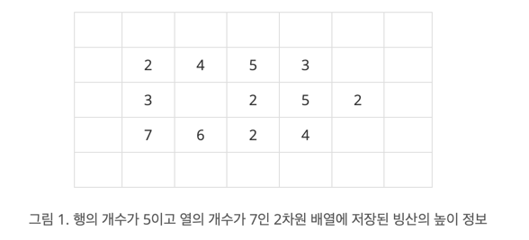
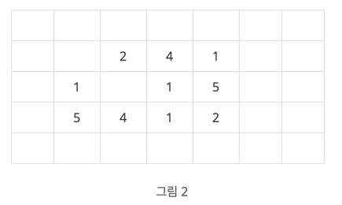
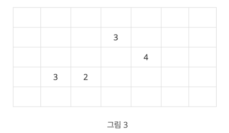

## 빙산

[백준 2573번 빙산](https://www.acmicpc.net/problem/2573)

| 시간 제한 | 메모리 제한 | 제출     | 정답    | 맞힌 사람 | 정답 비율   |
|:------|:-------|:-------|:------|:------|:--------|
| 1 초   | 256 MB | 88883 | 26083 | 17319 | 26.639% |

### 문제

지구 온난화로 인하여 북극의 빙산이 녹고 있다. 
빙산을 그림 1과 같이 2차원 배열에 표시한다고 하자. 
빙산의 각 부분별 높이 정보는 배열의 각 칸에 양의 정수로 저장된다. 
빙산 이외의 바다에 해당되는 칸에는 0이 저장된다. 
그림 1에서 빈칸은 모두 0으로 채워져 있다고 생각한다.



빙산의 높이는 바닷물에 많이 접해있는 부분에서 더 빨리 줄어들기 때문에, 
배열에서 빙산의 각 부분에 해당되는 칸에 있는 높이는 일년마다 그 칸에 동서남북 네 방향으로 붙어있는 0이 저장된 칸의 개수만큼 줄어든다. 
단, 각 칸에 저장된 높이는 0보다 더 줄어들지 않는다. 
바닷물은 호수처럼 빙산에 둘러싸여 있을 수도 있다. 
따라서 그림 1의 빙산은 일년후에 그림 2와 같이 변형된다. <br>

그림 3은 그림 1의 빙산이 2년 후에 변한 모습을 보여준다. 
2차원 배열에서 동서남북 방향으로 붙어있는 칸들은 서로 연결되어 있다고 말한다. 
따라서 그림 2의 빙산은 한 덩어리이지만, 
그림 3의 빙산은 세 덩어리로 분리되어 있다.





한 덩어리의 빙산이 주어질 때, 이 빙산이 두 덩어리 이상으로 분리되는 최초의 시간(년)을 구하는 프로그램을 작성하시오. 
그림 1의 빙산에 대해서는 2가 답이다. 
만일 전부 다 녹을 때까지 두 덩어리 이상으로 분리되지 않으면 프로그램은 0을 출력한다.

### 입력

첫 줄에는 이차원 배열의 행의 개수와 열의 개수를 나타내는 두 정수 N과 M이 한 개의 빈칸을 사이에 두고 주어진다. 
N과 M은 3 이상 300 이하이다. 
그 다음 N개의 줄에는 각 줄마다 배열의 각 행을 나타내는 M개의 정수가 한 개의 빈 칸을 사이에 두고 주어진다. 
각 칸에 들어가는 값은 0 이상 10 이하이다. 
배열에서 빙산이 차지하는 칸의 개수, 
즉, 1 이상의 정수가 들어가는 칸의 개수는 10,000 개 이하이다. 
배열의 첫 번째 행과 열, 마지막 행과 열에는 항상 0으로 채워진다.

### 출력

첫 줄에 빙산이 분리되는 최초의 시간(년)을 출력한다. 
만일 빙산이 다 녹을 때까지 분리되지 않으면 0을 출력한다.

---

## 풀이

이 문제는 BFS를 활용한 그래프 탐색과 시뮬레이션을 통해 해결했다. 
먼저 입력받은 2차원 배열에서 빙산의 높이를 바닷물과 접한 칸의 개수만큼 줄이는 연산을 매년 수행하며, 
높이가 0 이하로 떨어지면 바다로 변환한다. 
이후 BFS를 사용하여 빙산 덩어리의 개수를 계산하고, 
두 덩어리 이상으로 분리되는 순간을 찾았다. 
매 반복마다 전체 빙산이 녹아 사라졌는지 확인하며, 
빙산이 모두 녹을 때까지 분리되지 않을 경우 0을 출력한다. 
빙산의 녹는 과정을 효율적으로 관리하기 위해 기존 배열을 복사하여 새로운 높이를 동시 업데이트하며, 
BFS 탐색을 통해 방문 여부를 관리하여 각 덩어리를 정확히 탐색한다. 
이러한 과정을 매년 반복하며 최초로 빙산이 분리되는 시점을 계산하는 방식으로 문제를 해결한다.

```java
package test.code;

import java.util.*;

public class Main {
    static int n, m; // 행, 열 크기
    static int[][] iceberg; // 빙산의 높이 저장 배열
    static int[][] directions = {{-1, 0}, {1, 0}, {0, -1}, {0, 1}}; // 상, 하, 좌, 우 방향 벡터

    public static void main(String[] args) {
        Scanner sc = new Scanner(System.in);

        // 입력 처리
        n = sc.nextInt(); // 행 크기
        m = sc.nextInt(); // 열 크기
        iceberg = new int[n][m]; // 빙산 배열 초기화
        for (int i = 0; i < n; i++) {
            for (int j = 0; j < m; j++) {
                iceberg[i][j] = sc.nextInt();
            }
        }

        // 결과 출력: 빙산이 분리되는 최초 시간
        System.out.println(simulate());
    }

    // 빙산이 분리되는 최초의 시간을 구하는 메서드
    static int simulate() {
        int years = 0;

        while (true) {
            // 빙산 덩어리 확인
            int chunks = countChunks();
            if (chunks >= 2) {
                return years; // 두 덩어리 이상으로 분리된 경우
            }
            if (allMelted()) {
                return 0; // 빙산이 모두 녹은 경우
            }

            // 빙산 녹이기
            meltIceberg();
            years++;
        }
    }

    // 빙산을 녹이는 메서드
    static void meltIceberg() {
        int[][] newIceberg = new int[n][m]; // 녹은 빙산 배열

        for (int x = 1; x < n - 1; x++) {
            for (int y = 1; y < m - 1; y++) {
                if (iceberg[x][y] > 0) { // 빙산인 경우
                    int waterCount = 0;

                    // 동서남북 탐색
                    for (int[] dir : directions) {
                        int nx = x + dir[0];
                        int ny = y + dir[1];
                        if (iceberg[nx][ny] == 0) { // 바다인 경우
                            waterCount++;
                        }
                    }

                    // 녹은 빙산 높이 계산
                    newIceberg[x][y] = Math.max(0, iceberg[x][y] - waterCount);
                }
            }
        }

        // 갱신된 빙산 배열을 기존 배열로 업데이트
        iceberg = newIceberg;
    }

    // 빙산 덩어리의 개수를 세는 메서드
    static int countChunks() {
        boolean[][] visited = new boolean[n][m];
        int chunks = 0;

        for (int x = 0; x < n; x++) {
            for (int y = 0; y < m; y++) {
                if (iceberg[x][y] > 0 && !visited[x][y]) { // 방문하지 않은 빙산인 경우
                    bfs(x, y, visited); // BFS로 연결된 덩어리 탐색
                    chunks++;
                }
            }
        }

        return chunks;
    }

    // BFS로 연결된 빙산 덩어리를 탐색
    static void bfs(int startX, int startY, boolean[][] visited) {
        Queue<int[]> queue = new LinkedList<>();
        queue.add(new int[]{startX, startY});
        visited[startX][startY] = true;

        while (!queue.isEmpty()) {
            int[] current = queue.poll();
            int x = current[0];
            int y = current[1];

            for (int[] dir : directions) {
                int nx = x + dir[0];
                int ny = y + dir[1];

                if (nx >= 0 && nx < n && ny >= 0 && ny < m && iceberg[nx][ny] > 0 && !visited[nx][ny]) {
                    visited[nx][ny] = true;
                    queue.add(new int[]{nx, ny});
                }
            }
        }
    }

    // 빙산이 모두 녹았는지 확인
    static boolean allMelted() {
        for (int x = 0; x < n; x++) {
            for (int y = 0; y < m; y++) {
                if (iceberg[x][y] > 0) { // 빙산이 남아 있으면
                    return false;
                }
            }
        }
        return true;
    }
}


```