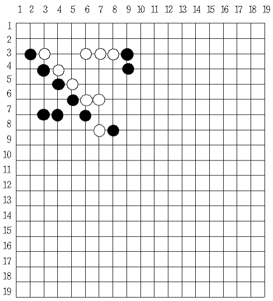

# 오목
[백준 2615번 오목](https://www.acmicpc.net/problem/2615)

| 시간 제한 | 메모리 제한 | 제출    | 정답   | 맞힌 사람 | 정답 비율   |
|:------|:-------|:------|:-----|:------|:--------|
| 1 초   | 128 MB | 44140 | 8807 | 6038  | 19.099% |

### 문제

오목은 바둑판에 검은 바둑알과 흰 바둑알을 교대로 놓아서 겨루는 게임이다. 바둑판에는 19개의 가로줄과 19개의 세로줄이 그려져 있는데 가로줄은 위에서부터 아래로 1번, 2번, ... ,19번의 번호가 붙고 세로줄은 왼쪽에서부터 오른쪽으로 1번, 2번, ... 19번의 번호가 붙는다.



위의 그림에서와 같이 같은 색의 바둑알이 연속적으로 다섯 알을 놓이면 그 색이 이기게 된다. 여기서 연속적이란 가로, 세로 또는 대각선 방향 모두를 뜻한다. 즉, 위의 그림은 검은색이 이긴 경우이다. 하지만 여섯 알 이상이 연속적으로 놓인 경우에는 이긴 것이 아니다.

입력으로 바둑판의 어떤 상태가 주어졌을 때, 검은색이 이겼는지, 흰색이 이겼는지 또는 아직 승부가 결정되지 않았는지를 판단하는 프로그램을 작성하시오. 단, 검은색과 흰색이 동시에 이기거나 검은색 또는 흰색이 두 군데 이상에서 동시에 이기는 경우는 입력으로 들어오지 않는다.

### 입력

19줄에 각 줄마다 19개의 숫자로 표현되는데, 검은 바둑알은 1, 흰 바둑알은 2, 알이 놓이지 않는 자리는 0으로 표시되며, 숫자는 한 칸씩 띄어서 표시된다.

### 출력

첫줄에 검은색이 이겼을 경우에는 1을, 흰색이 이겼을 경우에는 2를, 아직 승부가 결정되지 않았을 경우에는 0을 출력한다. 검은색 또는 흰색이 이겼을 경우에는 둘째 줄에 연속된 다섯 개의 바둑알 중에서 가장 왼쪽에 있는 바둑알(연속된 다섯 개의 바둑알이 세로로 놓인 경우, 그 중 가장 위에 있는 것)의 가로줄 번호와, 세로줄 번호를 순서대로 출력한다.

---

## 풀이

처음에는 `char[][]` 배열을 사용하여 입력을 처리했지만, 공백으로 구분된 숫자를 올바르게 읽지 못해 `int[][]` 배열로 변경했다. 또, `isOmok()` 메서드에서 5개의 돌이 연속되는지만 확인하고 **6목(여섯 개 이상 연속되는 경우)을 방지하는 로직이 없어서** 틀린 결과가 나왔다. 이를 해결하기 위해 **앞뒤 돌을 검사하여 6목 여부를 체크**하도록 수정했다. 그리고 승리한 돌의 좌표를 반환할 때, **배열 인덱스(0-based)와 바둑판 좌표(1-based) 차이를 고려하지 않아 잘못된 좌표가 출력되는 문제**도 발견했다. 이를 `(i + 1, j + 1)`로 변환하여 해결했고, 불필요한 `visited` 배열을 제거하여 코드의 복잡성을 줄였다. 결국, 입력 데이터를 정확히 읽고, 6목을 방지하면서, 올바른 승리 좌표를 반환하도록 개선하니 문제를 정확하게 해결할 수 있었다.

```java
import java.io.*;

class Omok {
    private static final int EMPTY = 0;
    private static final int[][] DIRECTIONS = {{0, 1}, {1, 0}, {1, 1}, {-1, 1}};
    private final int[][] board;
    private final int LINES;

    private Omok(int[][] board) {
        this.board = board;
        this.LINES = board.length;
    }

    static class Winner {
        private final int winner;
        private final int x;
        private final int y;

        private Winner(int winner, int x, int y) {
            this.winner = winner;
            this.x = x;
            this.y = y;
        }

        public static Winner from(int winner, int x, int y) {
            return new Winner(winner, x, y);
        }

        @Override
        public String toString() {
            return String.format("%d\n%d %d", winner, x, y);
        }
    }

    public static Omok from(int[][] board) {
        return new Omok(board);
    }

    private Winner findWinner() {
        for (int i = 0; i < LINES; i++) {
            for (int j = 0; j < LINES; j++) {
                if (board[i][j] != EMPTY) {
                    for (int[] direction : DIRECTIONS) {
                        if (isOmok(i, j, direction[0], direction[1])) {
                            return Winner.from(board[i][j], i + 1, j + 1);
                        }
                    }
                }
            }
        }
        return Winner.from(0, 0, 0);
    }

    private boolean isOmok(int x, int y, int dx, int dy) {
        int color = board[x][y];
        int count = 1;

        int prevX = x - dx;
        int prevY = y - dy;
        if (isValid(prevX, prevY) && board[prevX][prevY] == color) {
            return false; // 6목 방지: 연속된 돌의 시작점이 아님
        }

        for (int i = 1; i < 5; i++) {
            int nx = x + dx * i;
            int ny = y + dy * i;
            if (!isValid(nx, ny) || board[nx][ny] != color) {
                return false;
            }
            count++;
        }

        int nextX = x + dx * 5;
        int nextY = y + dy * 5;
        if (isValid(nextX, nextY) && board[nextX][nextY] == color) {
            return false; // 6목 방지
        }

        return count == 5;
    }

    private boolean isValid(int x, int y) {
        return x >= 0 && x < LINES && y >= 0 && y < LINES;
    }

    public String getWinner() {
        Winner winner = findWinner();
        if (winner.winner == 0) {
            return "0";
        }
        return winner.toString();
    }
}

public class Main {
    public static final int LINES = 19;

    public static void main(String args[]) throws IOException {
        BufferedReader reader = new BufferedReader(new InputStreamReader(System.in));
        int[][] board = new int[LINES][LINES];

        for (int i = 0; i < LINES; i++) {
            String[] input = reader.readLine().split(" ");
            for (int j = 0; j < LINES; j++) {
                board[i][j] = Integer.parseInt(input[j]);
            }
        }
        reader.close();

        String result = Omok.from(board).getWinner();

        BufferedWriter writer = new BufferedWriter(new OutputStreamWriter(System.out));
        writer.write(result);
        writer.newLine();
        writer.flush();
        writer.close();
    }
}
```