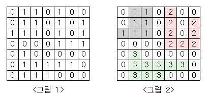

## 단지번호붙이기
[백준 2667 단지번호붙이기](https://www.acmicpc.net/problem/2667)

| 시간 제한 | 메모리 제한 | 제출     | 정답    | 맞힌 사람 | 정답 비율   |
|:------|:-------|:-------|:------|:------|:--------|
| 1 초   | 128 MB | 205711 | 93257 | 59242 | 43.144% |

### 문제

<그림 1>과 같이 정사각형 모양의 지도가 있다. 
1은 집이 있는 곳을, 0은 집이 없는 곳을 나타낸다. 
철수는 이 지도를 가지고 연결된 집의 모임인 단지를 정의하고, 단지에 번호를 붙이려 한다. 
여기서 연결되었다는 것은 어떤 집이 좌우, 혹은 아래위로 다른 집이 있는 경우를 말한다. 
대각선상에 집이 있는 경우는 연결된 것이 아니다. 
<그림 2>는 <그림 1>을 단지별로 번호를 붙인 것이다. 
지도를 입력하여 단지수를 출력하고, 각 단지에 속하는 집의 수를 오름차순으로 정렬하여 출력하는 프로그램을 작성하시오.



### 입력

첫 번째 줄에는 지도의 크기 $N$(정사각형이므로 가로와 세로의 크기는 같으며 $5≤N≤25$)이 입력되고, 그 다음 N줄에는 각각 $N$개의 자료($0$혹은 $1$)가 입력된다.

### 출력

첫 번째 줄에는 총 단지수를 출력하시오. 그리고 각 단지내 집의 수를 오름차순으로 정렬하여 한 줄에 하나씩 출력하시오.

---

## 풀이

이 문제를 읽으면서 DFS, BFS 둘 다 이용해 풀 수 있을 것 같다고 생각했다.
그렇지만 경험으로는 재귀 함수를 사용했을 때 메모리 제한이 걸리는 경우가 많아서 DFS 대신 BFS로 풀어보기로 했다.

먼저, `Queue`에 `poll`한 값에 대해 상하좌우를 확인하고 `1`이면 `Queue`에 `add`하는 방식으로 구현했다.
그리고 `Queue`가 비어있을 때까지 반복하면서 단지를 찾아서 `result`에 추가하는 방식으로 구현했다.


```java
package test.code;

import java.io.*;
import java.util.*;

class HideAndSeek {
    private final int maxPosition = 100_000;
    private final boolean[] visited;
    private final int startPosition;
    private final int endPosition;

    private HideAndSeek(int startPosition, int endPosition) {
        this.visited = new boolean[maxPosition + 1];
        this.startPosition = startPosition;
        this.endPosition = endPosition;
    }

    public static HideAndSeek of (int startPosition, int endPosition) {
        return new HideAndSeek(startPosition, endPosition);
    }

    private static final class State {
        private final int position;
        private final int time;

        private State(int position, int time) {
            this.position = position;
            this.time = time;
        }

        public static State of(int position, int time) {
            return new State(position, time);
        }

        public int previousPosition() {
            return position - 1;
        }

        public int nextPosition() {
            return position + 1;
        }

        public int doublePosition() {
            return position * 2;
        }

        public int increaseTime() {
            return time + 1;
        }
    }

    private boolean canMoveTo(int position) {
        return position >= 0 && position <= maxPosition;
    }

    private boolean isUnvisited(int position) {
        return !visited[position];
    }

    private boolean hasReached(int position) {
        return position == endPosition;
    }

    private int findShortestTime() {
        if (startPosition == endPosition) {
            return 0;
        }

        Queue<State> queue = new LinkedList<>();
        queue.offer(State.of(startPosition, 0));
        visited[startPosition] = true;

        while (!queue.isEmpty()) {
            State current = queue.poll();

            int[] nextPositions = {current.previousPosition(), current.nextPosition(), current.doublePosition()};
            for (int nextPosition : nextPositions) {
                if (canMoveTo(nextPosition) && isUnvisited(nextPosition)) {
                    if (hasReached(nextPosition)) {
                        return current.increaseTime();
                    }
                    queue.offer(State.of(nextPosition, current.increaseTime()));
                    visited[nextPosition] = true;
                }
            }
        }
        return -1;
    }

    public int getResult() {
        return findShortestTime();
    }
}

public class Main {
    public static void main(String[] args) throws IOException {
        BufferedReader reader = new BufferedReader(new InputStreamReader(System.in));
        StringTokenizer tokenizer = new StringTokenizer(reader.readLine());
        int n = Integer.parseInt(tokenizer.nextToken());
        int k = Integer.parseInt(tokenizer.nextToken());

        reader.close();

        int result = HideAndSeek.of(n, k).getResult();

        BufferedWriter writer = new BufferedWriter(new OutputStreamWriter(System.out));
        writer.write(result + "\n");
        writer.flush();
        writer.close();
    }
}
```