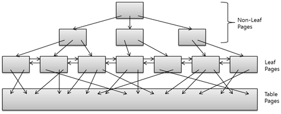
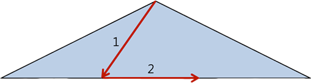
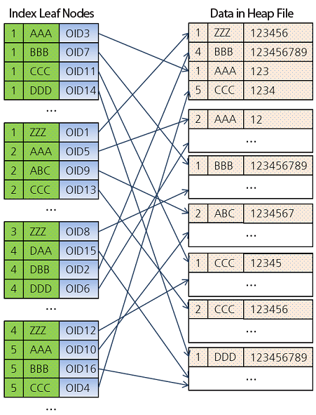
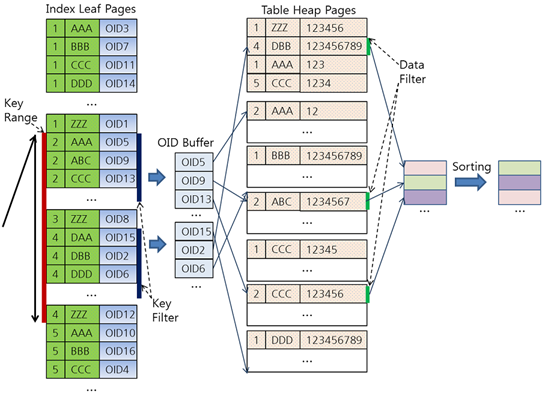

DBMS는 저장되어 있는 데이터를 효율적으로 검색할 수 있게 인덱스를 사용합니다. 
웹 애플리케이션의 백엔드 성능을 높이려고 종종 실행하는 SQL 튜닝이란, SQL이 DBMS의 인덱스를 활용하도록 SQL을 수정하는 것이라고 할 수 있습니다. 
그러니 인덱스를 잘 이해하고 있다면 더 좋은 SQL을 작성할 수 있을 것이고, 훨씬 더 성능 좋은 애플리케이션을 만들 수 있을 것입니다.
이 글에서는 MySQL 8.0에 적용된 다양한 인덱스 기법을 중심으로 인덱스 구조와 인덱스 활용 기법을 설명한다. 

## 인덱스 구조

거의 모든 DBMS는 B-Tree 계열 인덱스를 사용한다. 인덱스 종류에 대한 특별한 언급이 없다면 아마도 B-Tree 계열 인덱스를 의미할 것이다. CUBRID는 B+-Tree를 이용하고 있다. B+-Tree는 B-Tree의 한 종류로서, 일반적인 B-Tree와 달리 데이터 포인터를 리프(Leaf) 노드에만 저장한다. 리프 노드의 상위 레벨인 비리프(Non-Leaf) 노드는 전형적인 B-Tree 로 구성되며 리프 노드를 빠르게 찾는 인덱스 역할을 한다. 리프 노드에는 키와 키에 대응하는 데이터의 포인터가 저장되어 있다. 다음 그림은 전형적인 B+-Tree 모습이다.



## 인덱스 스캔

B+-Tree의 리프 노드는 링크드 리스트(linked list)로 서로 연결되어 있고, 저장된 키는 정렬되어 있어서 순차 처리가 용이하다. 그렇기 때문에 범위를 검색하는 데 유리하다. 테이블에서는 처음부터 끝까지 모든 레코드를 읽어야 완전한 결과 집합을 얻을 수 있지만, 인덱스는 키-칼럼 순으로 정렬되어 있기 때문에 특정 위치에서 검색을 시작해서 검색 조건이 일치하지 않는 값을 만나는 순간 검색을 멈출 수 있다. 이것을 인덱스 범위 스캔(Index Range Scan)이라고 한다. CUBRID는 범위 스캔을 B+-Tree 검색의 기본 연산으로 제공하고 있다. 범위 스캔에는 두 개의 키가 필요한데, 범위의 양 끝을 표현하는 하위 키(Lower Key)와 상위 키(Upper Key)가 그것이다.
인덱스 범위 스캔은 다음 그림과 같이 두 단계로 진행된다. 첫 번째 단계에서는 루트에서부터 트리를 순회하여 리프 노드에서 하위 키를 찾는다. 두 번째 단계에서는 첫 번째 단계에서 찾은 키에서부터 상위 키까지 순차적으로 레코드를 읽어 처리한다. 상위 키가 현재 노드에서 발견되지 않으면 다음 노드를 읽어 상위 키를 가진 노드까지 검색을 계속해 나간다. 상위 키까지 순차 검색이 끝나면 전체 범위 검색이 완료된다.



두 번째 단계에서 상위 키까지 찾아가는 과정은 레코드에서 키를 읽어와 상위 키와 비교하는 과정의 연속이다. 상위 키가 최대 키이면 현재 노드의 키부터 마지막 노드까지 모두 검색 결과에 포함되기 때문에 비교 연산을 할 필요가 없어져서 검색의 성능이 좋아진다. 검색 성능을 위해 옵티마이저는 입력된 쿼리를 재작성(rewrite)하며, CUBRID는 특정 키를 찾는 검색도 범위 검색으로 변환하여 수행한다. 특정 키를 찾는 검색을 범위 검색으로 변환할 때에는 하위 키와 상위 키 모두를 찾으려는 키로 동일하게 설정한다.

## 인덱스 스캔을 이용한 질의 처리 과정

다음 그림은 CUBRID에서 아래의 SQL 질의로 테이블과 인덱스를 생성하고 데이터를 입력했을 때 인덱스 리프 노드와 테이블 데이터의 관계를 나타낸 그림이다. 왼쪽 인덱스 리프 노드에는 인덱스 키와 키에 대응되는 OID(레코드의 물리적 주소 값)가 저장되어 있다.

```sql
CREATE TABLE tbl  
(a INT NOT NULL,
b STRING,  
c BIGINT);

CREATE INDEX idx ON tbl  
(a, b);

INSERT INTO tbl VALUES  
(1, 'ZZZ', 123456),
(4, 'BBB', 123456789),
(1, 'AAA', 123'),
…
(이하 생략)
```



```sql
SELECT * FROM tbl  
WHERE a > 1 AND a < 5  
AND b < 'K'  
AND c > 10000  
ORDER BY b;  
```

위와 같은 SELECT 질의에서 WHERE 절에 있는 검색 조건은 다음과 같이 3가지로 나눌 수 있다.

- Key Range: 인덱스 스캔 범위로 활용하는 조건이다(a > 1 AND a < 5). 
- Key Filter: Key Range에 포함할 수 없지만 인덱스 키로 처리 가능한 조건이다(b < 'K'). 
- Data Filter: 인덱스를 사용할 수 없는 조건이다. 테이블에서 레코드를 읽어야만 처리 가능한 조건이다(c > 10000).

MySQL의 질의 처리 과정은 다음과 같다.
인덱스 스캔인 경우 먼저 Key Range와 Key Filter를 적용하여 조건에 부합하는 OID 리스트를 만든다. 이 과정은 Key Range의 시작부터 끝까지 계속된다.
OID를 이용해 데이터 페이지에서 해당 레코드를 읽어 Data Filter를 적용하거나 SELECT 리스트에 기술된 칼럼 값을 읽어와 결과를 저장하는 임시 페이지에 기록한다.
ORDER BY 절이나 GROUP BY 절이 있으면 임시 페이지에 저장된 레코드를 정렬하여 최종 결과를 생성한다.
다음 그림은 위의 SELECT 질의가 처리되는 과정이다.



## 인덱스 사용하기

옵티마이저가 인덱스를 사용하게 하려면 WHERE 절에 범위(Range) 조건이 있어야 한다. 범위 조건은 값의 비교 조건, 즉 크다, 작다, 크거나 같다, 작거나 같다, 같다와 같은 비교문으로 기술한다. 만약 범위 조건이 없다면 옵티마이저는 테이블 순차 스캔을 시도할 것이다.

두 개 이상의 칼럼을 묶어서 인덱스를 만들 때는 칼럼의 순서가 매우 중요하다. 이런 인덱스를 다중 칼럼 인덱스(Multi-Column Index) 또는 복합 인덱스라고 한다. 복합 인덱스에서는 WHERE 절에 인덱스 키의 첫 번째 칼럼을 사용해야 인덱스 스캔을 수행한다. 인덱스가 여러 칼럼으로 조합되어 있을 때 칼럼 가운데 한 가지 칼럼만 사용해도 무방하다고 알려져 있는데, 잘못 알려진 것이라고 할 수 있다. 첫 번째 칼럼이 없는 상태에서는 두 번째 칼럼이 정렬된 상태라고 할 수 없기 때문에 범위를 정의할 수 없다. 따라서 반드시 첫 번째 칼럼이 조건에 있어야 하며, 첫 번째 이후의 칼럼은 조건에 없어도 상관없다.

인덱스는 값의 대소 비교를 토대로 트리를 구성한다 따라서 값의 대소 비교가 아닌 조건은 B+-Tree를 사용해서 값을 찾을 수 없다. <>, != 와 같이 부정형 조건이나 NULL 비교는 인덱스를 사용할 수 없다. 인덱스의 칼럼을 조건절에서 가공할 때도 인덱스를 사용할 수 없다. 다음은 인덱스를 사용하지 못하는 쿼리와 튜닝 후 인덱스를 사용하도록 수정한 쿼리의 예이다.


| 튜닝 전	                                                                | 튜닝 후                                                                    |
|:---------------------------------------------------------------------|:------------------------------------------------------------------------|
| SELECT * FROM student WHERE grade <> 'A';	                           | SELECT * FROM student WHERE grade > 'A';                                |
| SELECT name, email_addr FROM student WHERE email_addr IS NULL;       | 	SELECT name,email_addr FROM student WHERE email_addr = '';             |
| SELECT student_id FROM record WHERE substring(yymm, 1, 4) = '1997';	 | SELECT student_id FROM record WHERE yymm BETWEEN '199701' AND '199712'; |
| SELECT * FROM employee WHERE salary * 12 < 10000;                    | 	SELECT * FROM employee WHERE salary < 10000 / 12;                      |


작성한 SQL 질의가 DBMS에서 실행될 때 인덱스 스캔을 이용하는지 확인하려면 질의 실행 계획을 출력해 봐야 한다. 질의 실행 계획에서는 테이블 스캔(sscan)이나 인덱스 스캔(iscan) 여부, 예상되는 CPU 및 I/O 비용, 예상 결과 집합의 레코드 개수, 예상 페이지 접근 개수 등을 볼 수 있다.

## 참고
[NAVER D2 강동완](https://d2.naver.com/helloworld/1155)<br>
[Hard disk drive](https://en.wikipedia.org/wiki/Cylinder-head-sector)
