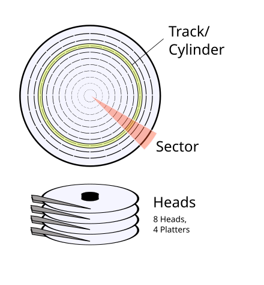
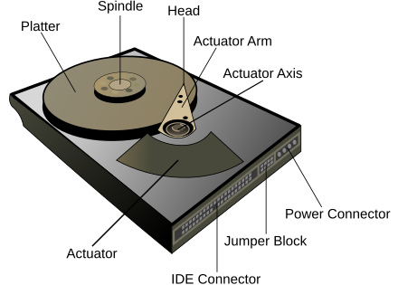
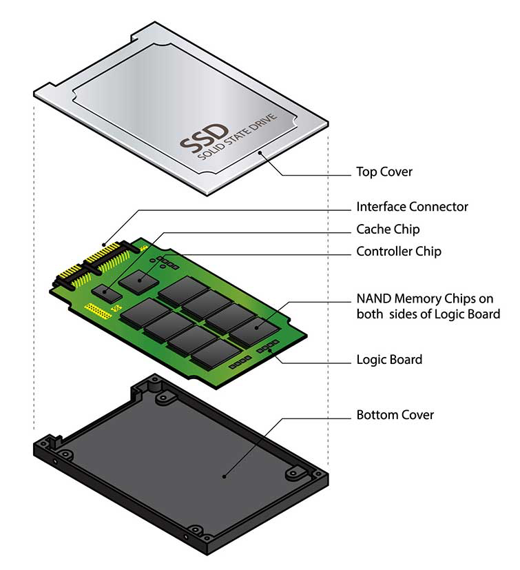
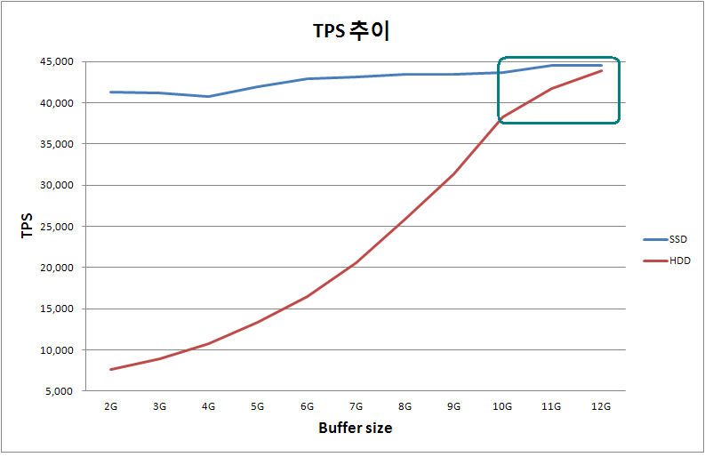
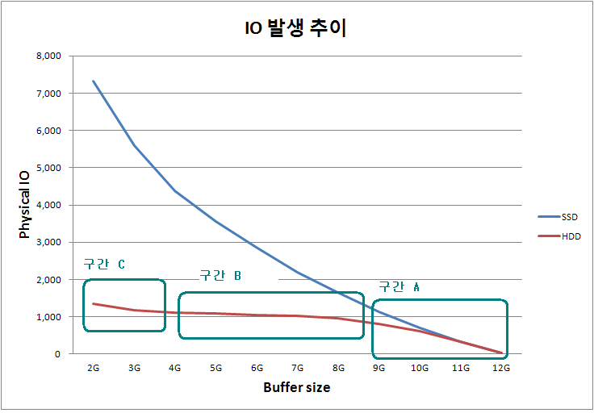
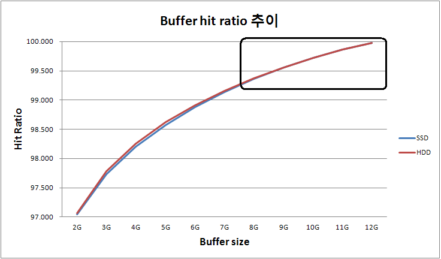

SSD(Solid State Drive)는 HDD(Hard Disk Drive)에 비해 데이터 처리 속도가 빠르다.
이로 인해 운영체제나 여러 프로그램의 성능 향상이 일반적이다.
그렇다면 DBMS의 저장 매체를 HDD에서 SSD로 전환하면 DBMS의 속도도 빨라질까?

## 디스크 드라이브와 데이터 버퍼링

DBMS에서는 저장 매체를 SSD로 바꾸어도 성능이 큰 폭으로 개선되지 않을 수 있다.
그 이유는 DBMS의 데이터 버퍼링(페이지 버퍼링) 기능 때문이다.
데이터 버퍼링은 데이터의 지역성이 높은 경우(같은 데이터나 인접한 데이터에 자주 접근하는 경우) 
메모리에 데이터를 미리 저장하여 디스크 I/O를 줄이는 캐시 시스템으로,
이를 통해 저장 매체의 I/O를 줄일 수 있다.
즉, 데이터 버퍼링 같은 캐시 시스템의 히트율(hit ratio)이 높은 환경인 경우라면
저장 매체의 I/O 실행 성능이 상대적으로 중요하지 않게 되는 것이다.

그래서 HDD를 SSD로 바꾸어 DBMS의 성능 향상 효과를 기대하려면
DBMS의 데이터 버퍼링이 효율적으로 동작하고 있는지 파악한 이후에 결정하는 것을 권장한다.
이유는 위에서 언급했듯이 저장 매체를 SSD로 변경하지 않고 데이터 버퍼링을 효율적으로 관리하면
충분히 DBMS의 성능 향상을 기대할 수 있기 때문이다.

그럼 저장 매체를 SSD로 변경하는 것이 DBMS의 성능 향상에 도움이 되지 않는가?
이를 알아보기 위해 먼저 디스크 드라이브와 데이터 버퍼링의 관계에 대해 알아야 한다.

## HDD의 구조와 I/O 특성

HDD는 플래터(회전하는 자기 디스크)에 데이터를 기록한다.
HDD에는 여러 개의 플래터가 있는데, 이 플래터는 각각 독립적으로 회전하는 것이 아니라 동시에 모두 회전한다.
다음 그림에서 보듯이 플래터의 중심을 중점으로 하는 동심원을 트랙이라고 한다.
그리고 여러 플래터에서 같은 위치의 트랙을 실린더라고 한다.
이 플래터에 자기 정보를 읽고 쓰는 것을 헤드라고 하는데 
플래터 양면에 정보를 기록할 수 있기 때문에 각각의 플래터마다 두 개의 헤드가 있다.
그리고 헤드는 디스크 암의 끝에 위치한다.

데이터는 빠르게 회전하는 플래터의 실린더에 순차적으로 블록 단위로 기록된다.
그래야 연속된 데이터를 한 번의 이동(플래터 회전과 디스크 암 이동)으로 읽을 수 있기 때문이다.
그래서 HDD의 I/O 시간이란 `디스크 암이 해당 실린더까지 이동하는 시간인 seek time`과
`플래터가 해당 블록(섹터)까지 회전하는 retional latency`, 그리고
`헤드가 데이터를 읽거나 쓰는 시간인 data transfer time`을 모두 합이라고 말할 수 있다.

여기서 data transfer time 보다 seek time과 rotational latency가 더 크기 때문에
(약 10배 이상, seek >> rotational latency > data transfer),
HDD의 성능을 최적화하려면 이 두 가지를 줄이는 것이 중요하다.
이를 위해 운영체제는 이러한 헤드의 이동과 플래터의 회전을 최소화하기 위해 최적화 스케줄링(I/O Scheduling) 방식을 사용한다.

하지만 애플리케이션은 운영체제에 빈번하게 I/O 요청하고 운영체제 입장에서는 이러한 시기를 예측할 수 없기 때문에 
언제나 I/0 스케줄링의 효과를 기대하기 어렵다.
예를 들어 애플케이션이 `데이터를 적게 읽고 쓰는 대용량의 요청`을 하기보다
`작은 크기의 데이터를 빈번하게 읽고 쓰는 요청`을 하는 패턴이라면  
운영체제의  I/O 스케줄링의 효과가 제한적일 수 있다.

## SSD의 구조와 I/O 특성

SSD는 HDD와 달리 회전 디스크나 이동하는 물리적 헤드가 없고, 플래시 메모리(flask memory)를 저장 매체로 사용하는 디스크이다.
플래시 메모리는 전자적으로 메모리의 내용을 읽는 것 외에, 프로그래밍(write)하거나 초기화(erase)할 수 있는 EEPROM의 일종이다.

HDD는 헤드가 데이터를 읽는 시간과 쓰는 시간이 거의 비슷한 반면에 SSD는 읽기 성능과 쓰기 성능이 다르다.
보통 페이지를 읽는 시간(read time)이 수백 ns 수준이라면,
페이지를 쓰는 시간(write time)은 us 단위이고, 초기화(erase)하는 시간은 ms 단위이다.

초기화는 한 영역에 대해서 동시에 진행하기 때문에 칩 전체를 초기화하거나 몇몇 페이지를 초기화하거나
보통 동일한 시간이 소요된다.
그래서 일반적으로 여러 페이지의 묶음인 섹터나 블록 단위로 초기화를 수행하도록 구성한다.

플래시 메모리의 특성상 섹터 당 초기화 횟수에 한계(보통 수만~수십만 정도)가 있다.
그래서 FAT에서 처럼 특정 부분이 자주 갱신되는 경우가 없도록,
논리 블록 주소에 대한 물리 블록 주소를 다르게 매핑하여 각 섹터별 초기화 횟수가 고르게 되도록 한다.
이러한 방법을 wear leveling이라고 한다.

이러한 특성들 때문에 SSD의 I/O 특성은 HDD와 다르다.

읽기의 경우에는 HDD와 다르게 seek time, rotational latency가 없이 data transfer time만 소요되기 때문에,
random read에서도 일정한 응답 속도가 보장된다.
그러나 쓰기의 경우에는 wear leveling을 진행하다 비어 있는 공간이 없으면 섹터 단위로 초기화하게 되고 이 작업 동안 해당 섹터에 대한
I/O 요청 작업이 모두 대기 상태가 된다.

## DBMS의 데이터 버퍼

DBMS의 데이터 버퍼는 메모리 기반 캐시로, 디스크 I/O를 최소화하여 성능을 높인다.
메모리가 디스크 드라이브에 비해 빠르고, 최근에 자주 사용된 데이터를 메모리에 저장하여,
디스크 드라이브에 접근이 아닌 메모리에 접근하도록 한 것이다.

DBMS의 데이터 버퍼는 일반적으로 LRU(Least Recently Used) 알고리즘을 기반으로 사용하고 있지만,
hot zone과 cold zone을 분리하여 LRU 관리 비용을 줄이는 방법도 있다.

DBMS의 I/O 요청에 대한 전체 처리 시간은 다음과 같이 표현할 수 있다.

$$Total Access Time = A \cdot HR + B \cdot (1 - HR)$$

각 항의 의미는 다음과 같다.

- $A$: 메모리 접근(Access) 시간
- $B$: 스토리지의 평균 접근(Access) 시간
- $HR$: 버퍼의 히트율

 전체 처리 시간이 위와 같이 때문에 HDD와 SSD의 처리 시간 차이인 $B \cdot (1 - BR)$의 히트율이 클수록 차이가 줄어든다.
일반적인 데이터 버퍼 히트율은 90% 이상으로, 디스크의 성능 차이가 DBMS의 성능에 미치는 영향은 상대적으로 작다.

## 데이터 버퍼 설정에 따른 HDD와 SSD의 성능 비교 실험

데이터 버퍼와 저장매체의 변경에 따른 DBMS의 성능변화를 시험한 사례를 보겠다.
시험은 나머지 사양은 동일하고 저장 매체로 HDD와 SSD를 사용하는 두 DBMS에 대해
데이터 버퍼의 크기를 2GB에서 12GB까지 1GB 단위로 변경하며
HDD와 SSD 환경에서 TPS(Transactions Per Second), 히트율, I/O 요청 횟수를 측정했다.

### 실험 환경

사용한 DBMS 서버 사양은 다음과 같다.

- CPU: Xeon® CPU L5650 (2.27GHz 2*6 cores)
- Memory: 16GB 
- HDD: 300GB * 2 
- SSD: 64GB * 4 
- OS: CentOS 5.3 x86_64 
- DBMS: CUBRID 2008 R4.1 (8.4.1.0516) (64bit release build for linux_gnu)
- TOOL: Yahoo! YCSB (Latest 분포 사용)

> YCSB는 Yahoo!에서 클라우드 서비스의 스토리지를 벤치마킹하기 위해 개발한 도구로, 쿼리 패턴이나 분포를 설정하여 분석할 수 있다.

### 실험 방법

실험은 HDD와 SSD 환경에서 데이터 버퍼 크기를 2GB에서 12GB까지 1GB 단위로 변경하며
TPS(Transactions Per Second), 히트율, I/O 요청 횟수를 측정했다.

### 실험 결과

실험을 통해 다음과 같은 결과를 얻었다.

#### TPS 추이

먼저 TPS 추이 그래프는 다음과 같다.

DBMS의 데이터 버퍼가 커질수록 SSD, HDD의 TPS가 모두 증가하는 것을 확인한다.
상대적으로 HDD가 더 느리기 때문에 HDD에서 페이지 버퍼 크기를 늘릴수록 TPS가 증가하는 것이 눈에 띄게 확인할 수 있다.

SSD의 그래프는 2GB에서 4GB까지 구간의 결과를 제외하면 단순 비례 관계를 보여 준다.
반면 HDD의 그래프는 10GB 부근에서 변곡점이 있는 S자형 곡선을 보이며 성능 증가 폭이 감소한 것을 볼 수 있다.

#### I/O 요청 처리 추이

다음 그림은 DBMS가 운영체제에 요청한 I/O 요청 추이를 나타낸 것으로,
I/O 요청의 결과는 SSD를 사용했을 때는 버퍼 크기가 증가할수록 I/O 요청 횟수가 지수적으로 감소하는 형태를 띄고 있다.
반면 HDD의 경우에는 TPS의 그래프와 유사하게 6GB에서 10GB까지 구간에서 급감하다가, I/O 처리 한계에 도달하여 성능 정체 현상을 보이고 있다.

#### 데이터 버퍼 히트율 추이

DBMS의 데이터 버퍼에 대한 히트율 그래프는 다음과 같다.
동일한 분포로 실험했기 때문에 SSD와 HDD의 히트율은 동일한 패턴을 보인다.
히트율은 동일하지만 처리 속도 차이 때문에 I/O 요청은 위에 I/O 요청 처리 추이 그래프 처럼 다른 양상을 보인다.

그래프 패턴은 100%를 접선으로 하는 지수적 증가 형태로, 버퍼 크기가 커질수록 기울기가 완만해지는 것을 확인할 수 있다.

### 결과 분석

실험 결과와 같이 DBMS의 성능의 핵심은 데이터 버퍼의 히트율에 달려 있다.
그렇기 때문에 DBMS의 성능을 향상시키는 데에는 데이터 버퍼가 충분한 히트율을 유지라도록 관리하는 것이 중요하다.

데이터 버퍼가 주요 워킹셋(자주 사용하는 데이터 집합)을 충분히 포함할 수 있도록 적정한 크기를 유지해야 한다.
이 방법으로도 만족할 만한 히트율을 유지하지 못하게 되었을 때는 성능을 일정 수준 이상 유지하기 위해 SSD 도입을 고려할 수 있다.
SSD는 HDD보다 Random Read 성능이 뛰어나므로, 버퍼 미스가 발생하더라도 HDD에 비해 성능 저하를 최소화할 수 있다.

이 결론에 따라 실험 결과를 다시 자세히 분석해 본다.

위의 실험 결과를 종합해서 보면 히트율은 8GB 부분부터 완만해지기 시작하나 
TPS는 오히려 기울기가 커지다 10GB 부근에서 급격히 감소하는 것을 확인할 수 있다.
결국 8GB에서 10GB 사이 부근에서 데이터 버퍼의 비용 대비 성능 향상이 가장 크다는 것을 알 수 있다.
이런 환경에서는 데이터 버퍼를 10GB 수준으로 증설하는 것이 저장 매체를 SSD로 변경하는 것보다 
비용에 대비해 성능을 더 효율적으로 향상시킬 수 있다.

## 참고

[Hard disk drive](https://en.wikipedia.org/wiki/Cylinder-head-sector)
