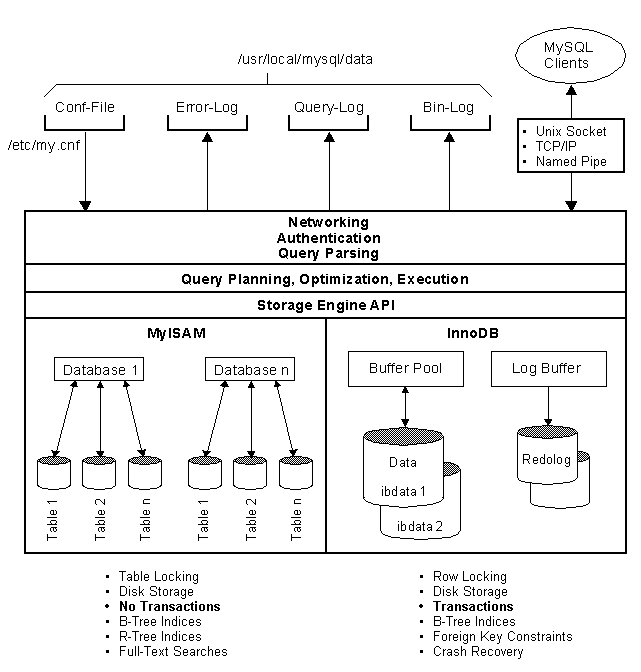
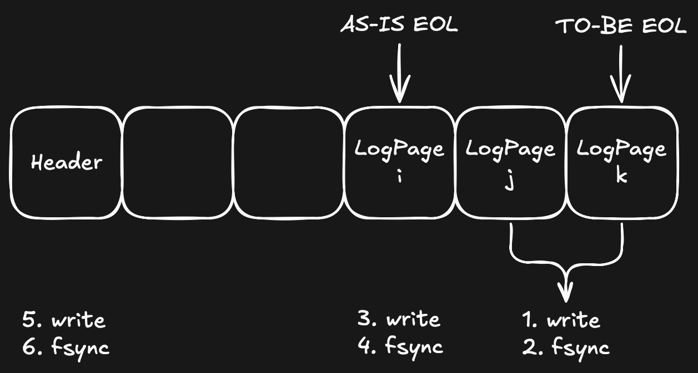

트랜잭션 관리는 DBMS가 제공하는 핵심 기능 중 하나로, 
데이터베이스 시스템에서 신뢰성을 보장하는 필수 요소이다.
DBMS 사용자들에게는 마치 공기처럼 당연한 존재이지만,
내부적으로는 매우 정교한 매커니즘이 작동하고 있다.
이 글에서는 트랜잭션을 커밋하거나 롤백할 때 DBMS 내부에서 어떤일이 발생하는지,
그리고 시스템이 트랜잭션을 어떻게 복구하는지를 살펴보면서,
트랜잭션 관리가 어떤 원리로 동작하는지 구체적으로 알아가보겠다.

## 트랜잭션이란 무엇인가?

잘 알려진 내용이라 진부할 수 있지만, 그래도 트랜잭션의 개념을 한번 짚고 넘어가자.
트랜잭션은 데이터베이스 시스템에서 하나의 논리적 작업 단위를 구성하는 연산들의 집합이다.
이는 데이터의 무결성을 보장하고 일관된 상태를 유지하기 위해 필수적인 개념이다.
가장 흔한 예로 계좌 간 자금 이체가 많이 언급된다.
한 계좌에서 10만원을 출금하고,
다른 계좌에 10만원을 입금하는 작업은 반드시 원자적으로 수행되어야 한다.
즉, 전체 작업이 정상적으로 완료되거나, 그렇지 않다면 아무것도 수행되지 않은 상태로 복구되어야 한다.
이러한 특성 덕분에 트랜잭션은 데이터베이스에서 여러 다양한 데이터 항목을 읽고 갱신하는 프로그램의 실행 단위가 된다.
흔히 트랜잭션의 ACID 성질이라고 하는 다음 네 가지 성질로 설명된다.

### 원자성(Atomicity)

트랜잭션은 “모두 수행되거나, 전혀 수행되지 않거나”라는 특성을 가져야 한다. 
즉, 트랜잭션 수행 도중 오류가 발생하면, 해당 트랜잭션이 수행한 모든 변경 사항은 취소되어야 한다. 
예를 들어, 자금 이체 중 한 계좌에서 돈을 출금했지만, 다른 계좌로 입금하기 전에 오류가 발생했다면, 출금된 금액도 원래 상태로 복구되어야 한다. 
원자성은 “All or Nothing” 원칙으로 이해할 수 있다.

### 일관성(Consistency)

트랜잭션이 실행된 후에도 데이터베이스의 무결성이 유지되어야 한다.
즉, 트랜잭션 수행 전후의 데이터베이스 상태는 각각 정합성을 갖는 상태여야 한다. 
예를 들어, 자금 이체 트랜잭션을 수행했을 때, 두 계좌의 잔고 총합이 변하지 않아야 한다. 
이러한 일관성은 기본 키, 외래 키 제약 조건뿐만 아니라, 도메인 무결성, 애플리케이션 레벨의 비즈니스 규칙 등을 포함한다.

### 독립성(Isolation)

여러 트랜잭션이 동시에 실행되더라도, 각 트랜잭션은 독립적으로 수행되어야 하며, 다른 트랜잭션의 영향을 받아서는 안 된다. 
즉, 하나의 트랜잭션이 완료되기 전까지는 해당 트랜잭션의 중간 결과를 다른 트랜잭션이 볼 수 없어야 한다. 
예를 들어, 사용자가 계좌 잔액을 조회할 때, 동시에 진행 중인 이체 트랜잭션의 영향을 받지 않아야 한다.
이를 보장할 수 있는 가장 쉬운 방법은 트랜잭션을 순차적으로 실행하는 것이지만, 이는 성능에 큰 영향을 미친다.
그래서 DBMS에서는 병렬적 수행을 위해 직렬화(Serializable) 수준의 고수준의 트랜잭션 격리 방식을 제공하고 있다.

> 직렬화(Serializable) 수준은 모든 변경 사항을 읽을 수 없는 수준의 격리 수준이다.

### 지속성(Durability)

트랜잭션이 성공적으로 완료되고 커밋되면, 그 결과는 영구적으로 데이터베이스에 반영되어야 한다. 
이후 시스템 장애(전원 장애, 하드웨어 고장 등)가 발생하더라도, 트랜잭션의 결과가 유실되지 않아야 한다. 
이를 위해 DBMS는 로그(Log), 체크포인트(Checkpoint), WAL(Write-Ahead Logging) 기법 등을 활용하여 트랜잭션을 복구할 수 있도록 한다.

## 트랜잭션의 종료 형태

그럼 트랜잭션은 어떻게 종료되는 것일까?
트랜잭션은 수행 결과에 따라 다음과 같은 세 가지 형태로 종료될 수 있다.

1. 정상 종료(Commit): 모든 작업이 정상적으로 수행되었으며, 변경 사항이 영구적으로 반영된다. 
2. 사용자 철회(Abort by User): 사용자가 트랜잭션 수행 중 취소(rollback)를 요청하여 변경 사항이 반영되지 않는다. 
3. 시스템 강제 철회(Abort by System): 트랜잭션 수행 중 오류(무결성 제약 위반, 교착 상태, 타임아웃 등)가 발생하여 시스템이 자동으로 트랜잭션을 중단하고 롤백한다.

이 외에도 트랜잭션은 각종 시스템 고장으로 인하여 영향을 받아 비정상 종료가 발생할 수 있다. 
DBMS는 이와 같은 상황에서도 트랜잭션을 관리해야 한다.

> 대표적인 복구 기법으로는 로그 기반 복구, 체크포인트 복구, 그림자 페이징(Shadow Paging) 등이 있다.

## 트랜잭션 관리를 위한 DBMS의 전략

트랜잭션 관리를 효과적으로 수행하기 위해서는 DBMS의 개략적인 구조와 버퍼 관리자(Buffer Manager), 그리고 트랜잭션 관리와 연관된 버퍼 관리 정책(Buffer Management Policy) 에 대한 이해가 필요하다.

DBMS는 보통 비휘발성 저장 장치(디스크)에 데이터를 저장하며, 전체 데이터 중 일부를 메인 메모리에 유지하면서 운영된다. 
데이터는 고정 길이의 페이지(Page) 단위로 저장되며, 디스크에서 데이터를 읽거나 쓸 때도 페이지 단위로 입출력이 수행된다. 
페이지 버퍼(Page Buffer) 관리자 또는 버퍼 관리자(Buffer Manager) 는 메인 메모리에 유지하는 페이지들을 관리하는 핵심 모듈로, DBMS의 성능과 트랜잭션 관리에 중요한 역할을 한다.

DBMS의 구조는 제품마다 다소 차이가 있지만, 일반적으로 다음과 같이 질의 처리기(Query Processor) 와 저장 시스템(Storage System) 으로 구분할 수 있다.

> 질의 처리기(Query Processor): 사용자의 SQL 질의를 분석하고 실행하는 역할을 담당한다. <br>
> 저장 시스템(Storage System): 데이터를 저장하고 관리하는 역할을 수행하며, 내부적으로 페이지 버퍼 관리자를 포함한다.

대표적인 DBMS인 MySQL 은 InnoDB, MyISAM 등 여러 저장 엔진을 선택할 수 있도록 설계되어 있으며, 이러한 구조는 질의 처리기와 저장 시스템 간의 계층(layered) 구조 를 따른다. 



DBMS의 여러 구성 요소 중에서 버퍼 관리자가 중요한 이유는 버퍼 관리 정책이 트랜잭션 관리에 직접적인 영향을 미치기 때문이다. 
특히, 특정 버퍼 관리 정책에 따라 UNDO(트랜잭션 취소) 및 REDO(트랜잭션 재적용) 복구가 필요할 수도 있고, 필요하지 않을 수도 있다. 
이 부분에 대해서 하나씩 살펴보자.

## UNDO는 왜 필요할까?

DBMS에서 트랜잭션이 수행되는 동안, 수정된 페이지들은 버퍼 관리자의 버퍼 교체 알고리즘(Buffer Replacement Algorithm) 에 따라 디스크로 출력될 수 있다. 
버퍼 교체는 메모리 상태에 따라 결정되며, 일관성 관점에서 보면 임의의 방식으로 이루어진다. 
즉, 아직 커밋되지 않은 트랜잭션이 수정한 페이지도 디스크에 기록될 수 있으며, 만약 해당 트랜잭션이 정상적으로 종료되지 못하면, 변경된 데이터는 원래 상태로 복구되어야 한다. 
이러한 복구 과정을 UNDO(롤백) 라고 한다.

만약 버퍼 관리자가 트랜잭션 종료 전까지 수정된 페이지를 절대로 디스크에 기록하지 않는 정책을 따른다면, UNDO는 단순히 메모리 버퍼 내에서만 이루어지므로 복구 과정이 간단해진다. 
그러나 이러한 방식은 매우 큰 크기의 메모리 버퍼가 필요하다는 문제점이 있다. 
따라서 대부분의 DBMS는 수정된 페이지가 트랜잭션 종료 전에 디스크에 기록될 수도 있도록 허용하는 정책을 채택 한다.

수정된 페이지를 디스크에 쓰는 시점에 따라 다음과 같은 두 가지 정책으로 나누어 볼 수 있다.

- STEAL 정책
  - 트랜잭션이 종료되기 전이라도 수정된 페이지를 디스크에 기록할 수 있는 방식이다.
  - 버퍼 관리자가 메모리 공간 확보를 위해 아직 커밋되지 않은 데이터도 디스크에 기록할 수 있다.
  - 그러나 비정상 종료된 트랜잭션이 이미 디스크에 기록한 데이터를 원상 복구하기 위해 UNDO 작업이 필요하다.
  - 거의 모든 DBMS가 채택하는 정책으로, 보다 유연한 메모리 관리를 가능하게 한다.
- NO-STEAL 정책
  - 트랜잭션이 종료될 때까지 수정된 페이지를 디스크에 기록하지 않는 방식이다.
  - UNDO 작업이 필요하지 않지만, 모든 수정된 데이터를 버퍼 내에서만 유지해야 하므로 메모리 사용량이 증가한다.
  - 현실적으로 대용량 데이터를 처리하는 DBMS에서는 사용하기 어려운 방식이다.

STEAL 정책에서는 수정된 페이지가 언제든지 디스크에 기록될 수 있으므로, 트랜잭션이 비정상적으로 종료되었을 때 데이터를 원상태로 되돌릴 수 있도록 UNDO 로깅 및 복구 과정이 필수적이다.

예를 들어, 어떤 트랜잭션이 디스크에 100만 원을 인출하는 작업을 기록했지만, 이후 과정에서 오류가 발생했다면, DBMS는 해당 트랜잭션이 변경한 데이터를 이전 상태로 되돌려야 한다. 
이를 위해 트랜잭션이 시작되기 전에 변경 이전의 값을 로그에 저장(UNDO Logging) 해두고, 필요할 경우 이를 활용하여 데이터를 복구하는 방식으로 동작한다.

STEAL 정책은 거의 모든 DBMS에서 사용되고 있고, 효율적인 버퍼 관리와 안정적인 트랜잭션 복구를 위한 핵심적인 설계 요소라고 할 수 있다.

## REDO는 왜 필요할까?

이제는 UNDO 복구의 반대 개념인 REDO 복구에 대해서 알아볼 것인데, 앞서 설명한 바와 같이 거밋된 트랜잭션의 변경 내용은 어떤 경우에도 유지(Durability)되어야 한다.
만약 시스템 장애가 발생해도, 커밋된 트랜잭션의 결과는 반드시 데이터베이스에 반영되어야 한다.
이러한 복구 작업을 REDO라고 한다.
REDO 복구는 UNDO 복구와 마찬가지로 버퍼 관리 정책에 영향을 받으며, 수정된 데이터를 디스크에 기록하는 시점에 따라 정책이 구분된다.

트랜잭션이 커밋될 때, 해당 트랜잭션이 수정한 페이지를 즉시 디스크에 반영할 것인지 여부에 따라 다음과 같은 두 가지 정책으로 나눌 수 있다.

- FORCE 정책
  - 트랜잭션이 커밋될 때, 수정된 모든 페이지를 즉시 디스크에 반영하는 방식이다.
  - 따라서 시스템 장애가 발생하더라도, 디스크에는 커밋된 데이터가 남아 있으므로 REDO 복구가 필요하지 않다.
  - 하지만 트랜잭션 커밋 시점마다 모든 변경 사항을 디스크에 반영해야 하므로, 성능이 저하될 가능성이 크다.
- NO-FORCE 정책
  - 트랜잭션이 커밋되더라도, 수정된 페이지를 즉시 디스크에 반영하지 않을 수 있는 방식이다.
  - 대신 커밋된 트랜잭션이 어떤 작업을 수행했는지에 대한 로그를 기록(WAL, Write-Ahead Logging)한다.
  - 장애 발생 시, 커밋된 트랜잭션의 변경 사항이 아직 디스크에 반영되지 않을 수 있으므로, REDO 복구가 반드시 필요하다.
  - 거의 모든 DBMS가 성능 최적화를 위해 NO-FORCE 정책을 채택하고 있다.

여기서 주의 깊게 봐야 할 부분은 NO-FORCE 정책을 따르더라도, 데이터베이스 백업 복구(미디어 복구, Media Recovery) 과정에서는 REDO 복구가 필요할 수 있다는 점이다.

NO-FORCE 정책은 수정된 데이터를 즉시 디스크에 반영하지 않음으로써, 버퍼 관리의 효율성을 높이고 시스템 성능을 개선하는 장점이 있다. 
그러나 이로 인해 장애 발생 시 REDO 복구가 필수적이 된다. 
반면 FORCE 정책을 사용하면 REDO 복구가 필요 없지만, 모든 커밋 시점마다 디스크 I/O가 발생하여 성능이 저하되는 단점이 있다.

사실 FORCE 정책을 따르더라도, 데이터베이스 백업 복구(미디어 복구, Media Recovery) 과정에서는 REDO 복구가 필요할 수 있다. 
따라서 현실적으로 거의 모든 DBMS는 NO-FORCE(¬FORCE) 정책을 채택 하며, 시스템 장애 발생 시 커밋된 트랜잭션을 복구하기 위해 REDO 작업을 수행 한다.

앞서 살펴본 STEAL 정책과 NO-FORCE 정책을 함께 채택하면, 트랜잭션이 수행되는 동안 변경된 데이터가 언제든지 디스크에 기록될 수도 있고, 반대로 커밋 이후에도 디스크에 기록되지 않았을 수도 있다. 
이로 인해 다음과 같은 복구 작업이 필요해진다.

- UNDO 복구: STEAL 정책을 사용하면 아직 커밋되지 않은 데이터가 디스크에 기록될 수 있으므로, 트랜잭션이 롤백될 경우 변경 내용을 되돌려야 한다.
- REDO 복구: NO-FORCE 정책을 사용하면 커밋된 트랜잭션의 변경 사항이 디스크에 반영되지 않았을 수 있으므로, 시스템 장애 발생 시 이를 다시 적용해야 한다.

정리해보면 DBMS는 성능과 복구 가능성을 모두 고려하여, STEAL + NO-FORCE 정책을 채택하는 것이 일반적이다.
이러한 정책 선택으로 인해 UNDO 복구(롤백)와 REDO 복구(재적용)가 모두 필요하게 된다.

## 트랜잭션 관리

지금까지 살펴본 UNDO 복구와 REDO 복구를 수행하기 위해 가장 널리 사용되는 구조는 로그(Log)이다.
일부 데이터베이스 시스템에서는 Shadow Paging(Nilavalagan, 2009) 과 같은 복구 기법도 존재하지만, 여기서는 가장 일반적인 로그 기반 복구(Log-Based Recovery) 기법에 초점을 맞추어 설명하겠다.

### 로그(Log)란?

로그는 데이터베이스의 모든 갱신 작업을 기록하는 연속적인 로그 레코드(로그 파일의 단위)로 구성된다.
이론적으로 로그는 안정적 저장 매체(Stable Storage)에 기록된다고 가정한다.
안정적 저장 매체란 어떠한 경우에도 데이터 손실이 발생하지 않는 이상적인 저장 매체를 의미하지만, 현실적으로 존재하지 않는다.

이를 보완하기 위해 DBMS는 RAID와 같은 하드웨어 보호 기법을 사용하거나, 여러 개의 로그 파일을 유지하여 안정성을 보장하는 방법을 사용한다.
하지만 성능상의 이유로, 대부분의 DBMS는 하나의 로그 파일만을 유지하는 경우가 많다.

로그는 항상 새로운 내용을 덧붙이는(append) 방식으로 기록되며, 각 로그 레코드는 고유한 식별자를 가진다.
이 식별자를 LSN(Log Sequence Number) 또는 LSA(Log Sequence Address) 라고 부르며, 로그가 추가될 때마다 단조 증가하는 성질을 갖는다.

로그 데이터는 저장 방식과 기록 방식에 따라서 분류할 수 있다.

|          | State              | Transition       |
|:---------|:-------------------|:-----------------|
| Physical | -                  | Action(DML, DDL) |
| Logical  | 이전 이미지 <br> 이후 이미지 | XOR 차이           |

### 물리적인 상태 로깅(Physical State Logging)

DBMS에서 가장 널리 사용되는 로깅 방식으로, 갱신 이전(before-image)과 갱신 이후(after-image)의 물리적인 데이터를 기록한다.
UNDO 복수 시, 수정 이미지로 데이터를 되돌리고, REDO 복구시, 수정 이후 이미지를 데이터베이스에 반영한다.

```sql
UPDATE customer SET balance = balance + 100 WHERE id = 1;
-- UNDO 로그: balance = 기존 값(예: 500)
-- REDO 로그: balance = 변경된 값(예: 600)
```

### 물리적인 전이 로깅(Physical Transition Logging)
XOR 연산을 사용하여 변경된 부분만 기록하는 방식이다.
전체 페이지나 레코드의 이미지를 저장하는 대신, 수정된 부분만 XOR 연산을 통해 기록하므로 로그 크기를 줄일 수 있다.
복구 시, 로그에 기록된 XOR 차이를 적용하여 UNDO 및 REDO를 수행한다.

```sql
UPDATE customer SET balance = balance + 100 WHERE id = 1;
-- 로그 데이터: XOR(기존 값, 변경 값)
```

이 방식은 로그 크기를 줄일 수 있는 장점이 있지만, 복구 과정이 복잡해질 수 있다.

### 논리적인 전이 로깅(Logical Transition Logging)

오퍼레이션 자체를 기록하는 방식으로, 오퍼레이션 로깅(Operation Logging)이라고도 한다.
물리적인 로그가 결과값을 저장하는 방식이라면, 논리적인 로그는 실행된 연산 자체를 기록한다.
복구 시 UNDO와 REDO를 위해 연산을 재수행하거나 역 오퍼레이션을 수행한다.

```sql
UPDATE customer SET balance = balance + 100 WHERE id = 1;
-- UNDO 로그: balance = balance - 100
-- REDO 로그: balance = balance + 100
```

하지만 더 중요한 점은 물리적으로 복구하기 쉽지 않은 자료 구조에 대한 로깅을 쉽게 해준다는 점이다. 
예를 들어, 인덱스 구조로 많이 사용되는 B+-tree 또는 B-tree 는 split, merge 와 같은 SMO(Structure Modification Operation)를 통해서 레코드의 위치가 계속 변경되기 때문에 
로깅 시점과 복구 시점의 데이터 물리적 위치가 같다는 점이 보장되지 않기 때문에(페이지 내의 위치가 다를 수도 있고, 심지어 다른 페이지에 위치할 수도 있다), 물리적인 로그를 통해서 복구하기가 쉽지 않지만, 논리적인 로그를 통해서 보다 쉽게 복구할 수 있다. 
즉, 인덱스에 키 값 k와 포인터 p가 저장되었다는 논리 로그에 대한 REDO 복구는 인덱스에 (k, p)를 다시 삽입하는 작업이면 충분하고, UNDO 복구는 (k, p)를 인덱스에서 제거하는 작업을 수행하면 된다.

대부분의 DBMS는 하나의 로깅 방식만 사용하는 것이 아니라, 상황에 따라 여러 가지 방식을 혼용한다. 
MySQL(InnoDB)도 물리적 로깅과 논리적 로깅을 함께 사용하여 복구 성능을 최적화 한다.
위에서 설명한 3개의 그룹으로 나눠볼 수 있는 로그 레코드가 DBMS 내에 실제로 몇 종류나 필요할까 하는 궁금증이 드는데, 
DBMS마다 다르지만 MySQL(InnoDB)의 경우에는 UNDO 로그, REDO 로그, BINARY 로그(Binlog) 같은 것을 포함하여 약 40여 종류의 로그 레코드가 존재한다.
또한, DBMS에서 자료 구조마다 복구 연산이 다르기 때문에, 실제로는 로그 레코드보다 훨씬 많은 복구 연산(Recovery Functions)이 필요하다.
MySQL(InnoDB)의 경우, 약 100여 개의 복구 연산을 가지고 있다.

여기서 한 가지 더 얘기할 사항은 로그를 이용한 UNDO 및 REDO 복구는 반드시 멱등성(Idempotency)을 가져야 한다.
즉, 같은 연산을 여러 번 수행하더라도 동일한 결과를 유지해야 하는 것을 의미하는데, 물리적인 로그를 통한 복구는 자연스럽게 멱등성이 보장되지만, 논리적인 로그를 통한 복구는 그렇게 간단하지 않다.
예를 들어, 물리적인 로깅을 사용하면, 같은 데이터를 여러 번 복구해도 동일한 결과를 유지할 수 있다.
하지만, 논리적인 로깅을 사용할 경우, a++ 연산을 여러 번 반복하면 값이 변하는 문제가 발생할 수 있다.
이러한 문제를 방지하기 위해, DBMS는 한 번 수행한 복구 연산을 다시 수행하지 않도록 제어하는 추가적인 로직을 적용한다.

## 로그는 어떻게 쓸까?

로그는 로그 타입과 관계없이 다음과 같은 원칙을 준수하여 기록된다.

- 로그는 데이터베이스에 변경 사항이 반영되기 전에 먼저 기록되어야 한다. 이 원칙을 WAL(Write-Ahead Logging)이라고 하며, UNDO 복구를 위해 반드시 필요한 규칙이다. 즉, 어떤 경우에도 트랜잭션이 수정한 데이터가 디스크에 기록 되지 전에, 해당 변경 사항의 UNDO 정보가 로그에 먼저 기록되어야 한다. 이 원칙이 지켜지지 않으면, 트랜잭션이 롤백될 때 변경 사항을 되돌릴 수 없게 된다.
- 트랜잭션이 정상적으로 종료(Commit)되기 위해서는, REDO 정보가 로그에 기록되어야 한다. 마찬가지로 어떤 경우에도 커밋을 수행하기 전에 반드시 REDO 로그가 기록되어야 하며, 이 원칙이 지켜져야 장애 발생 시 커밋된 데이터를 복구할 수 있다.

DBMS는 성능 최적화를 위해 로그를 즉시 디스크에 기록하지 않고, 로그 버퍼(Log Buffer)라는 메모리 공간에 먼저 저장한다.
로그 버퍼에 모아둔 로그들은 일정한 조건이 충족되면 블록 단위로 로그 파일에 기록(flush)된다.

로그 버퍼에 저장된 로그 레코드는 다음과 같은 상황에서 로그 파일에 기록된다.

- **트랜잭션이 커밋을 요청한 경우**, 커밋을 요청한 트랜잭션의 모든 레코드가 로그 파일에 기록된 후, 트랜잭션이 완료된다.
- **WAL 규칙을 준수해야 하는 경우**, 데이터 변경 사항이 디스크에 기록되기 전에, 해당 변경을 되돌릴 수 있도록 UNDO 로그가 반드시 기록되어야 한다.
- **로그 버퍼가 가득 찬 경우**, 로그 버퍼는 상대적으로 작기 때문에(보통 수 MB에서 수십 MB 수준), 긴(long) 트랜잭션이 수행 중일 경우 버퍼가 소진될 수 있다.
- **DBMS 내부적으로 로그 기록이 필요한 경우**, 체크포인트(Checkpoint) 연산, 로그 관리 연산 등으로 인해 DBMS가 주기적으로 로그를 기록하는 경우도 있다.

대부분의 경우 트랜잭션 커밋(1) 또는 WAL 규칙 준수(2)로 인해 로그가 기록되며, 로그 버퍼 소진(3)이나 DBMS 내부 처리(3)로 인해 추가적으로 기록될 수도 있다.

어떤 트랜잭션이 커밋을 요청하면, 해당 트랜잭션의 마지막 로그 레코드까지 로그 파일에 기록되어야 한다.
예를 들어, 트랜잭션 T1이 커밋될 때, LSN3까지의 로그 레코드가 로그 파일에 기록되어야 한다.

```sql
<LSN1, T1, type, location, before, after>  # 트랜잭션 T1의 첫 번째 로그
<LSN2, T2, type, location, before, after>  # 트랜잭션 T2의 첫 번째 로그
<LSN3, T1, commit>                         # T1의 커밋 로그
```

트랜잭션 T1이 커밋될 경우, LSN3까지의 모든 로그가 디스크에 기록된 후 커밋이 완료된다.

## 로그를 쓰는 일은 왜 느릴까?

DBMS에서 로그(Log) 레코드가 손실되면 데이터베이스를 복구할 수 없기 때문에, 로그를 최대한 안전하게 기록하는 것이 필수적이다.
이를 위해 DBMS는 로그를 기록할 때 write 함수(또는 writev 함수) 호출뿐만 아니라 fsync 함수(fsync(2) - Linux man page, 2013) 호출도 수행한다.

fsync 함수는 데이터가 디스크에 실제로 기록되는 것을 보장하는 함수이다.
그러나 리눅스를 포함한 대부분의 운영체제(OS)는 fsync 호출이 반드시 데이터를 디스크에 물리적으로 기록하는 것까지 보장하지는 않는다.
fyncs 함수 호출은 매우 느린 연산이고, 트랜잭션이 커밋되려면 해당 트랜잭션의 로그가 파일에 완전히 기록되어야 하므로, 커밋을 하려는 트랜잭션은 fsync가 종료되기를 대기해야 한다.

더 자세히 보면, DBMS가 로그 버퍼를 디스크에 기록할 때, 단순히 로그 레코드만 기록하는 것이 아니라, 로그 헤더까지 함께 기록되어야 하는데,
로그 레코드를 먼저 쓰고 fsync 함수를 실행하고, 로그 헤더를 업데이트한 후에 다시 fsync 함수를 실행해야 한다.
로그는 파일 끝에 덧붙이는(append) 방식으로 저장되므로, 이러한 단계가 없으면 로그 레코드나 헤더가 불완전한 상태로 기록될 수 있다.
그러나 fsync 호출 시 어떤 버퍼 프레임부터 디스크에 기록될지는 OS가 결정하기 때문에, DBMS가 원하는 순서대로 기록할 방법이 없다.
이로 인해 여러 단계의 fsync를 수행하면서 로그를 기록 하게 된다

하지만 DBMS는 보통 한 번에 하나의 로그 페이지(Log Page)만 기록하는 것이 아니라, 여러 개의 로그 페이지를 동시에 기록한다.
이 경우, 로그 쓰기 작업은 더 복잡해진다.
예를 들어, 로그 버퍼 Bi부터 Bk까지 출력하는 경우에, 먼저 Bj부터 Bk까지 로그 파일에 쓰고 fsync 함수를 실행하고, 첫 번째 로그 버퍼인 Bi를 쓴 후 다시 fsync 함수를 실행하고 나서, 비로소 로그 헤더를 업데이트하는 절차로 이루어진다.

{: width="400" }


