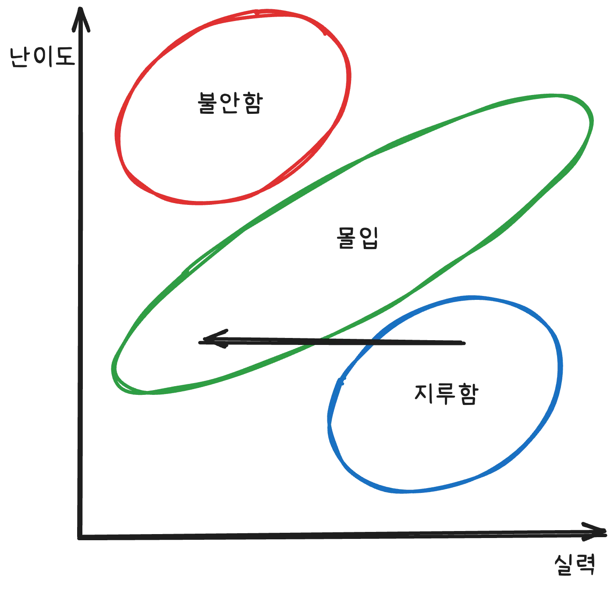
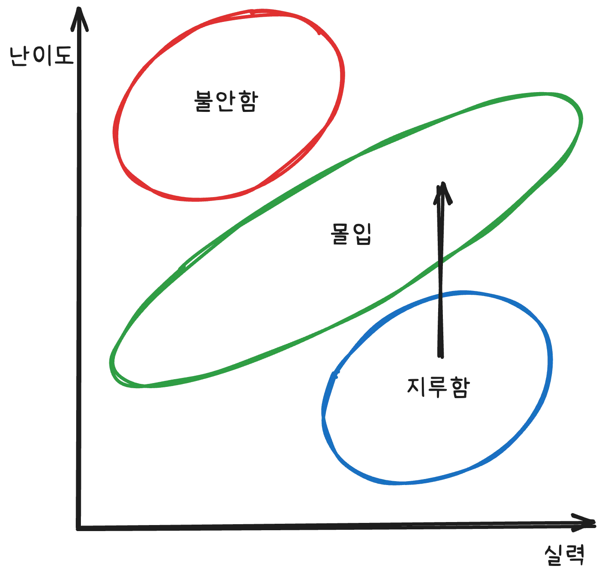

## 자라기

달인이 되기 위한 방법으로 1만시간의 법칙이 흔히 거론된다.
여기서, 1만 시간의 법칙이란 “특정 분야에서 1만 시간 이상 일을 하면 그 분야에 달인이 된다”라는 말이다.
그럼 우리가 매일하는 양치는 1만 시간이 넘을텐데 양치의 달인이라고 할 수 있는가?
아니다. 시간만 투자한다고 해서 그 분야의 전문가라고 할 수는 없을 것이다.

달인이 되기 위해서는 **의도적**으로 **타당성과 피드백이 있는 환경**에서 **동기를 갖고** 연습을 해야한다.
예를 들자면, 함수의 이름을 우아하게 만들기 위해서 작명 연습을 한다는 것이다.
여기서 요지는 들인 시간만 중요한 것이 아니라 성장하고자 하는 목적을 갖고 꾸준히 수련을 하는 것이다.

### 의도적 수련

의도적 수련은 자신의 기량을 향상 시키기 위해 반복적으로 노력하는 것을 말한다.
단순히 열심히 일하는 것과는 달리, 자신의 약점을 개선하려고 노력하는 것을 의미한다.
의도적 수련에는 몇 가지 조건이 필요하다.

- 메타인지
- 능력에 비례한 난이도
- 목적과 동기

여기서 능력에 비례한 난이도가 중요한 이유는 다음과 같다.
인간이 자신의 능력보다 낮은 난이도의 일을 할 때는 **지루함**을 느끼고, 자신의 능력보다 높은 난이도의 일을 하게 되면 **불안**을 느낀다고 한다.
하지만 본인의 능력과 비슷한 수준 혹은 그와 인접한 어려운 일을 하게 될 때,
**몰입**을 경험할 수 있게 된다고 한다.
만약 난이도를 설정할 수 없는 환경이라면, 스스로 난이도를 조정하는 방법을 활용할 수 있다.
현재 상황이 지루한지, 불안한지에 따라 어떻게 하면 좋을지 나와있었다.

현재 난이도가 낮아 **지루한 상황**이라면,

먼저 실력을 낮추는 방법이 있다.

- 코파일럿이나 GPT, Claude 같은 AI를 사용하지 않기
- 디버거를 안쓰기
- 마우스를 사용하지 않고 개발하기

이렇게 의도적으로 자신의 실력을 낮추어 몰입하는 단계로 들어설 수 있는 방법이 있다.

그 다음으로 난이도를 높이는 방법이 있다.

- 요구사항을 추가하기
- 시간 제한을 두고 개발하기

이렇게 스스로 난이도를 높여 몰입하는 방법도 있다.

난이도가 높아 **불안한 단계의 상황**이라면,

본인의 실력을 높이는 방법을 사용할 수 있다.

- 관련 책 읽기
- 스터디 하기
- 강의 듣기
- 전문가에게 조언을 구하기
- 과거의 비슷한 경험을 떠올려 보기
- 코파일럿이나 GPT, Claude 같은 AI와 같이 일하기

난이도를 낮추는 방법도 있다.

이때는 일을 단계 별로 잘게 쪼개어 하나씩 진행하는 방식으로 진행해본다.
여기까지 본인의 능력에 비례한 난이도가 왜 중요하고 의도적 수련이 무엇인지 알게 되었다.
하지만 여기서 메타인지가 왜 중요한지도 알 수 있다.
본인의 능력이 어느 정도 되는지 모른다면, 난이도에 따른 의도적 수련을 할 수 없을 것이다.
따라서, 충분히 메타인지를 한 후 난이도에 따른 의도적 수련을 진행해야 진정한 수련이라고 할 수 있을 것이다.

### ABC 작업

먼저, A란 업무 그 자체를 의미한다. 개발이나 공부가 여기에 속하게 된다.
그 다음으로, B는 A를 개선 시킬 무언가를 의미한다.
예를 들면, 테스트 코드나 혹은 동료에게 받는 피드백이 B가 될 수 있다.
그리고, C는 B를 개선 시킬 무언가를 의미한다. 회고 같은 활동이 여기에 속하게 된다.

### 마인드 셋

> 실수는 예방하는 것이 아니라 관리 하는 것이다. - [함께 자라기]

**실수 예방은 실수를 하지 않기 위해 하는 노력을 의미**한다.
만약 이러한 상황에서 **실수를 하게 된다면, 들키지 않기 위해 덮으려고 할 것**이다.
그런 다음, 다음에 안 그러면 된다라는 생각을 하게 될 것이다. 이것을 2차적 실수 예방이라고 한다.
실수는 성과에 좋지 않으니 실수가 두려워 지는 성과 마인드 셋과 비슷한 느낌인 것 같다.
**실수 관리는 실수가 발생하면 수습할 방법을 모색하고 발생한 이유를 분석**한다.
이때 배울 부분을 자연스럽게 학습하게 된다.

이러한 것을 볼 때, 학습 마인드셋과 비슷한 느낌이다.
**학습 마인드 셋을 가진 사람은 실수는 성장의 기회**로 여기며,
본인의 실수에 대한 피드백을 받는 행동을 할 것이다.
새로운 기술을 배울 때 이러한 실수 관리 차원의 학습 마인드 셋을 이용한다면,
실수나 실패를 두려워 하지 않기에 완벽하게 이해하기 전에 시도를 먼저 해볼 것이다.
빠르게 적용해보고, 결과를 다른 사람에게 전달을 한 다음에 피드백을 받고,
실수가 발견된다면 실수를 해결할 방법을 찾은 다음 원인을 분석할 것이다.
그리고 회고와 반성을 통해 새로운 기술을 잘 배우게 될 것이다.

반면, 실수 예방에 매몰된 성과 마인드 셋일 경우에는
완벽하게 이해하고 시도해보려고 할 것이다.
숙지가 안되었으니 나중으로 미루게 되고,
완벽하게 이해하지 못해서 나중으로 미루게 되고,
잘 모르고 저질러 버리는 실수에 대해 공포를 느끼며 결국 다음에 하기로 할 것이다.

여기서 요지는, 완벽하게 준비도기 전에 빠르게 실험하고, 빠르게 실패하고, 빠르게 피드백을 받으며 성장하자는 것이다.

## 함께

> 전문가 팀이 항상 최고는 아니다 - [구글]

**팀의 성과는 누가 팀에 있는 가보다 팀원들이 서로 어떻게 상호작용하는가가 중요**하다.
그렇다면 탁월한 팀이 되기 위해 중요한 요소는 어떠한 것이 있을까?

### 협력

팀의 성과는 **협력**에 달려 있다.
실제 전문가 팀과 비전문가 팀이 모였을 때, 전문가만 모인 팀이 오히려 성과가 낮은 결과가 있었다.
이를 분석해본 결과, 전문가 팀은 **정보 공유와 협력을 하지 않았고**, 비전문가 팀은 **적극적으로 협력**했다.
협력이 이렇게나 중요하다면, 협력을 하는 연습을 어떻게 해볼 수 있을까?
그건 바로 **지적에서 멈추지 않고, 대안을 함께 고민**하는 것이다.

### 심리적 안전감

심리적 안전감이란 **내가 실수를 하거나 부족한 의견을 내도 처벌 받거나 조롱 당하지 않을 거라는 믿음**을 의미한다.
심리적 안전감이 낮은 팀은 자신의 의견을 숨기거나 실수를 인정하지 않으려고 할 것이다.
그렇게 되면, 결국 창의적인 해결책이 나오지 않을 것이고, 실수를 감추고 문제를 회피하게 될 것이다.
그렇다면, 심리적 안전감을 높이려면 어떻게 해야할까?

특별히 고안된 활동을 통해 심리적 안전감을 높이는 방법이 있다.
정기적으로 실패 공유 세션을 열거나 틀리는 것을 두려워하지 않는 환경을 조성하는 것이다.
실패한 부분에 대해서 서로 공감과 인지를 해주며, 함께 고민하며 개선하는 방향으로 말이다.

### 프로젝트 확률론

협업이 진짜 중요할까?
처음 계획했던 프로젝트 일정이 계속해서 어긋나는 경험을 해본 적이 한 번쯤 있을 것이다.

왜 프로젝트 일정이 어긋날까?
작업자 한명 당 90%의 확률로 일을 끝낼 수 있다고 했을 때, 7명이 모인다면 90%^7 = 48%라는 결과가 도출된다.
동전 던지기 보다 낮은 확률이다.
그럼 어떻게 해야할까?
**팀원 간의 협력**이다.

그렇다면 협력이 프로젝트 일정에 어떤 영향을 줄까?
프로젝트 일정이 지켜질 확률이 **AND(^)가 아닌 OR의 논리로** 바꿀 수 있다.
**해결 방법을 공유 안한다고 했을 때**를 예로 들어보자.

모든 개발자는 시행착오를 반복할 것이다.
이때 **한 작업자가 버그를 발견할 확률이 30%확률이라고 봤을 때,**
**7명이 있다면, 30%^7 = 0.02% 밖에 안된다**.
즉, **7명이 모인 팀에서 버그를 공유하지 않는 것을 반복한다면 그 버그를 볼 확률은 0.02%**라는 말이다.

하지만, **한 명이 해결 방법을 공유한다면 이야기가 달라진다.**
**100% - (70%^7) = 91.76%의 해결할 확률이 도출**된다.

애자일 방식에서는 이러한 협업 과정과 정보 공유가 자연스럽게 이루어지도록 설계되어 있다.

### 팀을 위한 소통 방식

동료에게 어떤 개념이나 문제를 물어봤을 때 무시를 받게 된다면,
질문한 사람은 위축될 수 밖에 없을 것이다.
이런 경험이 쌓이게 되면 질문 자체를 아예 하지 않게 될 것이고,
결과적으로 팀 내 원활한 소통이 어려워 질 것이다.

그럼 어떻게 소통해야 할까?
먼저, 상대방이 무엇을 궁금해 하는지 물어보는 것이다.
**어떤 개념이 헷갈리는지, 그 전에 어떤 방법을 시도해봤는지 그리고 왜 그 방식을 선택했는지**
이런 방식으로 **질문자를 공감**하는 스탠스를 취해야 한다.

### 객관성의 주관성

소통 방식에서 신경 써야 할 또 하나의 요소는 **삼투압적 의사소통**이다.
단순히 정보를 전달하는 것을 넘어, 상대방을 설득하고 이해시키는 과정에서 고려해야 하는 과정이 존재해야 한다.
**보통 본인이 이해하는 방식이 상대방에게도 똑같이 전달될 것이라는 착각**을 한다.
하지만, 사람마다 받아 들이는 방식을 다를 수 있다.
상대방이 이해하는 방식을 고려하지 않고 본인 방식대로만 설명한다면,
아무리 논리적으로 말해도 설득되지 않을 가능성이 크다.

그럼 어떻게 소통해야 할까?
상대방을 얼마나 알고 있는지가 중요하다.
**설득은 전달하고자 하는 개념뿐만 아니라, 상대방이 어떤 사고방식을 가지고 있는지가 중요**하다.
어떤 방식의 설명을 선호하는지, 경험적으로 어떤 예시가 더 와닿을지.

상대방을 굴복시키려는 방식으로는 해결할 수 없다.
논쟁에서 이기려는 것이 아닌 함께 더 나은 이해를 만들어 가는 것을 목표로 해야한다.
상대방을 이기려고 하면 오히려 더 강한 반발을 불러 일으켜 신뢰를 잃을 수도 있다.

감정과 의사결정은 분리할 수 없다.
흔히 논리적으로 설명하면 상대방이 납득할 것이라고 생각한다.
하지만 논리는 상대적이므로 정보가 상대방의 입장에서 어떻게 받아들일지를 고민해야 한다.
본인이 전달하고 싶은 방식이 아니라 상대방에게 맞는 전달 방식은 무엇일까라는 고민을 항상 염두해야 한다.

## 참고

[함께 자라기](https://product.kyobobook.co.kr/detail/S000001033071?utm_source=google&utm_medium=cpc&utm_campaign=googleSearch&gad_source=1)