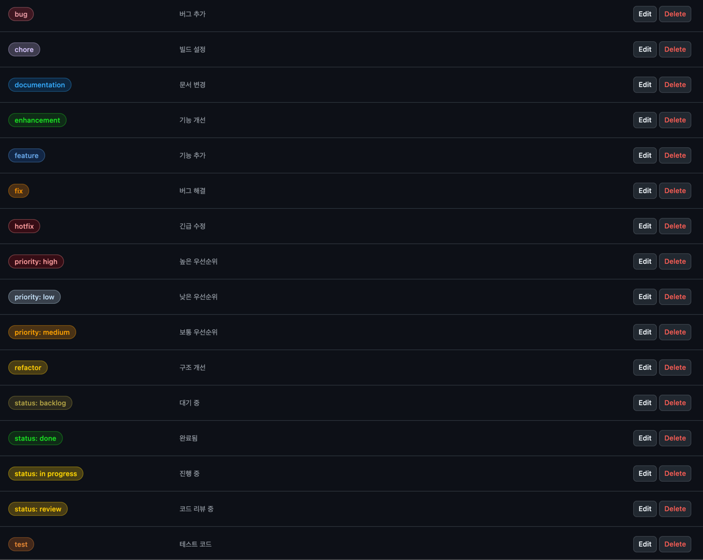

협업 프로젝트를 진행하면서 항상 처음 고민하는 것 중 하나가 Git 컨벤션일 것이다.
이 글에서는 협업을 하면서 굳혀진 컨벤션들을 공유하며 이 부분에 대해서 고민하는 개발자들에게 도움이 되길 바란다.
참고로 이 글은 개인적인 경험과 다른 개발자들의 컨벤션을 참고하여 작성되었다.
또한 지라의 티켓팅 방식을 사용하지 않는 다는 가정하에 작성했다.

## Git branching model

깃 브랜칭 전략은 다양한 방법이 있지만, 
아래 링크는 유명한 깃 브랜칭 전략 중 하나인 `git-flow` 전략이다.
많은 프로젝트에서 사용되는 전략이므로 참고하면 좋을 것이다.

[Successful Git branching model](https://nvie.com/posts/a-successful-git-branching-model/)

## Git commit convention

```markdown
<type>(<issue number>): <short summary>

<optional detailed description>
```

- `type`은 아래와 같이 정의할 수 있다.
  - `feat`: 새로운 기능 추가
  - `fix`: 버그 수정
  - `docs`: 문서 수정
  - `refactor`: 리팩토링 (기능 변경 없이 코드 개선)
  - `test`: 테스트 코드 추가/수정
  - `chore`: 빌드 관련 수정
  - `ci`: CI/CD 관련 수정
  - `revert`: 커밋 되돌리기

- `issue number`는 이슈 번호로 깃허브에서 이슈를 생성할 때 부여되는 번호를 의미한다.

- `short summary`는 커밋의 간단한 요약이다. 커밋 메시지의 첫 줄은 50자 이내로 작성하는 것이 좋다.

- `optional detailed description`은 커밋의 상세한 내용을 작성한다.

참고한 링크들은 아래와 같다.
더 자세한 내용을 알고 싶다면 맨 아래 링크를 참고하면 좋을 것이다.
다음 섹션들에 대한 참고 링크도 같은 위치해 있으니 참고하길 바란다.

## Git branch convention

```markdown
<type>/<issue-number>-<short-description>
```

브랜치 이름에 `issue-number`를 넣은 이유는 어떤 이슈에 대한 작업인지 명확하게 표현하는 것이 좋다고 생각해서 추가했지만,
이 또한 입맛대로 수정해도 되는 부분일 것이다.

- type
    - `feature/`: 새로운 기능 개발
    - `fix/`: 버그 수정
    - `hotfix/`: 긴급 수정
    - `test/`: 테스트 관련
    - `chore/`: 기타 작업
    - `docs/`: 문서 작업

## Label



라벨은 위의 이미지처럼 해도 되고 현재 프로젝트 상황에 맞는 라벨 전략을 도입하면 좋을 것이다. 

```markdown
<type><status><priority>
```

- type
    - `bug`: 버그 수정
    - `hotfix`: 긴급 수정
    - `chore`: 빌드 설정
    - `refactor`: 코드 개선
    - `test`: 테스트 코드
    - `documentation`: 문서 변경
    - `feature`: 기능 추가
    - `enhancement`: 기능 개선

- status
    - `status: done`: 완료됨
    - `status: review`: 코드 리뷰 중
    - `status: in progress`: 진행 중
    - `status: backlog`: 대기 중

- priority
    - `priority: high`: 높은 우선 순위
    - `priority: medium`: 보통 우선 순위
    - `priority: low`: 낮은 우선 순위

## Issue template

```markdown
[<type>] <short-description>
```

- type
    - `Bug`: 버그 수정
    - `Feature`: 기능 추가
    - `Fix`: 기존 기능의 오류 수정
    - `Refactor`: 리팩토링
    - `Docs`: 문서 변경
    - `Chore`: CI/CD, 빌드 수정
    - `Test`: 테스트 코드

본문은 아래와 같다.

```markdown
## 개요
<!-- 내용을 간략하게 설명 -->

## 상세 설명
<!-- 작업한 내용을 설명 -->

## 작업 내용
- [ ] TODO
- [ ] TODO
- [ ] TODO

## 참고 사항(선택)
<!-- 추가적으로 공유할 내용 -->
```

## Pull request template

```markdown
[<type>] <issue-number>-<short-description>
```

- type
  - `Bug`: 버그 수정
  - `Feature`: 기능 추가
  - `Fix`: 기존 기능의 오류 수정
  - `Refactor`: 리팩토링
  - `Docs`: 문서 변경
  - `Chore`: CI/CD, 빌드 수정
  - `Test`: 테스트 코드

본문은 아래와 같다.

```markdown
## 개요
<!-- 내용을 간략하게 설명 -->

## 작업 내용
<!-- 작업한 내용을 간략하게 설명 -->

## 관련 이슈
<!-- 해당 PR이 해결하는 이슈 번호: `#1` -->
<!-- ex) `#200 (로그인 관련 Issue)` -->

## 참고 사항(선택)
<!-- 리뷰어가 참고해야 할 사항 -->

<type> <issue-number>, <issue-number>
-> closes #10

```

마지막에 `Closes #10`과 같이 작성하면 해당 PR이 이슈를 해결했을 때 자동으로 이슈를 닫을 수 있다.
이 외에도 아래와 같은 키워드를 사용할 수 있다.

- type
  - `close`
  - `closes`
  - `closed`
  - `fix`
  - `fixes`
  - `fixed`
  - `resolve`
  - `resolves`
  - `resolved`

## Bug report template

버그 리포트 템플릿은 이슈 템플릿과 비슷하지만 버그 리포트에 특화된 템플릿을 따로 관리하는 것이 좋다고 생각한다.

```markdown
[Bug] <short-description>
```

```markdown
## 버그 설명
<!-- 어떤 문제가 발생했는지 간략하게 설명 -->

## 재현 방법
<!-- Given-When-Then으로 설명 -->

## 예상되는 동작
<!-- 정상적으로 작동해야 할 동작을 설명 -->

## 관련 이슈
<!-- 해당 PR이 해결하는 이슈 번호: `#1` -->

## 참고 사항(선택)
<!-- 추가적으로 공유할 내용 -->
```

## 참고

[Github PR merge](https://yeoonjae.tistory.com/entry/Project-Github-PR-merge-%EC%8B%9C-issue-%EC%9E%90%EB%8F%99-close-%EB%B0%A9%EB%B2%95)

[Joel Parker Henderson, Git commit message](https://github.com/joelparkerhenderson/git-commit-message/blob/main/README.md)

[Joel Parker Henderson, Git commit template](https://github.com/joelparkerhenderson/git-commit-template/blob/main/git-commit-template.txt)

[Conventional commits](https://www.conventionalcommits.org/en/v1.0.0/)

[qoomon, conventional commits cheatsheet](https://gist.github.com/qoomon/5dfcdf8eec66a051ecd85625518cfd13)

[digitaljhelms, Git/GitHub branching standards & conventions](https://gist.github.com/digitaljhelms/4287848)

[Abhay Amin, Naming conventions for Git Branches — a Cheatsheet](https://medium.com/@abhay.pixolo/naming-conventions-for-git-branches-a-cheatsheet-8549feca2534)

[jpolete, Git Branching Strategy](https://gist.github.com/jpolete/aa31b9043e8e90f8a47c7738669555fa)

[Jack Pritom Soren, GitHub Branching Name Best Practices](https://dev.to/jps27cse/github-branching-name-best-practices-49ei)

[In-Jun Hwang, Git Branch Naming: For Effective Collaboration](https://blog.injun.dev/posts/git-branch-naming-conventions/)

[GitHub Docs, Managing labels](https://docs.github.com/en/issues/using-labels-and-milestones-to-track-work/managing-labels)

[all contributors, Labels](https://github.com/all-contributors/all-contributors/labels?sort=count-desc)

[kentcdodds, Issue Template](https://github.com/kentcdodds/issue-template)

[stevemao, GitHub issue templates](https://github.com/stevemao/github-issue-templates)

[GitHub Docs, Creating a pull request template for your repository](https://docs.github.com/en/communities/using-templates-to-encourage-useful-issues-and-pull-requests/creating-a-pull-request-template-for-your-repository)

[amaran-th, Github Issue & PR Template](https://amaran-th.github.io/Github/%5BGithub%5D%20Issue%20&%20PR%20Template%20%EC%84%A4%EC%A0%95%ED%95%98%EA%B8%B0/)

[GitHub Docs, Linking a pull request to an issue](https://docs.github.com/en/issues/tracking-your-work-with-issues/using-issues/linking-a-pull-request-to-an-issue)

[GitHub Docs, Configuring the template chooser](https://docs.github.com/articles/configuring-issue-templates-for-your-repository#configuring-the-template-chooser)

[lisawolderiksen, Using Git Commit Message Templates to Write Better Commit Messages](https://gist.github.com/lisawolderiksen/a7b99d94c92c6671181611be1641c733)