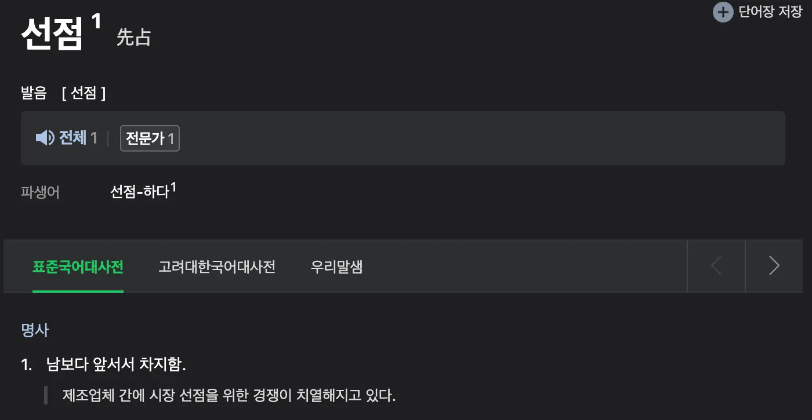
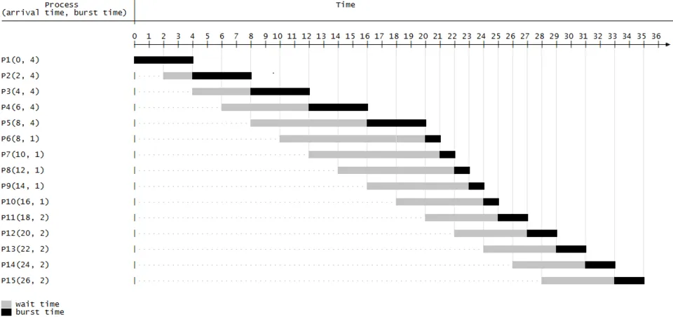
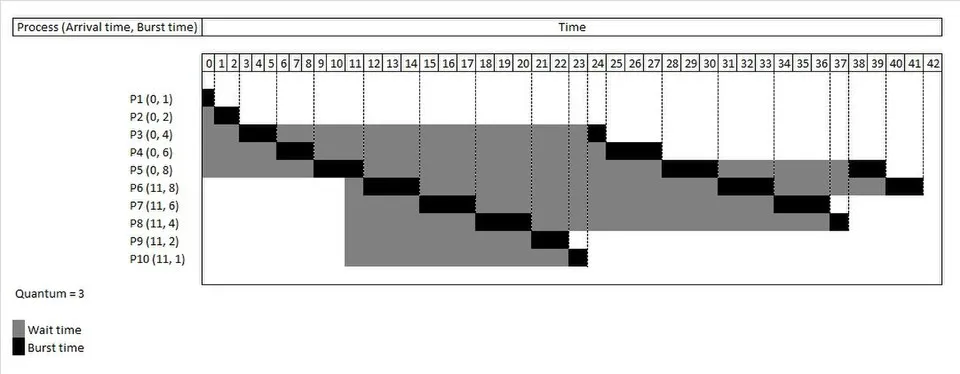
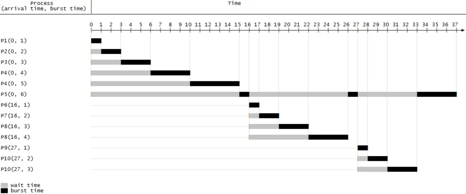

## 기아 상태와 CPU 스케줄링

프로세스들은 실행할 때 컴퓨터 자원을 사용하는데, 이때 CPU도 사용합니다.
그런데 만약 하나의 프로세스가 오랜 시간 동안 CPU를 점유하거나, 
너무 짧은 텀동안만 실행되는 경우 공정하지 못한 방법으로 자원을 할당하게 될 것이고
이는 시스템의 효율적이지 못한 방법으로 돌아가게 하는 길을 초래할 수 있을 겁니다.
이를 컴퓨팅에서는 기아 현상이라고 하는데,
이로 인해 프로세스들에게 CPU 자원 할당을 배분해주는 CPU 스케줄링이 개발되었고,
운영체제에 반드시 필요로 하게 되었습니다.

> 기아 현상에 대한 대표적인 해결 방법은 에이징 기법을 이용하는 것입니다.
> 오랫동안 대기한 프로세스의 우선순위에 대해 가중치를 주어,
> 처음에 우선순위가 낮아도 언젠가는 우선순위가 높아져 기아 현상을 막을 수 있습니다.
> 이와 같이 CPU 스케줄링에서는 이러한 문제 해결을 위한 다양한 방식들이 있습니다. 

## 프로세스 우선 순위

스케줄링을 지정하는 것은 순서를 지정하는 것과 같습니다.
그런데 어떻게 프로세스들 간의 순위를 공정하게 지원하고 있을까요?

### 순차방식

가장 단순하게 생각해보면 요청이 들어온 순서대로 할당하는 방식입니다.
그러나 이 방식은 빨리 처리해야 하는 프로세스가 있을 수 있는 상황에서 대응하지 못한다는 것입니다.

예시로 CPU를 많이 사용하는 프로세스가 I/O 작업을 하는 프로세스 보다 늦게 들어올 경우,
순서상으로는 뒤에 있어야 하지만, CPU 자원을 할당한다는 측면에서 볼 떄에는 앞 순위로 두는 것이 효울적일 것입니다.

### 우선순위 지정 방식

위 순차적인 방식이 아닌, 별도의 우선순위를 지정하는 방식도 있습니다.
이때, 우선순위에 대한 정보는 PCB에 저장이 됩니다.

이로 인해 프로세스의 중요도에 맞게 프로세스가 CPU를 이용할 수 있도록 운영체제가 부여하는 것이 우선순위이며,
운영체제는 PCB를 기반으로 어떤 프로세스가 CPU를 얼마나 사용하게 될 것인지 등을 결정합니다.
 
프로세스 우선순위는 간단한 명령어나 프로그램 등으로 확인이 가능한데, 
일부 우선순위의 경우에는 사용자가 직접 설정 가능한 것도 있습니다. 

### 스케줄링 큐

프로세스가 여러 개일 경우, 다음 CPU 자원을 이용할 프로세스를 선택하기 위해 매번 모든 프로세스들의 PCB를 다 뒤져보는 것은 매우 비효율적일 것입니다.
또한, CPU 말고도, 메모리, 입출력 장치를 사용하고자 하는 경우에도 비슷한 상황을 겪을 것입니다.

때문에 운영체제는 어떤 자원을 이용하고자 할 때 대기 하는 스케줄링 큐를 활용하고 있습니다.

이때, 큐라고 해서 반드시 선입선출(FIFO)에 국한되지 않습니다.

## 선점형 스케줄링과 비선점형 스케줄링

스케줄링 방식에는 선점형 스케줄링과 비선점형 스케줄링 방식이 있습니다.

### 선점형 스케줄링

선점형 스케줄링은 현재 CPU를 사용 중인 프로세스로부터 CPU 자원을 뺴앗아 요청한 프로세스에 할당하는 방법입니다.
어느 한 프로세스의 자원 독점을 막고 프로세스에 골고루 자원을 배분할 수 있으나, 그 만큼 컨텍스트 스위칭 과정에서 오버헤드가 발생할 수 있습니다.

### 비선점형 스케줄링

비선점형 스케줄링은 현재 CPU를 사용 중인 프로세스의 작업이 끝날 때까지 기다리는 방식입니다.

선점형 스케줄링과 반대되는 개념으로, 컨텍스트 스위칭에서 발생하는 오버헤드가 적지만, 한편으로는 모든 프로세스가 골고루 자원을 이용하기 어렵습니다.

## CPU 스케줄링 알고리즘

선점형 스케줄링과 비선점형 스케줄링을 기반으로 다양한 CPU 스케줄링 알고리즘이 있습니다. 

### 선입 선처리 스케줄링

FCFS(First Come First Served) 스케줄링으로, 준비 큐에 삽입된 순서대로 처리하는 비선점 스케줄링 방식입니다.
CPU를 먼저 요청한 프로세스부터 CPU를 할당합니다.
이로 인해 프로세스들이 기다리는 시간이 매우 길어질 수 있는 부작용이 있으며,
이를 convoy effect, 호위 효과라고 합니다.

### 최단 작업 우선 스케줄링

SJF(Shortest Job First) 스케줄링으로,
사용 시간이 긴 프로세스를 나중에 실행하고, 
시간이 짧은 프로세스를 먼저 실행함으로써 평균 대기 시간을 줄일 수 있습니다.
이 알고리즘은 기본적으로는 비선점형 스케줄링 방식에 속하지만,
선점형과 비선점형 스케줄링 방식으로 모두 가능합니다.

### 라운드 로빈 스케줄링

RR(Round Robin) 스케줄링으로, 
선입 선처리 스케줄링과 시분할 시스템의 타임 슬라이스(time slice) 개념이 결합된 방식입니디.
정해진 타임 슬라이스만큼의 시간 동안 돌아가며 CPU를 이용하게 하는 선점형 스케줄링입니다.

### 최소 잔여 시간 우선 스케줄링

SRT(Shortest Remaining Time) 스케줄링으로,
최단 작업 우선 스케줄링과 라운드 로빈 스케줄링이 결합된 형태입니다.
정해진 시간만큼 CPU를 이용하되, 
다음으로 CPU를 사용할 프로세스로는 남은 작업 시간이 가장 적은 프로세스를 선택합니다.

### 우선순위 스케줄링

프로세스들에 우선순위를 부여하고, 우선순위가 높은 프로세스부터 실행하는 방식입니다.
우선순위가 같은 프로세스들은 선입 선처리 스케줄링으로 돌아가고,
최단 작업 우선 스케줄링이나 최소 잔여 시간 스케줄링은 포괄적인 의미에서 우선순위 스케줄링에 속한다고 할 수 있습니다.

### 다단계 큐 스케줄링

멀티 레벨 큐 스케줄링으로도 불리는데, 우선순위 스케줄링의 발전된 형태입니다.
우선순위 별로 준비 큐를 여러 개 사용하고, 우선순위가 높은 큐에 있는 프로세스를 먼저 실행합니다.
우선순위가 높은 큐가 비어 있다면, 그 다음 우선순위 큐에 있는 프로세스를 처리합니다.
이러한 방식은 프로세스 유형별로 우선순위를 구별하게 하여 관리가 쉬워집니다.
큐 별로 타임 슬라이스를 여러 개 지정할 수도 있고, 큐마다 다른 스케줄링 알고리즘을 사용할 수도 있습니다.
기본적으로 큐 간 이동이 불가능하기 때문에, 우선순위가 낮은 프로세스는 계속해서 우선순위가 낮을 수 밖에 없고,
그로 인해 기아 현상을 겪을 수도 있습니다.

### 다단계 피드백 큐 스케줄링

멀티 레벨 피드백 큐 스케줄링으로도 불리는 이 방식은 다단계 큐 스케줄링의 발전된 형태로,
큐 간 이동이 가능합니다.
새로 준비 상태로 된 프로세스가 있으면 가장 우선순위가 높은 큐에 삽입합니다.
일정 시간 즉, 타임 슬라이스 만큼 CPU를 사용할 수 있는데,
만약 작업이 끝나지 않았다면,
그때 우선순위가 다음으로 높은 곳에 삽입을 합니다.
이로 인해 작업을 많이 있는 프로세스일수록 우선순위가 점점 낮아지게 되어서,
결과적으로 CPU 집중 프로세스는 상대적으로 우선순위가 낮아지고, 입출력 집중 프로세스는 높아지게 되는 양상을 보이게 됩니다.
다단계 큐 스케줄링은 이렇게 일정 시간 이상 낮은 우선순위에서 기다리고 있던 프로세스가 있었다면 이 프로세스의 우선순위를 점차 높임으로써 기아 현상을 방지할 수 있습니다.
다단계 피드백 큐 스케줄링은 CPU 사용 시간이 길면 우선순위가 점점 낮아지고, 동시에 어떤 프로세스가 낮은 우선순위 큐에서 너무 오래 기다리면 우선순위를 높일 수도 있습니다.
이렇듯 다단계 피드백 큐 스케줄링은 복잡하지만, CPU 스케줄링의 가장 일반적인 형태로 알려져 있습니다.
