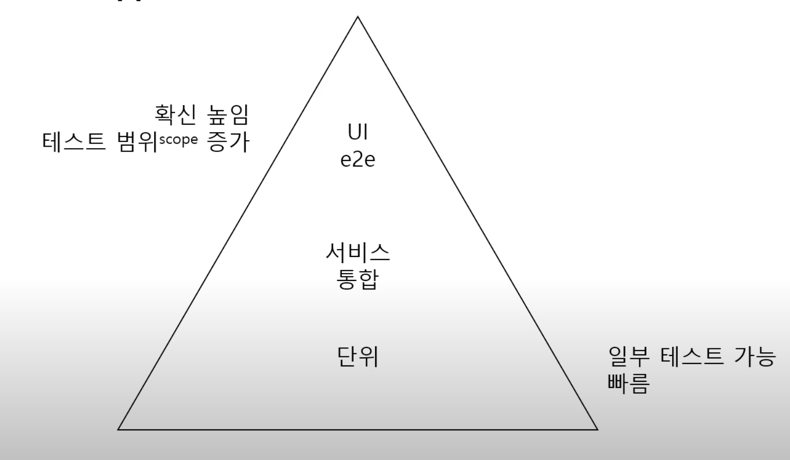

## 개발을 (거의) 완료했다는 것의 의미

완료의 의미를 생각해보면 (거의) 사용 가능한 상태까지 만든 것을 완료했다라고 말할 수 있을 것 같다.
개발을 배포한 상태라던가, QA 전 상태라던가, 운영 배포 전 상태라던가 
이런식 개발을 완료했다라는 것은 실제로 요구한 기능을 거의 사용 가능한 상태로 만들었다고 정의할 수 있을 것이다

완료에 필요한 개발활동은 그럼 무엇이 있을까?
나열을 해보면, 일단 뭔가 분석을 하고,
분석한 결과를 갖고,
어떻게 만들지 설계하는 과정을 거치고, 
코딩을 한 다음, 
그 코딩한 결과물을 검증을 할 것이고, 
검증 과정에서 버그가 나오면 버그를 수정해야할 것이고,
요구는 항상 변하니까 그 요구를 바녕ㅇ하는 것도 무언가를 완료짓는 행동일 것이다.

## 개발 시간을 줄이려면?

이러한 다양한 활동이 있는데 개발 시간을 줄이려면 우리는 어떻게 해야 하나?
요구 분석을 멀쩡하게 하고, 설계를 멀쩡하게 하면 나중에 뭔가 요구가 변경되는 것을 줄일 수 있을 것이다.
버그 또한 줄어들 것이다.
코딩 자체는 코딩 시간을 짧을 수록 개발 시간을 줄 것이고,
검증은 얼마나 더 잘 검증하느냐에 따라서 버그 수정 시간이 줄어들 것이다.
QA 이후 발생하는 버그가 줄어들 것이고, 검증 또한 중요할 것이다.

## 기능 검증

이러한 기능 검증은 기본적으로 개발자의 몫이라고 생각을 한다.
여기서 검증은 어떠한 범위까지 할 것인지는 정상인 상황과 예외인 상황까지 고려해야 할 것이다.
이런 검증은 당연히 개발자가 해야할 것이다.

## 수동 테스트

이런 검증을 수동으로 한다면, 아무래도 검증하는 범위에 누락이 발생할 여지가 있다.
예를 들면, 특정 기능 관련 코드를 변경했으면 보통 그 변경된 코드만 테스트만 할 것인데,
이는 사이드 이펙트까지 확인하기 어렵다.
또한 다양한 경우의 수를 수동으로 테스트 하거나 외부 서비스 오류 상황 만들기 등은 어렵다.
한다고 해도 오래 걸릴 것이다. 물론 누락과 함께 말이다.

## 자동화된 테스트

그럼 우린 뭐가 필요할까?
바로 자동화된 테스트가 필요하다.
자동화 테스트는 실행할 수 있는 테스트 의미한다.
실행할 수 있다는 것은 코드로 해석할 수 있는 수단으로 작성을 한다는 것이다.
이러한 자동화된 테스트가 쌓이면 쌓일수록, 수정한 코드로 인해 다른 코드에 문제가 생기지 않는지 확인이 가능하다($회귀^{regression}$ 테스트).
그리고 검증하게 되는, 할 수 있는 $범위^{coverage}$ 또한 넓어질 것이다.

내가 만드는 코드에 따라 달라지겠지만, 수 초에서 수 분 내로 완료가 될 것이다.
빌드 과정에서 이런 과정을 실행하면 굉장히 좋은 효과 즉, 내 코드로 인한 사이드 이펙트에 대한 안정성을 이 시간안에 검증을 할 수 있는 효과를 볼 수 있을 것이다.

## 테스트 종류

테스트는 보통 크게 3가지 종류의 형태로 나누어 설명을 한다.

위와 같은 사진을 테스트 피라미드라고 하는데,
가장 위인 UI와 e2e 테스트는 사용자와의 접점과 외부 서비스 연동을 포함한 서비스를 테스트해서 전체적인 범위에 대해서 테스트를 한다.
단위 테스트는 가장 작은 단위인 함수 단위로 테스트를 한다. 일부 테스트가 가능하기 때문에 빨라서 보통 단위 테스트를 많이 작성한다.
통합 테스트는 단위 테스트와 UI 테스트의 중간 정도의 범위를 테스트 한다.

## 정리

정리를 해보면, 테스트는 (개발자의) 안정감과 자신감을 높인다.
내가 만든 코드가 다른 기능을 망가뜨리면 빌드가 안되기 때문에,
내가 뭔가 실수를 해도 시스템에 이상한 코드가 나가지 않을거라는 일종의 안전망이 있어 안정감과 자신감을 준다.

추가로 작성하는 코드가 부담일 수 있으나, 얻는 이점이 이를 상쇄하기에 충분히 더 크다.
실제로 수동 검증과 이로 인해 누락된 버그로 버그 수정을 하는 이 시간과 테스트 코드 작성 시간을 볼 때,
테스트 코드를 작성하는 시간이 실질적으로 더 적다.

문제는 주로 테스트 코드를 만들지 않은 지점에서 발생한다. 
그래서 테스트 커버리지를 일정 수준 이상으로 유지하는 것이 중요하다.
이걸 위해 테스트 코드를 작성하다보면 70~80% 정도의 커버리지를 유지하는 것이 현실적일 것이다.

