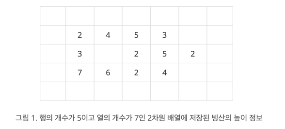

## 빙산

[백준 2573번 빙산](https://www.acmicpc.net/problem/2573)

| 시간 제한 | 메모리 제한 | 제출     | 정답    | 맞힌 사람 | 정답 비율   |
|:------|:-------|:-------|:------|:------|:--------|
| 1 초   | 256 MB | 88883 | 26083 | 17319 | 26.639% |

### 문제

지구 온난화로 인하여 북극의 빙산이 녹고 있다. 
빙산을 그림 1과 같이 2차원 배열에 표시한다고 하자. 
빙산의 각 부분별 높이 정보는 배열의 각 칸에 양의 정수로 저장된다. 
빙산 이외의 바다에 해당되는 칸에는 0이 저장된다. 
그림 1에서 빈칸은 모두 0으로 채워져 있다고 생각한다.



빙산의 높이는 바닷물에 많이 접해있는 부분에서 더 빨리 줄어들기 때문에, 
배열에서 빙산의 각 부분에 해당되는 칸에 있는 높이는 일년마다 그 칸에 동서남북 네 방향으로 붙어있는 0이 저장된 칸의 개수만큼 줄어든다. 
단, 각 칸에 저장된 높이는 0보다 더 줄어들지 않는다. 
바닷물은 호수처럼 빙산에 둘러싸여 있을 수도 있다. 
따라서 그림 1의 빙산은 일년후에 그림 2와 같이 변형된다. <br>

그림 3은 그림 1의 빙산이 2년 후에 변한 모습을 보여준다. 
2차원 배열에서 동서남북 방향으로 붙어있는 칸들은 서로 연결되어 있다고 말한다. 
따라서 그림 2의 빙산은 한 덩어리이지만, 
그림 3의 빙산은 세 덩어리로 분리되어 있다.


한 덩어리의 빙산이 주어질 때, 이 빙산이 두 덩어리 이상으로 분리되는 최초의 시간(년)을 구하는 프로그램을 작성하시오. 
그림 1의 빙산에 대해서는 2가 답이다. 
만일 전부 다 녹을 때까지 두 덩어리 이상으로 분리되지 않으면 프로그램은 0을 출력한다.

### 입력

첫 줄에는 이차원 배열의 행의 개수와 열의 개수를 나타내는 두 정수 N과 M이 한 개의 빈칸을 사이에 두고 주어진다. 
N과 M은 3 이상 300 이하이다. 
그 다음 N개의 줄에는 각 줄마다 배열의 각 행을 나타내는 M개의 정수가 한 개의 빈 칸을 사이에 두고 주어진다. 
각 칸에 들어가는 값은 0 이상 10 이하이다. 
배열에서 빙산이 차지하는 칸의 개수, 
즉, 1 이상의 정수가 들어가는 칸의 개수는 10,000 개 이하이다. 
배열의 첫 번째 행과 열, 마지막 행과 열에는 항상 0으로 채워진다.

### 출력

첫 줄에 빙산이 분리되는 최초의 시간(년)을 출력한다. 
만일 빙산이 다 녹을 때까지 분리되지 않으면 0을 출력한다.

---

## 풀이

이 문제는 BFS를 활용한 그래프 탐색과 시뮬레이션 기능 구현을 통해 해결했다. 
먼저 입력받은 2차원 배열에서 빙산의 높이를 바닷물과 접한 칸의 개수만큼 줄이는 연산을 매년 수행하며, 
`exploreChunks` 메서드를 통해 빙산의 덩어리 개수를 구했고, 
빙산 덩어리가 2개 이상이면 무한루프를 탈출하고 연수를 반환하게 했다.
이때 `exploreChunks` 메서드는 BFS 탐색을 통해 빙산 덩어리의 개수를 구하는 메서드이다.
빙산 덩어리의 개수를 구하는 것은 `directions` 배열을 활용한 BFS 탐색을 통해 구현했다.
`matrixs`의 크기만큼 순회하며 빙산이면 큐에 넣고, 방문처리를 했다.
`isAllMelted` 메서드 구현을 통해 모든 빙산의 높이가 0이면 모두 녹았다고 판단하고 0을 반환하게 했다.

우선 이렇게 구현을 해서 테스트 값에 대한 결과가 일치하는 것을 보고, 제출했다.
하지만 테스트 케이스에 대한 결과는 일치했지만, 이유 모를 원인으로 인해 실패했다.

그래서 다시 코드를 살펴보니, 빙산이 녹는 연산을 수행할 때, 새로운 배열에 값을 저장하고,
이를 다시 `matrix`에 할당하는 방식으로 구현했어야 했다.

이유는 참조값에 대해 동시성 문제였다.
하나의 `matrix`에서 값을 참조하면서,
수정을 하는 탓에 동시성 문제가 발생해서 이전 값이 변경되는 문제가 발생했다.

다음엔 이런 실수를 하지 않도록 주의해야겠다.

```java
package test.code;

import java.io.*;
import java.util.*;

class IceBerg {
    private int rows;
    private int columns;
    private int[][] matrix;
    private final int [][] directions = {{-1, 0}, {1, 0}, {0, -1}, {0, 1}};

    private IceBerg(int rows, int columns, int[][] matrix) {
        this.rows = rows;
        this.columns = columns;
        this.matrix = matrix;
    }

    public static IceBerg of(int rows, int columns, int[][] matrix) {
        return new IceBerg(rows, columns, matrix);
    }

    private int simulate() {
        int years = 0;

        while (true) {
            int chunks = countChunks();
            if (chunks >= 2) {
                return years;
            }
            if (isAllMelted()) {
                return 0;
            }
            meltIceburg();
            years++;
        }
    }

    private void meltIceburg() {
        int[][] newMatrix = new int[rows][columns];
        for (int row = 0; row < rows; row++) {
            for (int column = 0; column < columns; column++) {
                if (matrix[row][column] > 0) { // 빙산일 경우
                    int water = 0;
                    for (int[] direction : directions) {
                        int movedRow = row + direction[0];
                        int movedColumn = column + direction[1];
                        if (movedRow >= 0 && movedRow < rows && movedColumn >= 0 && movedColumn < columns && matrix[movedRow][movedColumn] == 0) {
                            water++;// 주변 바다 수
                        }
                    }
                    newMatrix[row][column] = Math.max(0, matrix[row][column] - water);
                } else {
                    newMatrix[row][column] = 0;
                }
            }
        }
        matrix = newMatrix;
    }

    private int countChunks() {
        int chunks = 0;
        boolean[][] visited = new boolean[rows][columns];
        for (int row = 0; row < rows; row++) {
            for (int column = 0; column < columns; column++) {
                if (matrix[row][column] > 0 && !visited[row][column]) {
                    exploreChunk(row, column, visited);
                    chunks++;
                }
            }
        }
        return chunks;
    }

    private void exploreChunk(int row, int column, boolean[][] visited) {
        Queue<int[]> queue = new LinkedList<>();
        queue.offer(new int[]{row, column});
        visited[row][column] = true;
        while (!queue.isEmpty()) {
            int[] current = queue.poll();
            int currentRow = current[0];
            int currentColumn = current[1];

            for (int[] direction : directions) {
                int movedRow = currentRow + direction[0];
                int movedColumn = currentColumn + direction[1];
                if (movedRow >= 0 && movedRow < rows && movedColumn >= 0 && movedColumn < columns && matrix[movedRow][movedColumn] > 0 && !visited[movedRow][movedColumn]) {
                    queue.offer(new int[]{movedRow, movedColumn});
                    visited[movedRow][movedColumn] = true;
                }
            }
        }
    }

    // 빙산이 다 녹았는 지 확인
    private boolean isAllMelted() {
        for (int row = 0; row < rows; row++) {
            for (int column = 0; column < columns; column++) {
                if (matrix[row][column] > 0) {
                    return false;
                }
            }
        }
        return true;
    }

    public int getMinimumYears() {
        return simulate();
    }
}

public class Main {
    public static void main(String[] args) throws IOException {
        // 2차원의 배열
        // 각 빙산의 높이 -> 양의 정수로 저장
        // 빙산 이외의 바다 -> 0
        // 1년마다 상하좌우 방향의 0의 개수 만큼 줄어듦(0까지 줄어듦) -> bfs, 상하좌우 탐색
        // 한 덩어리의 빙산이 주어짐 -> 두 덩어리가 되는 최소 시간 -> bfs, visited 전과 다를 떄
        // 만일 전부 녹을때까지 두 덩어리로 분리되지 않으면 0을 출력
        // 빙하는 10,000개 이하
        BufferedReader reader = new BufferedReader(new InputStreamReader(System.in));
        StringTokenizer tokenizer = new StringTokenizer(reader.readLine());
        int rows = Integer.parseInt(tokenizer.nextToken()); // 3 <= rows <= 300
        int columns = Integer.parseInt(tokenizer.nextToken()); // 3 <= columns <= 300
        int[][] matrix = new int[rows][columns];
        for (int row = 0; row < rows; row++) {
            tokenizer = new StringTokenizer(reader.readLine());
            for (int column = 0; column < columns; column++) {
                matrix[row][column] = Integer.parseInt(tokenizer.nextToken()); // 0<= matrix[row][column] <= 10
            }
        }
        reader.close();

        int result = IceBerg.of(rows, columns, matrix).getMinimumYears();
        BufferedWriter writer = new BufferedWriter(new OutputStreamWriter(System.out));
        writer.write(result + "\n");
        writer.flush();
        writer.close();
    }
}
```