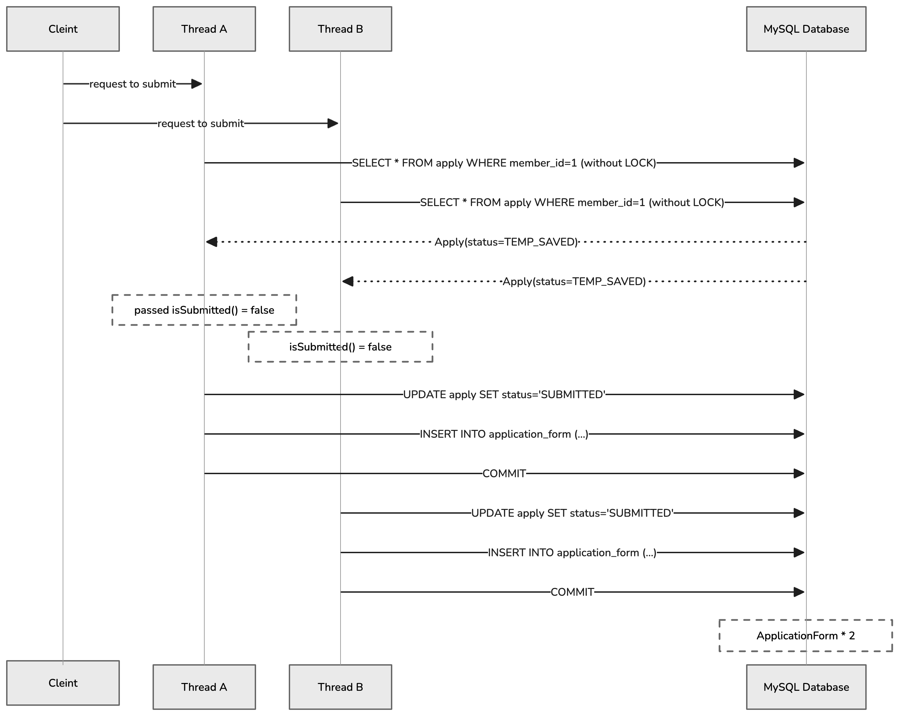
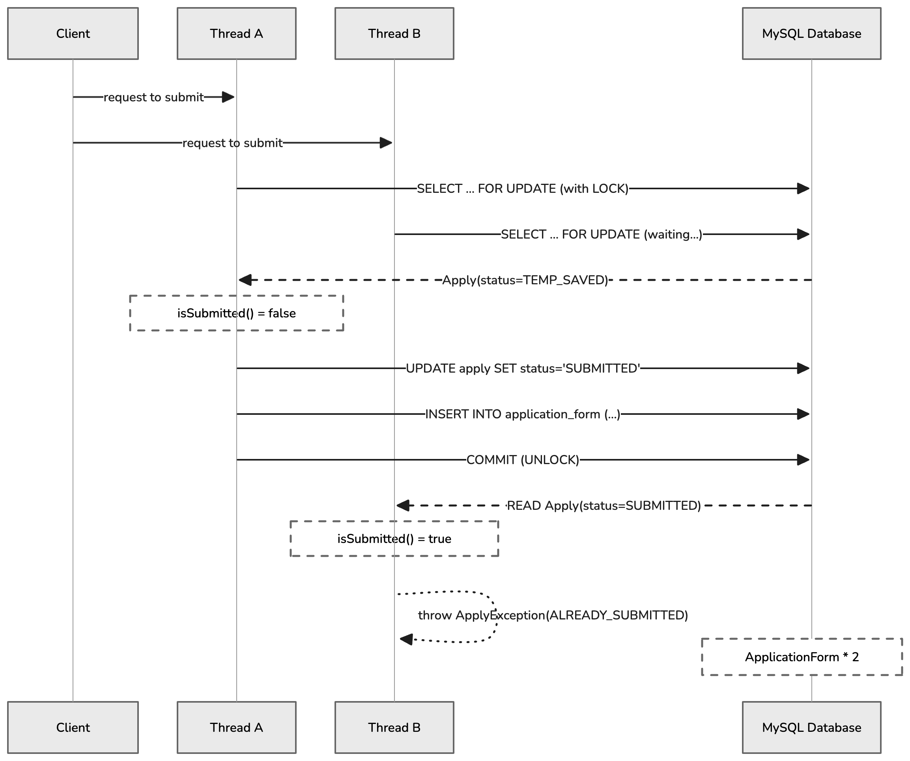

JECT 서비스는 모집 기간마다 지원자들의 지원서 데이터를 실시간으로 수신받아 관리합니다. 특히 지원서 제출은 모집 마감 직전 짧은 시간에 많은 요청이 몰리는 성향을 가지고 있다.

## 문제 상황

모집 마감 직전 등 짧은 시간에 동일 사용자가 제출 버튼을 여러 번(따닥 클릭) 급하게 누르거나, 네트워크 지연으로 인한 자동 재시도가 일어날 경우 서버에서 제출 처리가 중복 자원으로 수행되어 하나의 지원(Apply) 도메인에 두 개 이상의 지원서(ApplicationForm)가 생성되는 데이터 정합성이 깨지는 것을 발견했다.

```java
// Apply 도메인의 제출 처리
public void submit(ApplicationForm applicationForm) {
    if (isSubmitted()) {
        throw new ApplyException(ApplyErrorCode.ALREADY_SUBMITTED);
    }
    this.applicationForm = applicationForm;
    this.status = ApplyStatus.SUBMITTED;
}
```

```java
@Transactional
public void submitApplication(Long memberId, JobFamily jobFamily,
                               Map<String, String> answers, List<ApplyPortfolioDto> portfolios) {
    // 코드 생략 ...

    // 락 없이 조회 — 동시 요청 시 여러 스레드가 동일한 TEMP_SAVED 상태를 읽음
    Apply apply = applyRepository.findByMemberIdInActiveRecruit(memberId, LocalDateTime.now())
            .orElseThrow(() -> new ApplyException(NOT_FOUND_APPLY));

    apply.submit(applicationForm);  // 두 트랜잭션 모두 검증을 통과하여 이중 제출 발생
}
```

코드를 보면 제출 전 `isSubmitted()`를 통해 상태를 검증하지만, 해당 검증은 동일한 트랜잭션 내(1차 캐시)에서만 유효하다. 영속성 컨텍스트는 트랜잭션 단위로 격리된 메모리 공간을 제공해서 분리된 서로 다른 스레드가 동시에 접근할 경우 각자의 1차 캐시에서 독립적인 엔티티 스냅샷을 유지하게 된다.

그래서 서로 다른 두 스레드가 동시에 `Apply` 데이터를 읽고 트랜잭션을 시작하면서 둘 다 아직 제출되지 않은 상태인 `isSubmitted() = false`로 검증 통과하게 되었고, 결국 DB에는 중복된 `ApplicationForm`이 만들어지는 전형적인 Race Condition이 발생했던 것이었다.



이러한 경합 결과로 인해 단일 지원서 객체에 대하여 하위 `ApplicationForm` 데이터가 2개 이상 영속화되는 오류가 발생하며, 2차적인 장애를 유발할 수 있었다.

## 문제 해결

동시성 문제를 해결하기 위해 처음에는 낙관적 락을 우선적으로 고려했다. 비관적 락은 데이터베이스의 동시 처리량을 저하시킬 수 있고, 데드락 위험이 있다는 인식 때문에 자연스럽게 배제하려는 경향이 있었기 때문이다. 하지만 지원서 제출이라는 도메인의 특성을 기준으로 재검토해 보니, 일반적으로 알려진 낙관적 락의 장점이 이 시나리오에서는 유효하지 않다는 걸 느끼게 되었다.

먼저 락 경합의 범위를 살펴보면, 비관적 락이 치명적인 병목이 되는 경우는 쿠폰 발급처럼 다수의 사용자가 하나의 동일 레코드를 동시에 갱신하려는 상황이다. 
이 경우 모든 요청이 하나의 자원을 두고 대기하게 되면서 시스템 전체가 지연된다. 
반면 지원서 제출은 `WHERE a.member.id = :memberId` 조건을 기반으로 동작하기 때문에, 락의 범위가 특정 사용자 개인의 레코드로 제한된다. 
즉 A 사용자의 요청이 B 사용자에게 영향을 주지 않으며, 경합은 동일 사용자 내에서만 발생한다. 
이는 시스템 전체 관점에서 매우 국소적인 락이므로 충분히 감당 가능한 수준이라고 판단했다.

다음으로 낙관적 락의 핵심 장점인 재시도 가능성을 검토했다. 
낙관적 락은 충돌 발생 시 예외(`OptimisticLockingFailureException`)를 발생시키고, 최신 데이터를 다시 읽어 재시도하는 방식으로 문제를 해결한다.
이러한 방식은 프로필 수정이나 게시글 수정처럼 최신 상태를 반영해 다시 시도하는 것이 자연스러운 도메인에서는 효과적일 것이다.
하지만 최종 제출이라는 행위에도 통하는 논리인지 의심을 했다.
후행 스레드는 트랜잭션 커밋 직전에서 `OptimisticLockingFailureException`을 맞고 실패하게 되며, 재시도를 수행하더라도 결국 `SUBMITTED` 상태를 확인하게 되므로 낙관적 락이 제공하는 재시도 전략은 이 도메인에서는 실질적인 가치를 가지지 못한다고 판단했다.

또한 예외 처리 관점에서도 낙관적 락은 불리하다. 낙관적 락에서 발생하는 `OptimisticLockingFailureException`은 “이미 제출되었다”는 비즈니스 의미를 담고 있지 않고, 단순히 “데이터베이스 충돌이 발생했다”는 인프라 수준의 정보만을 전달한다. 따라서 애플리케이션 레벨에서는 이 예외를 포착한 뒤, 이를 “중복 제출”이라는 의미로 해석하고 다시 비즈니스 예외로 변환하는 별도의 예외 번역 로직이 필요해진다. 이는 불필요한 복잡도를 증가시키는 요소다.

반면 비관적 락(SELECT FOR UPDATE)을 적용하면 트랜잭션이 직렬화(Serialization)되어 동시 요청이 순차적으로 처리된다. 후행 스레드는 선행 스레드의 커밋이 완료될 때까지 대기하고, 이후 최신 상태(SUBMITTED)를 읽게 된다. 이 시점에서 기존에 구현된 if (apply.isSubmitted()) throw new ApplyException(...) 검증 로직을 그대로 활용할 수 있고, 의도한 비즈니스 예외를 자연스럽게 발생시킬 수 있다.

결국 비관적 락을 선택한 이유는 동시성 제어뿐만 아니라, 도메인 로직의 일관성을 유지하기 위함도 있었다. 시스템 에러를 의도적으로 발생시킨 뒤 사후 수습하기보다는, 처음부터 요청을 직렬화하여 “이미 앞선 처리가 완료되었다”는 상태를 기준으로 비즈니스 로직을 수행하는 것이 훨씬 명확하고 안정적이라고 판단했다. 

위와 같은 판단을 바탕으로, 제출 시점에만 비관적 락이 적용되도록 기존 조회 로직은 그대로 유지하면서, 실제 제출 처리에만 `SELECT FOR UPDATE`가 동작하도록 별도의 메서드를 추가했다.



```java
@Lock(LockModeType.PESSIMISTIC_WRITE)
@Query("SELECT a FROM Apply a JOIN a.recruit r WHERE a.member.id = :memberId AND r.startDate <= :now AND r.endDate >= :now")
Optional<Apply> findByMemberIdInActiveRecruitForUpdate(@Param("memberId") Long memberId, @Param("now") LocalDateTime now);
```


## 결과

실제 실행 환경에서도 완전히 제어되는지를 검증하기 위해, `CountDownLatch`와 `ExecutorService`를 활용한 동시성 테스트를 구성했다.

단순한 병렬 실행만으로는 스레드 생성 시점의 미세한 시간차 때문에 실제 `Race Condition`을 재현하기 어렵다. 따라서 모든 스레드를 `startLatch`에 대기시킨 뒤 하나의 트리거로 동시에 실행시키는 방식으로, 의도적으로 경쟁 상황을 만들어냈다.

```java
@Test
void 동시_제출_시_하나만_성공해야_한다() throws InterruptedException {
    int threadCount = 2;
    ExecutorService executorService = Executors.newFixedThreadPool(threadCount);
    
    // 동시성 제어를 위한 래치(Latch) 장치 설정
    CountDownLatch readyLatch = new CountDownLatch(threadCount);
    CountDownLatch startLatch = new CountDownLatch(1);  // 동시 시작 신호 통제용
    CountDownLatch doneLatch = new CountDownLatch(threadCount);

    AtomicInteger successCount = new AtomicInteger(0);
    AtomicInteger failCount = new AtomicInteger(0);

    for (int i = 0; i < threadCount; i++) {
        executorService.execute(() -> {
            try {
                readyLatch.countDown();   // 개별 스레드 준비 완료 신호 전송
                startLatch.await();       // 단일 트리거가 활성화될 때까지 완벽한 대기 상태 유지
                
                applyService.submitApplication(memberId, jobFamily, answers, List.of());
                successCount.incrementAndGet();
            } catch (Exception e) {
                failCount.incrementAndGet(); // 이미 제출되었거나 락 타임아웃 발생 시 실패 카운트 증가
            } finally { doneLatch.countDown(); }
        });
    }
    
    readyLatch.await();     // 메인 스레드는 모든 워커 스레드의 생성 및 대기를 확인
    startLatch.countDown(); // 동시 실행 트리거 활성화! (Race Condition 강제 유발)
    doneLatch.await();      // 전체 작업 완료 대기 및 메인 스레드 진행 재개

    // 검증: 동시 다발적인 요청에도 시스템은 정확히 1건의 트랜잭션만 성공시켜야 함
    assertThat(successCount.get()).isEqualTo(1); 
}
```

테스트를 수행한 결과, 락이 전혀 적용되지 않은 기존 환경에서는 모든 요청이 성공하며 `Race Condition`이 발생했다. 반면, 비관적 락이 적용된 개선 환경에서는 후행 스레드가 `SELECT FOR UPDATE`에 의해 대기 상태에 진입하고 선행 트랜잭션 커밋 이후 변경된 상태(`SUBMITTED`)를 읽어서 이후 애플리케이션 레벨의 `isSubmitted()` 검증 로직이 실행하게 되었고 데이터 정합성이 비즈니스 예외 형태로 정확히 보장되는 것을 단 1건만 성공하고 나머지는 정상적으로 차단됨으로 확인했다.

물론 비관적 락을 사용하면 일부 상황에서 대기 시간이 발생할 수 있다. 하지만 이 지연은 모든 요청에 영향을 주는 것이 아니라, 동일 사용자에 대한 동시 제출처럼 실제로 경합이 발생하는 경우에만 제한적으로 나타난다.

또한 지원서 제출은 초당 수만 건씩 발생하는 고빈도 API가 아니기 때문에, 약간의 지연을 감수하더라도 데이터 정합성을 확실하게 보장하는 것이 더 중요한 선택이라고 판단했다.

결국 락으로 인한 비용은 항상 발생하는 비용이 아니라 충돌이 발생했을 때만 지불하는 비용이며, 이러한 특성은 현재 도메인에서 충분히 합리적인 트레이드오프였다고 생각한다.

## 느낀 점

일반적으로는 성능과 확장성을 이유로 낙관적 락이 권장되는 경우가 대부분일 거로 생각된다. 그러나 이번 사례처럼 “단 한 번만 성공해야 하는 쓰기 작업”에서는 상황이 달랐다. 재시도 자체가 의미 없고, 실패를 비즈니스적으로 명확하게 표현해야 하는 경우라면 비관적 락이 오히려 더 적합한 선택이 된 것 같다.

현재 구조는 단일 인스턴스 환경에서는 충분히 효율적으로 동작하고, 실제 경합이 발생하는 경우에만 제한적으로 비용이 발생하기 때문에 실용적인 트레이드오프로 보고 있다.

다만 트래픽이 급격히 증가하는 상황에서는 또 다른 병목이 드러날 수 있음도 느꼈다. 이 경우 핵심 문제는 락 자체보다도 데이터베이스 커넥션 점유로 인한 리소스 고갈이다. 특히 동시 요청이 폭증하면 대기 중인 트랜잭션이 커넥션을 점유하게 되고, 이는 커넥션 풀 고갈로 이어질 가능성이 있다.

이러한 상황에 대비해 아키텍처는 다음과 같은 방향들로 점진적으로 확장할 수 있을 것 같다는 생각이 들었다. 

- API 레벨에서 Rate Limiting을 적용해 유입 트래픽 자체를 제어하는 방식
- Redis 기반 애플리케이션 락을 통해 데이터베이스에 도달하기 전 단계에서 경합을 완화하는 방식
- 멱등성 키(Idempotency Key)를 도입하면 중복 요청 자체를 애플리케이션 레벨에서 차단하는 방식
- 메시지 큐 기반의 비동기 처리 구조로 전환하여 요청을 완전히 직렬화하고, 처리 흐름을 시스템적으로 분리하는 방식

이렇게 나열해보니 실제로 이러한 구조를 적용하고 운영해보는 경험까지 이어가고 싶다는 생각이 들었다.
