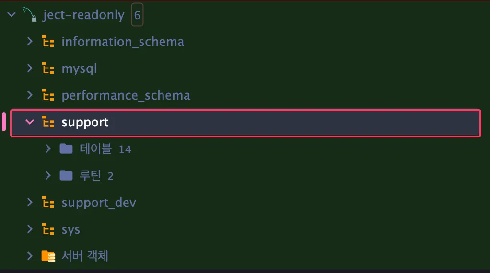
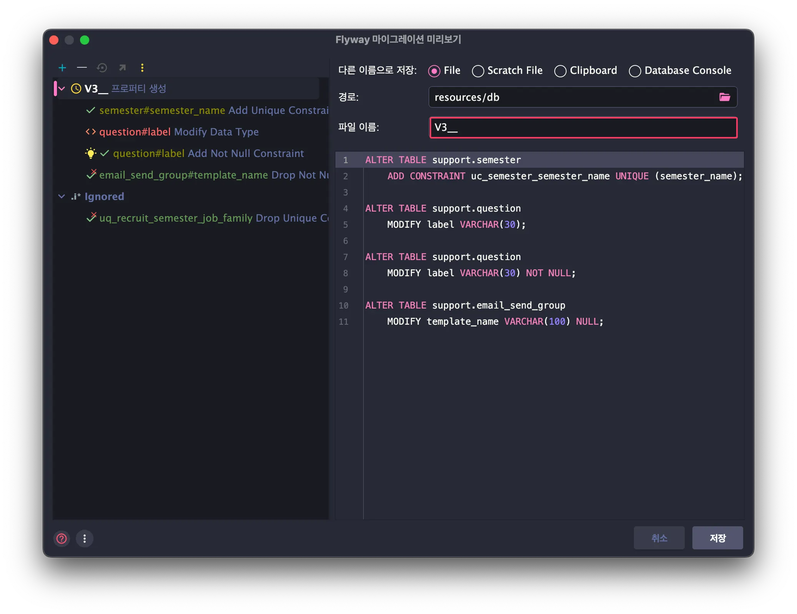

기존에는 ddl-auto=create/update 옵션을 사용해 스키마를 관리하고 있었지만,
이 방식은 환경마다 스키마 불일치가 발생할 수 있고, DB 변경 이력이 추적되지 않습니다.
이 부분을 해결하고자 Flyway 도입을 하고자 했습니다.
Flyway를 사용하면 애플리케이션 실행 시 자동으로 데이터베이스와 스키마 이력을 관리하여 모든 환경에서 동일한 마이그레이션 수행할 수 있습니다.

### 적용 방법

- build.gradle 의존성 추가

    ```kotlin
    implementation 'org.flywaydb:flyway-core'
    implementation 'org.flywaydb:flyway-mysql' // ver for MySQL 8.X
    ```

- application.yml 환경 변수 추가

    ```yaml
    spring:
    	jpa:
    		hibernate:
    			ddl-auto: validate # or none
    
    	flyway:
    		enabled: true
    ```


### **환경별 적용 전략**

- 운영 환경 (application-prod.yml)

    ```yaml
    spring:
      flyway:
        enabled: true
        locations: classpath:db/migration
        baseline-on-migrate: true
        baseline-version: 1
        validate-on-migrate: true
        clean-disabled: true   
    ```

    - `ddl-auto: validate`: Hibernate가 스키마를 건드리지 않게 설정
    - `baseline-on-migrate: true`, `baseline-version: 1`: 기존 DB를 기준으로 마이그레이션 시작
    - `clean-disabled: true`: 운영 DB 보호 (실수로 초기화 방지, 운영 환경에선 절대 clean 금지!)
    - `validate-on-migrate: true`: 마이그레이션 시 검증

- 개발 환경 (application-dev.yml)

    ```yaml
    spring:
      flyway:
        enabled: true
        locations: classpath:db/migration
        baseline-on-migrate: false
        validate-on-migrate: true
    ```

    - `ddl-auto: validate`: 엔티티와 DB 스키마를 검증만 하도록 설정
    - `baseline-on-migrate: false`: 초기 DB는 Flyway migration 파일로 자동 생성
    - `validate-on-migrate: true`: 마이그레이션 실행 시 스키마 검증

  > 추가적으로 JPA 설정 또한 기존 `update`에서 `validate`로 수정

### **마이그레이션 파일 작성 규칙**


- 위치: `src/main/resources/db/migration`
- 파일명 규칙: `V{버전번호}__{설명}.sql`
    - 예: `V1__init.sql`, `V2__add_project_table.sql`
- 작성 원칙:
    - `CREATE TABLE IF NOT EXISTS` 사용
    - 변경 사항은 반드시 새로운 버전 파일로 추가 (기존 파일 수정 금지)
    - 데이터 변경이 필요할 경우도 마찬가지 (`V3__insert_default_roles.sql`)

### 마이그레이션 파일 작성 팁(✋ 해당 팁은 IntelliJ 환경입니다.)

1. IntelliJ에서 연결한 데이터베이스 소스에서 target할 데이터베이스를 선택합니다.

   

2. 오른쪽 마우스와 같이 더보기 이벤트 키를 누르면 사진처럼 뜹니다. `Flyway 마이그레이션` 를 클릭합니다.

   

3. 소스는 현재 프로젝트 코드 모델로 설정하고, 타깃은 실제 데이터베이스의 스키마를 선택한 다음 확인을 클릭합니다.

   

4. 경로를 `resources/db/migration` 으로 하고, 적절한 파일 이름을 작성한 다음 저장을 합니다.

   

5. 그럼 `src/main/resources/db/migration` 에서 파일을 확인할 수 있습니다.

### **참고**

- https://leeeeeyeon-dev.tistory.com/12
- https://hudi.blog/dallog-flyway/
