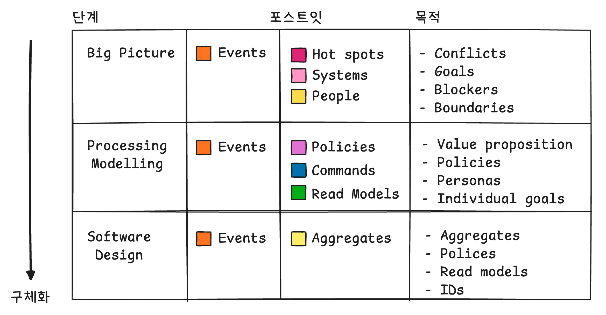
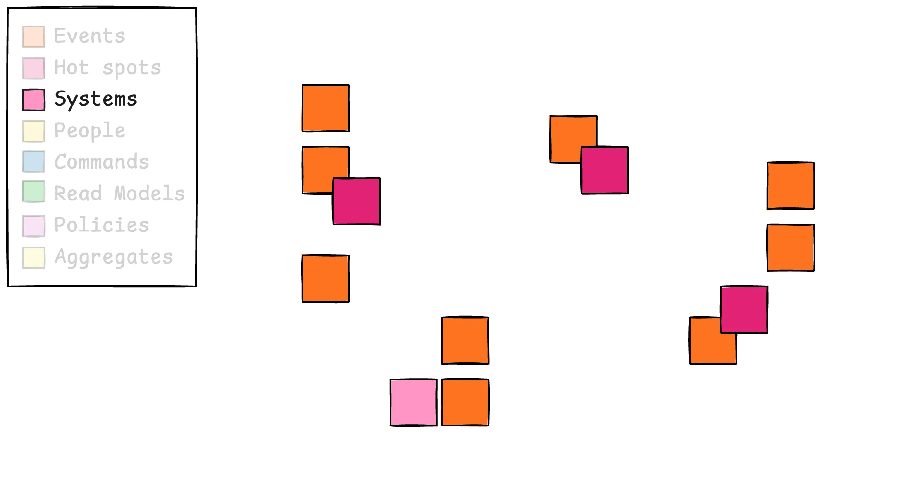
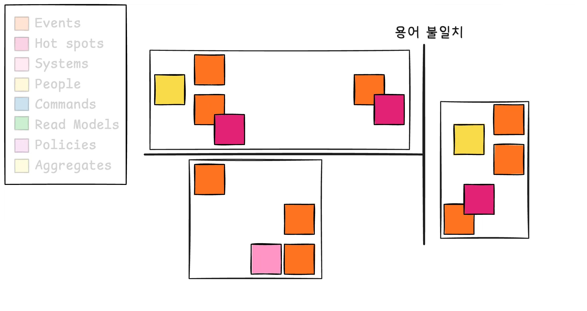
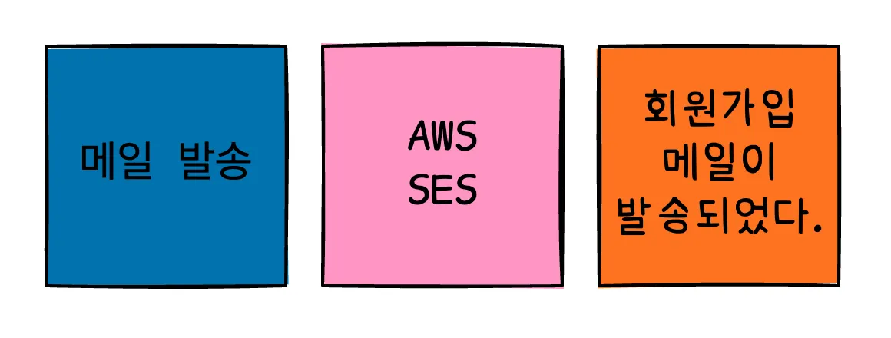

이벤트 스토밍(Event Storming)이라는 단어는 익숙치 않을 것이다.
그럼 브레인 스토밍(Brain Storming)은 어떠한가?
상대적으로 더 익숙할 것이다.
브레인 스토밍은 “머릿속 아이디어를 스토밍으로 쏟아낸다.”라고 표현할 수 있다.
그럼 이벤트 스토밍은 어떻게 표현할 수 있을까?
“발생 가능한 이벤트를 스토밍으로 자유롭게 도출한다.” 라고 표현할 수 있다.

## 이벤트 스토밍을 왜 사용할까?

예를 들어, 아래와 같은 상황이 있다고 하자.

> A: **책**에 대한 정보가 필요한 것 같아!  
> B: 그래! **도서** 조회 API를 만들면 되겠다.

같은 생각을 하지만, 서로 다른 단어를 말하는 것을 볼 수 있다.

이러한 상황도 있다.

> A: **사용자**의 비밀번호 생성 정책은 이렇게 하면 어떨까?  
> B: 우리 서비스를 이용하는 사용자에는 **비회원**도 있을 텐데. **비회원**이 비밀번호가 왜 필요하지?

위 상황은 같은 용어를 말하지만, 다른 의미로 생각하는 것을 볼 수 있다.

만약 생소한 도메인이라면 이러한 상황들 속에서는 혼란을 발생할 수 있다.

여러 도메인에 대한 지식이 필요한 기능을 개발이 필요한 상황도 발생할텐데.
프로젝트를 하다보면 각자 맡은 도메인에만 신경을 쓰는 일이 발생하여,
여러 도메인에 대한 기능 개발을 할 때 그만큼의 팀원들과 소통을 해야할 것이다.
이처럼 고르지 않은 도메인 지식 분배로 인한 생산성 저하를 발생할 수 있다.

이 모든 상황은 도메인 이해도 불일치로 인해 발생하는 상황들이다.
이벤트 스토밍은 이러한 도메인 이해도를 일치 시키는 방법 중 하나이다.

## 이벤트 스토밍이란

도메인 내에서 발생하는 이벤트를 중심으로 복잡한 비즈니스 도메인을 빠르게 탐색하고 학습할 수 있는 일종의 설계 기법이다.
이때 개발자뿐만 아니라 도메인 전문가, 기획자, 디자이너 등 실제 문제 해결과 관련된 모든 사람들이 참여하는 과정이다.

그럼 어떻게 진행할까?

1. 커다란 보드를 놓는다.
2. 포스트잇을 붙여나간다.
3. 비즈니스 프로세스를 이해하는데 초점을 맞춘다.

“포스트잇을 붙여나간다”라고 표현을 했지만, 사실 여기에는 많은 단계가 있다.
크게 3가지 단계로 나눌 수 있다.

이때 단계가 진행됨에 따라 설계가 구체화되고 각 단계마다 붙일 수 있는 포스트잇의 종류도 다르다.

## 도메인 이벤트(Events)

도메인 이벤트를 작성할 때 각자 알고 있는 도메인 이벤트 작성을 하면된다.

단, 이 과정에서는 의논을 하면 안된다.
여기서 도메인 이벤트는 관리하고 있는 상태가 변경되어 비즈니스적으로 의미가 있는 일을 의미한다.
과거에 일어났던 일을 표현하기에 과거 시제를 사용하여 작성한다.
“회원이 생성되었다.”를 예로 들 수 있겠다.

도메인 이벤트를 작성하는 과정이 끝나면,
각자 의논없이 진행했기에 중복되는 이벤트들이 존재할 것이다.
이러한 중복된 이벤트를 제거하면 된다.

이때 주의할 점은 같은 이벤트를 적었다 하더라도 같은 이벤트가 아닐 수도 있다는 점이다.
두 포스트잇 모두 “로그인이 성공 되었다.”라고 작성했지만, 한 명은 자체 로그인을 생각을 하고 작성했고, 또 다른 한 명은 소셜 로그인을 생각을 해서 적었을 수도 있다. 이렇게 된다면 두 이벤트는 다른 이벤트로 볼 수 있다. 그래서 중복 이벤트를 제거할 때는 중복을 100%로 확신해야만 지울 수 있도록 해야한다.

중복된 이벤트를 제거하는 과정이 끝나면, 타임라인대로 정렬을 하는 과정을 한다.
이때, 왼쪽에서 오른쪽으로는 시간의 흐름을 표현하고, 위쪽에서 아래쪽으로는 평행한 시간의 이벤트 흐름을 표현한다.

## 핫스팟(Hot Spot)

도메인 이벤트 과정들이 다 끝나면 핫스팟을 작성한다.
핫스팟은 도메인 이벤트를 작성하는 과정에서 질문, 갈등, 불평, 불만 사항들을 말하는 데,
이러한 것들을 작성하면 된다.

예를 들어, “결제가 환불되었다.”라는 이벤트가 있으면 환불 정책에 대해서 궁금해서 “환불 정책이 어떻게 되나요” 같이 적을 수 있을 것이고,
환불이라는 단어가 마음에 안들어서 ”환불이라는 단어보다는 취소라는 단어는 어때요” 같이 적을 수도 있다.

이때 중요한 것은 이런 사항들에 대해서는 당장 토론하지 않는 것이다. 이것을 토론하게 되면 이 과정에서 지치게 될 것이다.
그래서 우선 유지를 하고 나중에 문제가 해결이 되면 그 때 제거하는 방식으로 진행하면 된다.
이렇듯 핫스팟이 파악되기만 해도 이벤트 스토밍이 충분히 유의미한 활동으로 볼 수 있다.

## 외부 시스템(External System, System)

외부 시스템 과정은 책임 전가 가능한 모든 것에 대해 붙이는 것이다.

예를 들어, “회원 가입 메일이 발송되었다.”라는 이벤트를 하기 위해서 AWS의 SES라는 외부 서비스를 이용할 수 있다.

외부 시스템 과정에서는 이러한 사항들을 작성하면 된다.

## 액터(Actor, People)

액터 과정에서는 단순 사용자나 고객, 회원같은 보편적인 대상이 아닌 구체적인 페르소나를 요구한다.

예를 들어, “주문이 생성되었다.”라는 이벤트를 발생시키는 주체는 “구매자”가 될 것이다.

이렇게 진행하다보면 슬슬 구분되는 경계를 가지는 Context가 나타난다.
이전의 언급했던 “같은 용어, 다른 의미”나 “같은 의미, 다른 용어” 이러한 상황들 또한 점차적으로 나타날 것이다.
예를 들어, “커피”를 생각해보면 이탈리아에선 일반적으로 “에스프레소”를 떠올리지만, 한국이나 미국에서는 “아메리카노”를 떠올릴 것이다.
이러한 용어 불일치는 컨텍스의 경계를 나누는 기준이 된다.

이렇게 나눠진 경계 내에서 정의된 용어를 유비쿼터스 언어라고 부른다. 그리고 이러한 유비쿼터스를 정의하는 좋은 방법은 용어사전을 이용하는 것이다.

## 커맨드(Command)

이제 시스템에서 어떻게 호출이 되는지 정리해야 한다.
이러한 과정을 커맨드(Command)라고 하는데, 도메인 이벤트가 발생하는 원인으로 시스템에서 어떤 일이 일어나는지 작성하면 된다.

예를 들어, “회원 가입 메일 발송되었다.”라는 이벤트를 발생시키는 원인은 “메일 발송”이라는 커맨드가 될 것이다.

## 리드 모델(Read Model)

리드 모델이란 액터가 커맨드하는데 도움이 되는 정보를 말한다.

예를 들어, “구매자”가 “주문을 생성”하는 코맨드를 할 때 필요한 정보로는 “상품 목록, 배송 주소, 결제 수단”등이 될 것이다.

## 정책(Policy)

정책은 도메인 이벤트와 커맨드 사이에 위치하여 주로 “~할 때마다”라는 단어로 작성을 한다.

예를 들어, 회원 가입이 완료”될 때마다” 메일을 발송한다. 같이 작성될 것이다.

## 작업 단위(Aggregate, Constraint)

마지막으로 작업 단위 과정은 일관성을 유지하기 위한 작업 단위를 의미한다

예를 들어, “회원 가입이 완료되었다”라는 이벤트가 발생한 시점부터 정책에 따라 메일을 발송하고 메일 이벤트가 완료될 때까지의 흐름을 일관성이 유지되어야 한다는 작업 단위를 “회원”이라고 작성할 수 있다.

## 도입해 보고자 한다면

여기까지 읽었으면 얼마나 많은 단계가 있는지 체감할 수 있을 것이다.
이 모든 단계를 진행하지 않고 한 단곈만 진행해도 충분히 의미가 있다.
이마저도 부담스럽다면, 컨텍스트 분리를 하여 유비쿼터스 언어를 구축하는 것만으로도 이벤트 스토밍의 효과를 충분히 얻을 수 있다.

도입만 하게된다면 새로운 개발자도 누락된 도메인 지식을 빠르게 파악이 가능하다. 그럼 새로운 개발자도 보다 빨리 도메인에 몰입하여 개발할 수 있는 환경이 될 것이다.

이벤트 스토밍을 하면서 얻게 되는 제일 큰 효과는 모두가 같은 사실을 알게 된다는 것이다.

## 참고

- https://www.msaschool.io/operation/design/design-three/
- https://en.wikipedia.org/wiki/Event_storming