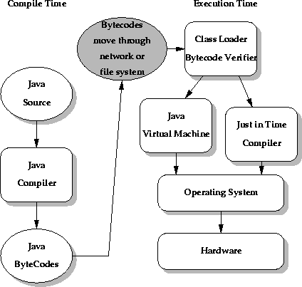
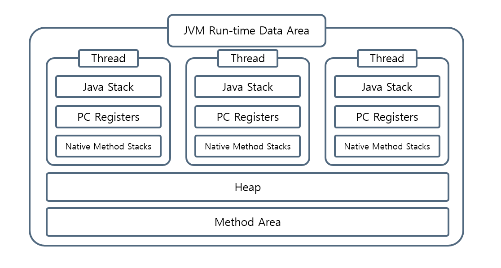
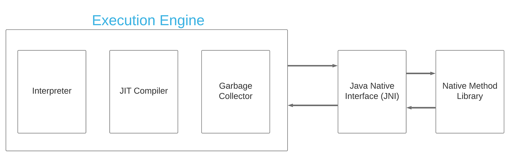

자바를 처음 배울 때 가장 자주 듣는 말은 "Write Once, Run Anywhere"이다.
그런데 이 말은 자바 코드가 곧바로 모든 운영체제에서 실행된다는 뜻은 아니다.
자바 소스 코드는 먼저 JVM이 이해할 수 있는 **바이트코드**로 컴파일되고, 각 운영체제에 설치된 JVM이 그 바이트코드를 읽어 실제 CPU가 실행할 수 있는 형태로 바꿔준다.

이번 글에서는 `Hello.java` 같은 자바 코드가 JVM 안으로 들어간 뒤 어떤 단계를 거쳐 실행되는지 정리해본다.



## 전체 흐름

큰 흐름은 다음과 같다.

1. 개발자가 `.java` 소스 코드를 작성한다.
2. `javac`가 소스 코드를 `.class` 바이트코드로 컴파일한다.
3. `java` 명령으로 JVM이 시작된다.
4. JVM은 실행할 첫 클래스를 로딩, 링킹, 초기화한다.
5. `public static void main(String[] args)`를 호출한다.
6. 실행 엔진이 바이트코드를 인터프리터 또는 JIT 컴파일러로 실행한다.
7. 실행 중 생성된 객체는 힙에 올라가고, 더 이상 참조되지 않는 객체는 GC 대상이 된다.

여기서 중요한 점은 `javac`와 JVM의 역할이 다르다는 것이다.
`javac`는 소스 코드를 바이트코드로 바꾸는 컴파일러이고, JVM은 바이트코드를 실행하는 런타임 환경이다.

```java
public class Main {
    public static void main(String[] args) {
        int result = add(1, 2);
        System.out.println(result);
    }

    static int add(int a, int b) {
        return a + b;
    }
}
```

이 코드를 `javac Main.java`로 컴파일하면 `Main.class`가 생성된다.
이 `.class` 파일은 CPU가 직접 실행하는 기계어가 아니라 JVM 명령어 집합으로 구성된 바이트코드다.

`javap -c Main`으로 확인하면 대략 다음과 같은 명령어를 볼 수 있다.

```text
public static void main(java.lang.String[]);
  Code:
     0: iconst_1
     1: iconst_2
     2: invokestatic  #7   // Method add:(II)I
     5: istore_1
     6: getstatic     #13  // Field java/lang/System.out:Ljava/io/PrintStream;
     9: iload_1
    10: invokevirtual #19  // Method java/io/PrintStream.println:(I)V
    13: return

static int add(int, int);
  Code:
     0: iload_0
     1: iload_1
     2: iadd
     3: ireturn
```

`iconst_1`, `iadd`, `invokestatic` 같은 명령어가 바로 JVM이 읽는 바이트코드 명령어다.
JVM의 실행 엔진은 이 명령어들을 하나씩 실행하거나, 자주 실행되는 부분을 네이티브 코드로 컴파일해서 실행한다.

## JVM이 시작될 때

`java Main`을 실행하면 운영체제 위에서 JVM 프로세스가 시작된다.
JVM은 먼저 사용자가 지정한 초기 클래스를 찾고, 그 클래스를 로딩한 뒤, 링킹하고, 초기화한 다음 `main` 메서드를 호출한다.
이 `main` 호출이 이후 프로그램 실행의 출발점이 된다.

예를 들어 `main` 안에서 `new Sub()`를 처음 만난다면 그때 `Sub` 클래스가 추가로 로딩될 수 있다.
즉 JVM은 모든 클래스를 시작 시점에 한 번에 올리는 것이 아니라, 필요한 시점에 동적으로 로딩한다.
물론 구현체나 옵션에 따라 미리 로딩하거나 공유 아카이브를 활용하는 최적화도 존재한다.

## 클래스 로더가 하는 일

클래스 로더의 역할은 `.class` 파일이나 JAR 안의 바이트코드 같은 클래스의 이진 표현을 찾아 JVM 내부 표현으로 만드는 것이다.
일반적인 흐름은 **Loading -> Linking -> Initialization**이다.


### Loading

로딩 단계에서는 클래스 이름에 해당하는 바이트코드를 찾는다.
애플리케이션에서는 보통 클래스패스 또는 모듈 경로에서 클래스를 찾고, 필요하다면 직접 만든 클래스 로더가 네트워크, 암호화된 파일, 동적으로 생성된 바이트 배열 등에서 클래스를 가져올 수도 있다.

클래스 로더는 계층 구조를 가지며 보통 부모에게 먼저 위임하는 방식으로 동작한다.
Java 8까지는 `Bootstrap -> Extension -> Application` 흐름으로 설명하는 경우가 많고, Java 9 이후 모듈 시스템이 도입된 뒤에는 `Extension` 대신 `Platform` 클래스 로더라는 이름을 더 자주 쓴다.
어느 쪽이든 핵심은 자바 기본 API처럼 신뢰해야 하는 클래스가 애플리케이션 클래스보다 먼저 검색된다는 점이다.

### Linking

링킹은 로드된 클래스를 실행 가능한 상태로 연결하는 과정이다.
세부적으로는 검증, 준비, 해석으로 나뉜다.

검증은 바이트코드가 JVM 명세에 맞는지, 타입 안정성을 깨뜨리지 않는지 확인한다.
`javac`가 정상적인 `.class`를 만들었다고 해도 JVM은 이 파일이 정말 신뢰할 수 있는 컴파일러에서 왔는지 알 수 없다.
그래서 런타임에서도 바이트코드 검증을 통해 잘못된 코드가 JVM을 망가뜨리지 못하게 막는다.

준비는 `static` 필드 같은 클래스 수준 저장 공간을 만들고 기본값을 넣는 단계다.
예를 들어 `static int count = 10;`이 있으면 준비 단계에서는 우선 `0`이 들어가고, 실제 `10` 대입은 초기화 단계에서 수행된다.

해결은 상수 풀의 심볼릭 레퍼런스를 다이렉트 레퍼런스로 바꾸는 단계다.
바이트코드 안에는 `java/lang/System.out` 같은 이름 기반 참조가 들어 있는데, 실행하려면 이것이 실제 메모리상의 클래스, 필드, 메서드 참조와 연결되어야 한다.(예시: `0x7f4a2b1c`)
이 해결 과정은 JVM 구현에 따라 일찍 처리될 수도 있고, 실제로 그 참조를 처음 사용할 때까지 미뤄질 수도 있다.

### Initialization

초기화 단계에서는 클래스 초기화 메서드인 `<clinit>`이 실행된다.
이때 `static` 필드의 명시적 초기값과 `static` 블록이 코드에 적힌 순서대로 실행된다.
또한 어떤 클래스를 초기화하기 전에는 그 부모 클래스가 먼저 초기화되어야 한다.

```java
class Parent {
    static int parentValue = init("Parent");

    static int init(String name) {
        System.out.println(name);
        return 1;
    }
}

class Child extends Parent {
    static int childValue = init("Child");
}
```

`Child`가 처음 적극적으로 사용되면 부모인 `Parent` 초기화가 먼저 필요하다.
그래서 클래스 초기화 순서를 이해하지 못하면 `static` 필드나 블록에서 예상과 다른 값이 보이는 상황을 만날 수 있다.

## 런타임 데이터 영역

클래스가 JVM 내부로 들어오면, JVM은 프로그램 실행에 필요한 데이터를 여러 런타임 데이터 영역에 나눠 저장한다.



### 메서드 영역(Method Area)

메서드 영역은 클래스 구조를 저장하는 논리적 영역이다.
클래스 파일(.class)이 JVM에 의해 처음 로드될 때 이 영역에 저장되고, 프로그램이 종료될 때까지 유지된다.
그렇기에 클래스 이름, 부모 클래스, 필드, 메서드, 생성자, 런타임 상수 풀 같은 정보가 여기에 속한다.
이 영역은 모든 스레드가 공유하는 구조로, 자바 프로그램의 클래스 구조와 실행 로직에 대한 핵심 정보가 저장된다.

> HotSpot JVM에서는 Java 8 이후 클래스 메타데이터가 주로 네이티브 메모리의 Metaspace에 저장되지만, JVM 명세 관점의 Method Area는 여전히 논리적 개념으로 이해하는 것이 좋다.

#### 1. 런타임 상수 풀(Runtime Constant Pool)

클래스 파일 내부에는 상수 값이나 심볼(문자열, 메서드 참조 등)을 모아둔 constant pool table이 존재한다.
이 테이블의 데이터는 JVM이 클래스를 로드하면서 메서드 영역 내부의 런타임 상수 풀로 변환되어 저장된다.

예를 들어, "Hello" 같은 문자열 리터럴이나 System.out.println 같은 메서드 참조가 이곳에 저장된다.
JVM은 상수 풀을 통해 필요한 정보를 참조하고, 중복되는 값 없이 공유해 메모리 효율을 높이는 역할을 한다.
즉, 상수 풀은 "공통 참조 데이터 저장소"라고 생각하면 된다.

#### 2. 필드/메서드 데이터(Field and Method Metadata)

클래스에 정의된 변수(필드)와 메서드 이름, 리턴 타입, 매개변수 타입 등 메서드 시그니처 정보가 여기에 저장된다.
실행 코드는 아니며, JVM이 해당 클래스의 구조를 이해하고 실행을 준비할 수 있도록 설계된 메타데이터이다.
예를 들어 `public int speed;` 같은 필드 선언, `public void start()` 같은 메서드 선언의 정보가 포함된다.

#### 3. 메서드 코드(Method Bytecode)

클래스에 정의된 각 메서드의 바이트코드(실행로직)가 저장되는 공간이다.
JVM은 이 바이트코드를 인터프리트하거나 JIT 컴파일하여 실제로 프로그램을 실행한다.
메서드 본문의 바이트코드와 예외 처리 정보 등이 포함되며, 호출 시마다 스택 영역에서 프레임을 만들어 실행된다.

#### 4. 생성자 코드(Constructor Bytecode)

클래스의 인스턴스를 생성할 때 호출되는 생성자의 바이트코드 역시 별도로 저장된다.
객체 초기화에 필요한 로직이 포함되며, 메서드 코드와 유사하게 바이트코드 형식으로 구성된다.

### 힙 영역(Heap Area)

힙 영역은 JVM이 실행 중 동적으로 생성하는 객체들을 저장하는 메모리 공간으로, 메서드 영역과 함께 모든 스레드가 공유한다.
이 영역은 JVM이 자동으로 메모리를 할당하고, 사용이 끝난 객체를 제거하는 GC의 대상이 된다.

힙에는 `new`로 생성된 객체 인스턴스와 배열 같은 참조 타입(Reference Type)의 실제 데이터가 저장된다.
예를 들어, `new User()`로 생성된 객체는 힙에 저장되고, 이 객체 안의 멤버 변수들도 힙에 함께 저장된다.
단, 멤버 변수가 또 다른 참조형일 경우, 그 값은 별도의 힙 공간에 저장되고 해당 주소를 참조한다.

힙에 저장된 객체는 스스로 접근되지 않으며, 반드시 스택 영역에 존재하는 참조 변수(레퍼런스)를 통해 접근한다.
예를 들어 `User user = new User();`에서 `user`는 스택에 저장된 참조 변수이고, `new User()`로 생성된 객체는 힙에 저장된다.

### 스택 영역(Stack Area)

스택 영역은 JVM이 메서드를 실행할 때 사용하는 임시 저장 공간으로, 기본형 변수나 메서드 실행 정보 등이 저장되는 곳이다.
각 스레드마다 고유한 스택이 생성되며, 메서드가 호출될 때마다 스택 프레임(Stack Frame)이 쌓이고, 메서드가 종료되면 해당 프레임은 제거된다.

각 스레드마다 고유한 스택이 생성되며, 메서드가 호출될 때마다 스택 프레임(Stack Frame)이 쌓이고, 메서드가 종료되면 해당 프레임은 제거된다.
이 영역은 LIFO(Last In, First Out) 구조로 동작하며, 메서드 호출과 반환에 따라 자동으로 관리된다.

> 예를 들어, `main` 메서드가 호출되면 `main` 스택 프레임이 생성되고, `add` 메서드가 호출되면 `add` 스택 프레임이 `main` 프레임 위에 쌓이는 식이다.
> 이후 `add`가 반환되면 `add` 프레임이 제거되고, `main` 프레임으로 돌아간다.

스택 영역에서는 메서드가 호출될 때마다 해당 메서드만을 위한 스택프레임이 하나씩 생성되며, 메서드 실행에 필요한 정보가 이 프레임 안에 저장된다.
스택 프레임에서는 메서드의 매개변수, 지역변수, 연산 임시값, 리턴값 등이 포함되며, 메서드가 종료되면 해당 프레임은 자동으로 제거되고 그 안에 저장된 정보에도 더 이상 접근할 수 없게된다.

> 힙 영역에서도 언급했듯이, 자바에서는 변수의 자료형에 따라 저장 위치가 달라진다.
> 기본형(Primitive Type) `int`, `double` 같은 값을 스택에 스택 프레임 내에 직접 저장하는 반면,
> 참조형(Reference Type) 클래스나 배열 등은 스택에 참조 값(주소)만 저장하고, 실제 객체는 힙에 저장한다.

### PC Register

**PC Register**는 각 스레드마다 독립적으로 생성되는 메모리 공간으로, 현재 해당 스레드가 실행 중인 JVM 명령어의 주소를 저장한다.
즉, JVM이 어떤 명령어를 수행하고 있는지, 다음에 어떤 명령어를 실행할 것인지를 추적하기 위한 실행 흐름 기록 장치의 역할을 한다.

일반적으로 CPU 연산에서 프로그램은 명령어 단위로 순차적으로 실행되며, 각 명령어는 특정 메모리 주소에 위치한다.
이때 레지스터는 현재 실행 중인 명령어의 위치나 중간 연산 결과 등을 임시로 저장하기 위한 작은 메모리 공간이다.

자바 역시 이런 개념을 사용하며, JVM 내부에서 실행흐름을 관리하기 위해 PC 레지스터라는 별도의 공간을 스레드별로 유지한다.
자바 프로그램에서 하나의 스레드는 독립적으로 실행되므로, 각 스레드는 자신만의 PC 레지스터를 가지고 있으며,
이 레지스터는 해당 스레드가 어떤 바이트코드 명령어를 실행 중인지를 추적한다.

JVM은 이 주소 정보를 기반으로 명령어를 순차적으로 읽어 들이고, 조건에 따라 점프하거나 분기하여 프로그램 흐름을 제어한다.
특히 자바에서는 JVM 명령어 단위로 프로그램을 실행하기 때문에, 현재 실행 중인 위치를 계속해서 추적할 필요가 있다.

이 역할을 PC 레지스터가 담당하며, 명령어 실행이 완료되면 다음 명령어 주소로 갱신된다.

> 단, 해당 스레드가 자바 메서드가 아닌 네이티브 메서드(C, C++ 등)로 실행 중이라면 PC 레지스터는 정의되지 않은 상태(undefined)가 된다.
> JVM이 네이티브 코드 실행 시에는 별도의 메커니즘(Native Method Stack 등)을 사용하여 실행 흐름을 관리하기 때문이다.

### 네이티브 메서드 스택(Native Method Stack)

네이티브 메서드 스택은 자바가 아닌 네이티브 코드(C, C++ 등)로 작성된 메서드를 실행할 때 사용하는 별도의 스택 영역이다.
자바 프로글매 내부에서 외부 네이티브 함수를 호출하게 되면 JVM 스택이 아닌 네이티브 메서드 스택에 쌓여 실행된다.

자바는 기본적으로 JVM 위에서 바이트코드 형태로 실행되지만, 운영체제나 하드웨어에 밀접한 기능을 사용해야 할 때 네이티브 메서드를 활용한다.
이때 사용하는 것이 JNI(Java Native Interface)로, JNI를 통해 자바에서 네이티브 메서드를 호출하면 네이티브 메서드 스택 영역이 사용된다.

> 자바의 JIT 컴파일러에 의해 바이트코드가 네이티브 코드로 변환되는 경우에도, 네이티브 방식으로 실행되기 때문에 이 스택이 사용된다고 볼 수 있다.

## 실행 엔진(Execution Engine)

실행 엔진은 클래스 로더에 의해 메모리에 적재된 바이트코드를 실제로 실행하는 컴포넌트다.
실행 엔진은 인터프리터 방식과 JIT 컴파일 방식이라는 두 가지 실행 전략을 병행하여 프로그램을 수행한다.



### 인터프리터(Interpreter)

인터프리터는 바이트코드를 한 명령어씩 읽고, 즉시 해석하여 실행하는 방식이다.
JVM은 기본적으로 인터프리터를 이용해 바이트코드를 실행하며, 프로그램이 처음 실행될 때 빠르게 시작할 수 있다는 장점이 있다.

실행 엔진이 바이트코드를 메서드 단위로 읽고, 각 명령어를 해석해 순차적으로 실행한다.
인터프리터는 같은 메서드가 반복해서 호출될 경우, 매번 동일한 바이트코드를 해석해야 하므로 실행 속도가 느려질 수 있다.
이러한 성능 문제를 보완하기 위해 JVM은 JIT 컴파일러를 도입하여 자주 실행되는 코드를 네이티브 코드(기계어)로 변환하여 캐싱하는 전략을 병행한다.

### JIT 컴파일러(Just-In-Time Compiler)

JIT 컴파일러는 HotSpot JVM은 프로그램 실행 중에 메서드 호출 횟수, 루프 반복 횟수 같은 프로파일링 정보를 모아 자주 실행되는 부분(Hot Spot)을 감지하여, 해당 바이트코드를 네이티브 코드로 컴파일한다.
이후에는 이 코드를 다시 해석하지 않고, 변환된 기계어를 직접 실행하여 성능을 크게 향상시킨다.

즉, 인터프리팅을 반복하는 대신 일정 기준 이상으로 많이 호출되는 메서드는 JIT 컴파일을 통해 최적화된 코드로 바꾸고 이를 캐싱해두었다가 재사용하는 방식이다.

단 바이트 코드를 기계어로 변환하는 과정 자체에도 자원이 소모되기 때문에, JVM은 JIT 컴파일을 적용할 때 신중하게 판단한다.

> 현대 HotSpot은 단계별 컴파일을 사용한다.
> 처음에는 인터프리터로 실행하면서 정보를 모으고, 어느 정도 실행되면 C1 컴파일러가 빠르게 컴파일하며, 
> 더 자주 실행되는 핵심 코드는 C2 컴파일러가 더 강한 최적화를 적용한다. 
> 이 과정 덕분에 JVM은 시작 속도와 장기 실행 성능 사이에서 균형을 잡는다.
> 단, JIT가 만든 네이티브 코드는 영원히 맞는다는 보장이 없다.
> 예를 들어 "이 인터페이스의 구현체는 지금까지 하나뿐이었다"는 가정으로 인라이닝했는데 나중에 다른 구현체가 로딩되면, JVM은 기존 최적화를 버리고 다시 인터프리터나 다른 컴파일 단계로 돌아갈 수 있다.
> 이 과정을 디옵티마이제이션이라고 한다.

## 정리

결국 자바의 플랫폼 독립성은 "한 번 만든 기계어를 어디서나 실행한다"가 아니라, 
"어디서나 같은 바이트코드를 실행할 수 있는 JVM이 있다"는 구조에서 나온다.

## 참고한 글과 문서

- [Java Virtual Machine Specification, Chapter 5. Loading, Linking, and Initializing](https://docs.oracle.com/javase/specs/jvms/se25/html/jvms-5.html)
- [Java Language Specification, Chapter 12. Execution](https://docs.oracle.com/javase/specs/jls/se25/html/jls-12.html)
- [Java Virtual Machine Specification, Chapter 2. The Structure of the Java Virtual Machine](https://docs.oracle.com/javase/specs/jvms/se25/html/jvms-2.html)
- [OpenJDK HotSpot Runtime Overview](https://openjdk.org/groups/hotspot/docs/RuntimeOverview.html)
- [Oracle, Java HotSpot Virtual Machine Performance Enhancements](https://docs.oracle.com/en/java/javase/11/vm/java-hotspot-virtual-machine-performance-enhancements.html)
- [Microsoft for Java Developers, How Tiered Compilation works in OpenJDK](https://devblogs.microsoft.com/java/how-tiered-compilation-works-in-openjdk/)
- [Baeldung, The JVM Run-Time Data Areas](https://www.baeldung.com/java-jvm-run-time-data-areas)
- [SMJ Blog, JVM의 Runtime Data Area](https://smjeon.dev/etc/jvm-rda/)
- [코딩공장공장장, JVM의 동작방식과 구조](https://developer111.tistory.com/entry/%EC%9E%90%EB%B0%94JVM-%EA%B5%AC%EC%A1%B0-%EB%B0%8F-%EC%9E%90%EB%B0%94-%EB%A9%94%EB%AA%A8%EB%A6%AC-%EA%B5%AC%EC%A1%B0)
