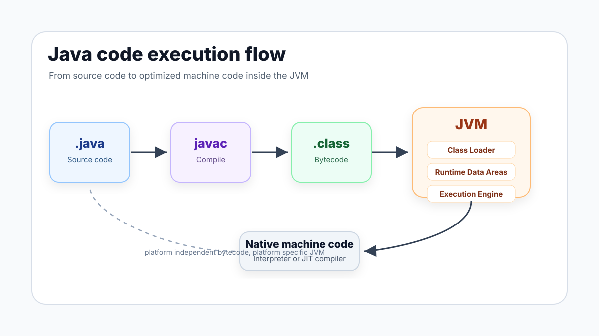
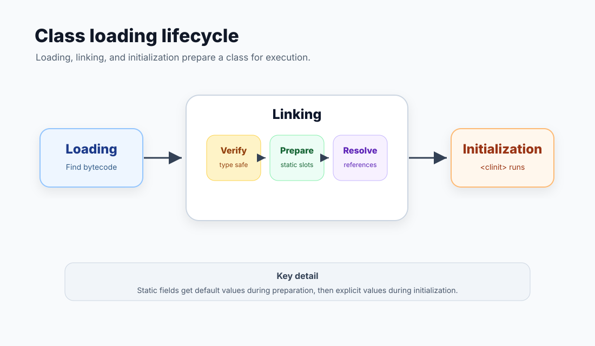
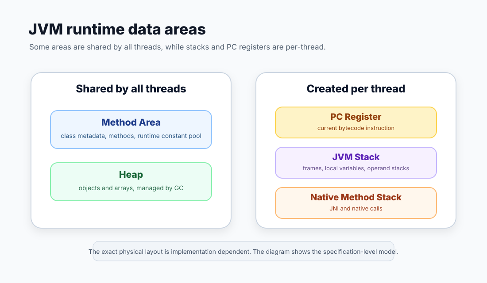
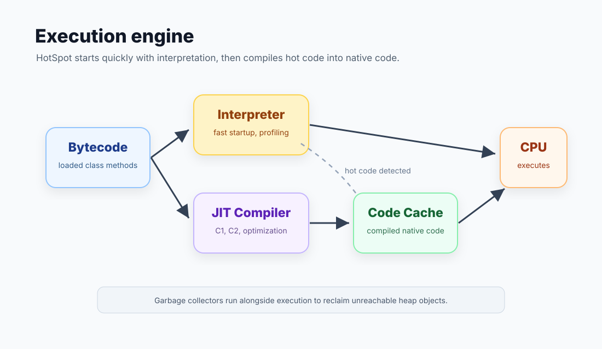

자바를 처음 배울 때 가장 자주 듣는 말은 "Write Once, Run Anywhere"이다.
그런데 이 말은 자바 코드가 곧바로 모든 운영체제에서 실행된다는 뜻은 아니다.
자바 소스 코드는 먼저 JVM이 이해할 수 있는 **바이트코드**로 컴파일되고, 각 운영체제에 설치된 JVM이 그 바이트코드를 읽어 실제 CPU가 실행할 수 있는 형태로 바꿔준다.

이번 글에서는 `Hello.java` 같은 자바 코드가 JVM 안으로 들어간 뒤 어떤 단계를 거쳐 실행되는지 정리해본다.



## 전체 흐름

큰 흐름은 다음과 같다.

1. 개발자가 `.java` 소스 코드를 작성한다.
2. `javac`가 소스 코드를 `.class` 바이트코드로 컴파일한다.
3. `java` 명령으로 JVM이 시작된다.
4. JVM은 실행할 첫 클래스를 로딩, 링킹, 초기화한다.
5. `public static void main(String[] args)`를 호출한다.
6. 실행 엔진이 바이트코드를 인터프리터 또는 JIT 컴파일러로 실행한다.
7. 실행 중 생성된 객체는 힙에 올라가고, 더 이상 참조되지 않는 객체는 GC 대상이 된다.

여기서 중요한 점은 `javac`와 JVM의 역할이 다르다는 것이다.
`javac`는 소스 코드를 바이트코드로 바꾸는 컴파일러이고, JVM은 바이트코드를 실행하는 런타임 환경이다.

```java
public class Main {
    public static void main(String[] args) {
        System.out.println("Hello, Java!");
    }
}
```

이 코드를 `javac Main.java`로 컴파일하면 `Main.class`가 생성된다.
이 `.class` 파일은 CPU가 직접 실행하는 기계어가 아니라 JVM 명령어 집합으로 구성된 바이트코드다.

`javap -c JvmRun`으로 확인하면 대략 다음과 같은 명령어를 볼 수 있다.

```text
public static void main(java.lang.String[]);
  Code:
     0: iconst_1
     1: iconst_2
     2: invokestatic  #7   // Method add:(II)I
     5: istore_1
     6: getstatic     #13  // Field java/lang/System.out:Ljava/io/PrintStream;
     9: iload_1
    10: invokevirtual #19  // Method java/io/PrintStream.println:(I)V
    13: return

static int add(int, int);
  Code:
     0: iload_0
     1: iload_1
     2: iadd
     3: ireturn
```

`iconst_1`, `iadd`, `invokestatic` 같은 명령어가 바로 JVM이 읽는 바이트코드 명령어다.
JVM의 실행 엔진은 이 명령어들을 하나씩 실행하거나, 자주 실행되는 부분을 네이티브 코드로 컴파일해서 실행한다.

## JVM이 시작될 때

`java JvmRun`을 실행하면 운영체제 위에서 JVM 프로세스가 시작된다.
JVM은 먼저 사용자가 지정한 초기 클래스를 찾고, 그 클래스를 로딩한 뒤, 링킹하고, 초기화한 다음 `main` 메서드를 호출한다.
이 `main` 호출이 이후 프로그램 실행의 출발점이 된다.

예를 들어 `main` 안에서 `new Sub()`를 처음 만난다면 그때 `Sub` 클래스가 추가로 로딩될 수 있다.
즉 JVM은 모든 클래스를 시작 시점에 한 번에 올리는 것이 아니라, 필요한 시점에 동적으로 로딩한다.
물론 구현체나 옵션에 따라 미리 로딩하거나 공유 아카이브를 활용하는 최적화도 존재한다.

## 클래스 로더가 하는 일

클래스 로더의 역할은 `.class` 파일이나 JAR 안의 바이트코드 같은 클래스의 이진 표현을 찾아 JVM 내부 표현으로 만드는 것이다.
일반적인 흐름은 **Loading -> Linking -> Initialization**이다.



### Loading

로딩 단계에서는 클래스 이름에 해당하는 바이트코드를 찾는다.
애플리케이션에서는 보통 클래스패스 또는 모듈 경로에서 클래스를 찾고, 필요하다면 직접 만든 클래스 로더가 네트워크, 암호화된 파일, 동적으로 생성된 바이트 배열 등에서 클래스를 가져올 수도 있다.

클래스 로더는 계층 구조를 가지며 보통 부모에게 먼저 위임하는 방식으로 동작한다.
Java 8까지는 `Bootstrap -> Extension -> Application` 흐름으로 설명하는 경우가 많고, Java 9 이후 모듈 시스템이 도입된 뒤에는 `Extension` 대신 `Platform` 클래스 로더라는 이름을 더 자주 쓴다.
어느 쪽이든 핵심은 자바 기본 API처럼 신뢰해야 하는 클래스가 애플리케이션 클래스보다 먼저 검색된다는 점이다.

### Linking

링킹은 로드된 클래스를 실행 가능한 상태로 연결하는 과정이다.
세부적으로는 검증, 준비, 해석으로 나뉜다.

검증은 바이트코드가 JVM 명세에 맞는지, 타입 안정성을 깨뜨리지 않는지 확인한다.
`javac`가 정상적인 `.class`를 만들었다고 해도 JVM은 이 파일이 정말 신뢰할 수 있는 컴파일러에서 왔는지 알 수 없다.
그래서 런타임에서도 바이트코드 검증을 통해 잘못된 코드가 JVM을 망가뜨리지 못하게 막는다.

준비는 `static` 필드 같은 클래스 수준 저장 공간을 만들고 기본값을 넣는 단계다.
예를 들어 `static int count = 10;`이 있으면 준비 단계에서는 우선 `0`이 들어가고, 실제 `10` 대입은 초기화 단계에서 수행된다.

해석은 상수 풀의 심볼릭 레퍼런스를 실제 참조로 바꾸는 단계다.
바이트코드 안에는 `java/lang/System.out` 같은 이름 기반 참조가 들어 있는데, 실행하려면 이것이 실제 메모리상의 클래스, 필드, 메서드 참조와 연결되어야 한다.
이 해석은 JVM 구현에 따라 일찍 처리될 수도 있고, 실제로 그 참조를 처음 사용할 때까지 미뤄질 수도 있다.

### Initialization

초기화 단계에서는 클래스 초기화 메서드인 `<clinit>`이 실행된다.
이때 `static` 필드의 명시적 초기값과 `static` 블록이 코드에 적힌 순서대로 실행된다.
또한 어떤 클래스를 초기화하기 전에는 그 부모 클래스가 먼저 초기화되어야 한다.

```java
class Parent {
    static int parentValue = init("Parent");

    static int init(String name) {
        System.out.println(name);
        return 1;
    }
}

class Child extends Parent {
    static int childValue = init("Child");
}
```

`Child`가 처음 적극적으로 사용되면 부모인 `Parent` 초기화가 먼저 필요하다.
그래서 클래스 초기화 순서를 이해하지 못하면 `static` 필드나 블록에서 예상과 다른 값이 보이는 상황을 만날 수 있다.

## 런타임 데이터 영역

클래스가 JVM 내부로 들어오면, JVM은 프로그램 실행에 필요한 데이터를 여러 런타임 데이터 영역에 나눠 저장한다.
명세상 영역은 다음처럼 이해할 수 있다.



### 모든 스레드가 공유하는 영역

**Method Area**는 클래스 구조를 저장하는 논리적 영역이다.
클래스 이름, 부모 클래스, 필드, 메서드, 생성자, 런타임 상수 풀 같은 정보가 여기에 속한다.
HotSpot JVM에서는 Java 8 이후 클래스 메타데이터가 주로 네이티브 메모리의 Metaspace에 저장되지만, JVM 명세 관점의 Method Area는 여전히 논리적 개념으로 이해하는 것이 좋다.

**Heap**은 객체와 배열이 생성되는 영역이다.
`new User()`를 호출하면 객체는 보통 힙에 만들어지고, 여러 스레드가 이 객체를 참조할 수 있다.
힙은 GC가 관리하는 핵심 영역이다.

### 스레드마다 따로 가지는 영역

**PC Register**는 현재 스레드가 실행 중인 JVM 명령어 위치를 가리킨다.
JVM은 멀티스레드 환경에서 각 스레드가 어디까지 실행했는지 따로 기억해야 하므로 스레드마다 PC Register를 가진다.

**JVM Stack**은 메서드 호출 정보를 저장한다.
메서드가 호출될 때마다 스택 프레임이 하나 생성되고, 메서드가 끝나면 그 프레임이 제거된다.
프레임 안에는 지역 변수 배열, 피연산자 스택, 런타임 상수 풀 참조, 반환 정보 등이 들어간다.

**Native Method Stack**은 JNI 등을 통해 C, C++ 같은 네이티브 메서드를 호출할 때 사용하는 스택이다.
JVM 구현체가 네이티브 메서드를 지원하지 않는다면 이 영역을 따로 두지 않을 수도 있다.

## 스택 프레임과 피연산자 스택

JVM 바이트코드는 레지스터 기반이 아니라 스택 기반으로 동작한다.
위에서 본 `add` 메서드의 바이트코드를 다시 보면 이해가 쉽다.

```text
0: iload_0
1: iload_1
2: iadd
3: ireturn
```

`iload_0`은 지역 변수 배열의 0번 값을 피연산자 스택에 올린다.
`iload_1`은 1번 값을 올린다.
`iadd`는 피연산자 스택에서 두 값을 꺼내 더한 뒤 결과를 다시 스택에 올린다.
`ireturn`은 그 결과를 호출한 메서드로 반환한다.

즉 `int result = add(1, 2);` 한 줄도 JVM 내부에서는 지역 변수 배열과 피연산자 스택 사이에서 값을 밀고 당기며 실행된다.

```text
Local Variables: [a=1, b=2]
Operand Stack: []

iload_0  -> Operand Stack: [1]
iload_1  -> Operand Stack: [1, 2]
iadd     -> Operand Stack: [3]
ireturn  -> caller receives 3
```

## 실행 엔진

런타임 데이터 영역에 바이트코드와 실행 정보가 준비되면 실행 엔진이 실제로 코드를 실행한다.
실행 엔진을 단순화하면 인터프리터, JIT 컴파일러, GC가 함께 동작하는 구조로 볼 수 있다.



### 인터프리터

인터프리터는 바이트코드를 한 명령어씩 읽고 실행한다.
처음 실행되는 코드나 한두 번만 실행되는 코드는 인터프리터로 처리하는 편이 유리할 수 있다.
왜냐하면 네이티브 코드로 컴파일하는 데도 비용이 들기 때문이다.

### JIT 컴파일러

반복해서 많이 실행되는 메서드나 루프는 인터프리터로 매번 해석하면 비효율적이다.
HotSpot JVM은 실행 중에 메서드 호출 횟수, 루프 반복 횟수 같은 프로파일링 정보를 모으고, 충분히 "뜨거운" 코드라고 판단되면 JIT 컴파일러가 해당 바이트코드를 네이티브 코드로 컴파일한다.
컴파일된 코드는 코드 캐시에 저장되고, 이후에는 같은 코드를 다시 해석하지 않고 네이티브 코드로 바로 실행할 수 있다.

현대 HotSpot은 단계별 컴파일을 사용한다.
처음에는 인터프리터로 실행하면서 정보를 모으고, 어느 정도 실행되면 C1 컴파일러가 빠르게 컴파일하며, 더 자주 실행되는 핵심 코드는 C2 컴파일러가 더 강한 최적화를 적용한다.
이 과정 덕분에 JVM은 시작 속도와 장기 실행 성능 사이에서 균형을 잡는다.

단, JIT가 만든 네이티브 코드는 영원히 맞는다는 보장이 없다.
예를 들어 "이 인터페이스의 구현체는 지금까지 하나뿐이었다"는 가정으로 인라이닝했는데 나중에 다른 구현체가 로딩되면, JVM은 기존 최적화를 버리고 다시 인터프리터나 다른 컴파일 단계로 돌아갈 수 있다.
이 과정을 디옵티마이제이션이라고 한다.

### GC

실행 중 `new`로 만들어진 객체는 힙에 저장된다.
어떤 객체가 스택, 메서드 영역, 다른 객체 등 어디에서도 도달할 수 없게 되면 GC가 회수할 수 있는 대상이 된다.

GC의 구체적인 알고리즘은 G1, ZGC, Shenandoah, Parallel GC 등 구현과 옵션에 따라 다르다.
하지만 개발자 관점에서 중요한 기본 원리는 같다.
객체는 보통 힙에 만들어지고, 더 이상 참조되지 않으면 JVM이 언젠가 회수한다.
이 "언젠가"를 직접 예측하기는 어렵기 때문에, 객체 생명주기와 불필요한 참조 유지에 신경 써야 한다.

## 한 줄씩 따라가 보기

다시 처음 예제로 돌아가서 실행 흐름을 이어보자.

```java
int result = add(1, 2);
System.out.println(result);
```

1. `JvmRun.class`가 클래스 로더에 의해 로딩된다.
2. 링킹 과정에서 바이트코드 검증, static 저장 공간 준비, 심볼릭 레퍼런스 해석이 수행된다.
3. 클래스 초기화가 필요한 경우 `<clinit>`이 실행된다.
4. JVM이 `main` 스택 프레임을 만든다.
5. `iconst_1`, `iconst_2`가 피연산자 스택에 값을 올린다.
6. `invokestatic add`가 호출되며 `add` 메서드의 새 스택 프레임이 생긴다.
7. `add` 프레임에서 `iload_0`, `iload_1`, `iadd`, `ireturn`이 실행된다.
8. 반환값 `3`이 `main` 프레임으로 돌아오고 `result` 지역 변수에 저장된다.
9. `System.out`과 `println` 참조가 필요하면 해석되고, `println(3)`이 호출된다.
10. 이 코드가 자주 실행되면 JIT 컴파일 대상이 될 수 있다.
11. 실행 중 만들어진 객체 중 더 이상 도달 불가능한 객체는 GC 대상이 된다.

소스 코드에서는 두 줄로 보이는 작업도 JVM 내부에서는 클래스 로딩, 검증, 스택 프레임 생성, 피연산자 스택 조작, 메서드 호출, 네이티브 코드 최적화, 메모리 관리가 함께 움직인다.

## 자주 헷갈리는 부분

### 모든 클래스는 프로그램 시작 때 로딩되는가?

아니다.
초기 실행에 필요한 클래스는 먼저 로딩되지만, 나머지는 실제로 참조되거나 사용되는 시점에 로딩될 수 있다.
이 덕분에 시작 시점에 불필요한 클래스를 모두 메모리에 올리지 않아도 된다.

### JIT는 모든 코드를 컴파일하는가?

아니다.
컴파일 자체도 비용이 들기 때문에 JVM은 자주 실행되는 코드 위주로 JIT 컴파일한다.
한 번만 실행되는 코드를 굳이 강하게 최적화하면 오히려 손해가 될 수 있다.

### 지역 변수는 무조건 스택, 객체는 무조건 힙인가?

프로그래밍 모델로는 그렇게 이해해도 좋다.
다만 실제 HotSpot 최적화에서는 탈출 분석을 통해 객체 할당 자체를 제거하거나 스칼라 값으로 쪼개는 경우가 있다.
즉 개발자가 보는 의미론과 JVM 내부 최적화 결과는 다를 수 있다.

## 정리

자바 코드가 실행되는 과정은 단순히 "컴파일하고 실행한다"로 끝나지 않는다.
`javac`는 플랫폼 독립적인 바이트코드를 만들고, JVM은 이 바이트코드를 필요한 시점에 로딩, 링킹, 초기화한다.
그 후 실행 엔진이 인터프리터로 빠르게 시작하고, 자주 실행되는 코드는 JIT 컴파일러가 네이티브 코드로 최적화한다.
실행 중 만들어지는 객체는 힙에 저장되고, GC가 더 이상 도달할 수 없는 객체를 정리한다.

결국 자바의 플랫폼 독립성은 "한 번 만든 기계어를 어디서나 실행한다"가 아니라, "어디서나 같은 바이트코드를 실행할 수 있는 JVM이 있다"는 구조에서 나온다.

## 참고한 글과 문서

- [Java Virtual Machine Specification, Chapter 5. Loading, Linking, and Initializing](https://docs.oracle.com/javase/specs/jvms/se25/html/jvms-5.html)
- [Java Language Specification, Chapter 12. Execution](https://docs.oracle.com/javase/specs/jls/se25/html/jls-12.html)
- [Java Virtual Machine Specification, Chapter 2. The Structure of the Java Virtual Machine](https://docs.oracle.com/javase/specs/jvms/se25/html/jvms-2.html)
- [OpenJDK HotSpot Runtime Overview](https://openjdk.org/groups/hotspot/docs/RuntimeOverview.html)
- [Oracle, Java HotSpot Virtual Machine Performance Enhancements](https://docs.oracle.com/en/java/javase/11/vm/java-hotspot-virtual-machine-performance-enhancements.html)
- [Microsoft for Java Developers, How Tiered Compilation works in OpenJDK](https://devblogs.microsoft.com/java/how-tiered-compilation-works-in-openjdk/)
- [Baeldung, The JVM Run-Time Data Areas](https://www.baeldung.com/java-jvm-run-time-data-areas)
- [SMJ Blog, JVM의 Runtime Data Area](https://smjeon.dev/etc/jvm-rda/)
- [코딩공장공장장, JVM의 동작방식과 구조](https://developer111.tistory.com/entry/%EC%9E%90%EB%B0%94JVM-%EA%B5%AC%EC%A1%B0-%EB%B0%8F-%EC%9E%90%EB%B0%94-%EB%A9%94%EB%AA%A8%EB%A6%AC-%EA%B5%AC%EC%A1%B0)
