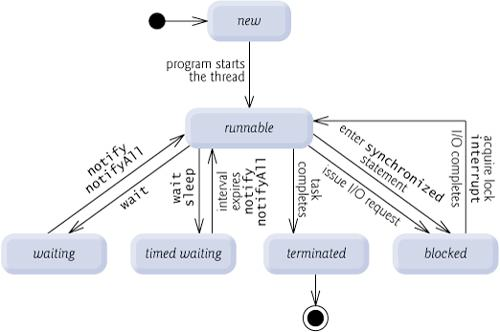

스레드는 하나의 프로그램 안에서 독립적으로 실행되는 흐름이다.
JVM은 하나의 애플리케이션 안에서 여러 실행 흐름이 동시에 동작하도록 지원한다.
일반적인 자바 애플리케이션은 `main()` 메서드를 실행하는 메인 스레드에서 시작하지만, 한 스레드만으로는 여러 작업을 동시에 처리하기 어렵다.
그래서 시간이 오래 걸리는 작업, I/O 대기 작업, 병렬로 처리할 수 있는 작업은 별도의 스레드에서 실행한다.

자바의 멀티스레드 프로그래밍을 이해하려면 먼저 `Thread`와 `Runnable`의 역할을 나눠서 봐야 한다.
`Thread`는 실행 흐름 자체를 나타내는 객체이고, `Runnable`은 그 실행 흐름 안에서 수행할 작업을 정의하는 인터페이스다.
간단히 말하면 `Thread`는 “누가 실행할 것인가”에 가깝고, `Runnable`은 “무엇을 실행할 것인가”에 가깝다.

자바는 초기부터 `Thread`와 `Runnable`을 제공했지만, 이후에는 더 높은 수준의 동시성 API가 계속 추가되었다.
`ExecutorService`는 작업 제출과 종료 관리를 제공하고, `Future`는 비동기 작업의 결과를 표현한다.
또한 Java 21 이후에는 플랫폼 스레드뿐 아니라 가상 스레드도 `Thread` API에서 만들 수 있다.
이 글에서는 그 기반이 되는 `Thread`와 `Runnable`을 먼저 정리한다.

## Thread 클래스

`Thread` 클래스는 자바에서 스레드를 만들고 시작하기 위한 기본 클래스다.
**[공식 문서 기준으로 `Thread`는 `Runnable`을 구현한 클래스이며, `start()`가 호출되면 새 실행 흐름에서 `run()` 메서드가 실행되도록 스케줄링된다.](https://docs.oracle.com/en/java/javase/26/docs/api/java.base/java/lang/Thread.html)**

`Thread`에서 자주 보는 메서드는 다음과 같다.

| 메서드 | 역할 | 주의할 점 |
| --- | --- | --- |
| `start()` | 현재 스레드와 독립적으로 실행될 새 스레드를 시작한다. | 한 `Thread` 객체는 최대 한 번만 시작할 수 있고, 종료된 뒤 다시 시작할 수 없다. |
| `run()` | 새 스레드에서 실행될 작업 본문이다. | 직접 호출하면 새 스레드가 만들어지지 않는다. 플랫폼 스레드에서는 현재 스레드가 `run()`을 실행하고, 가상 스레드에서는 직접 호출해도 아무 일도 하지 않는다. |
| `sleep()` | 현재 실행 중인 스레드를 지정한 시간만큼 일시 정지한다. | `synchronized` 모니터를 잡고 있었다면 그 소유권을 내려놓지 않는다. 인터럽트되면 `InterruptedException`이 발생한다. |
| `interrupt()` | 대상 스레드에 중단 요청을 보낸다. | 스레드를 강제로 죽이는 기능이 아니라 “멈춰 달라”는 신호에 가깝다. `InterruptedException`을 잡았다면 다시 던지거나 `Thread.currentThread().interrupt()`로 상태를 복원하는 편이 안전하다. |
| `join()` | 대상 스레드가 종료될 때까지 현재 스레드를 기다리게 한다. | 순서를 맞출 때 유용하지만, 무작정 기다리면 전체 흐름이 막힐 수 있다. |

`Thread`를 직접 상속해서 스레드를 만들 수도 있다.
이 경우 `run()` 메서드에 새 스레드가 수행할 작업을 작성하고, 실행할 때는 반드시 `start()`를 호출해야 한다.

```java
public class ThreadExample {
    public static void main(String[] args) {
        Thread worker = new WorkerThread();

        worker.start();

        System.out.println("main: " + Thread.currentThread().getName());
    }

    static class WorkerThread extends Thread {
        @Override
        public void run() {
            System.out.println("worker: " + Thread.currentThread().getName());
        }
    }
}
```

출력 순서는 매번 같다고 보장할 수 없다.
`start()`를 호출하면 JVM이 새 스레드를 스케줄링하고, 메인 스레드와 작업 스레드는 서로 독립적으로 실행되기 때문이다.

## start()와 run()의 차이

`start()`와 `run()`은 이름 때문에 헷갈리기 쉽지만 역할이 다르다.
`start()`는 새 스레드를 시작하라는 요청이고, `run()`은 그 스레드가 실행할 작업 본문이다.

```java
public class StartAndRunExample {
    public static void main(String[] args) {
        Runnable task = () -> System.out.println(Thread.currentThread().getName());

        Thread runThread = new Thread(task, "run-thread");
        runThread.run();   // main

        Thread startThread = new Thread(task, "start-thread");
        startThread.start(); // start-thread
    }
}
```

`run()`을 직접 호출하면 일반 메서드를 호출한 것과 같다.
따라서 위 코드에서 `runThread.run()`은 새 스레드가 아니라 메인 스레드에서 실행된다.
반면 `startThread.start()`는 새 스레드를 시작하고, 그 새 스레드 안에서 `run()`이 실행되도록 만든다.

또 하나 중요한 점은 `start()`는 한 번만 호출할 수 있다는 것이다.
**[이미 시작한 `Thread` 객체에 다시 `start()`를 호출하면 `IllegalThreadStateException`이 발생한다.](<https://docs.oracle.com/en/java/javase/26/docs/api/java.base/java/lang/Thread.html#start()>)**

```java
Thread thread = new Thread(() -> System.out.println("work"));

thread.start();
thread.start(); // IllegalThreadStateException
```

## Thread의 상태

스레드는 실행 중에도 여러 상태를 오간다.
**[공식 문서에서는 `Thread.State`를 `NEW`, `RUNNABLE`, `BLOCKED`, `WAITING`, `TIMED_WAITING`, `TERMINATED` 여섯 가지로 정의한다.](https://docs.oracle.com/en/java/javase/26/docs/api/java.base/java/lang/Thread.State.html)**



| 상태 | 의미 |
| --- | --- |
| `NEW` | 아직 시작되지 않은 상태 |
| `RUNNABLE` | JVM 안에서 실행 중이거나 실행 가능한 상태 |
| `BLOCKED` | 모니터 락을 얻기 위해 막혀 있는 상태 |
| `WAITING` | 다른 스레드의 특정 동작을 기한 없이 기다리는 상태 |
| `TIMED_WAITING` | 지정된 시간 동안 기다리는 상태 |
| `TERMINATED` | 실행이 끝난 상태 |

여기서 `RUNNABLE`은 “항상 CPU에서 실행 중”이라는 뜻이 아니다.
공식 문서도 `RUNNABLE` 상태의 스레드가 운영체제 자원, 예를 들어 CPU를 기다릴 수 있다고 설명한다.
따라서 자바의 스레드 상태는 JVM 관점의 상태이며, 운영체제의 스레드 상태와 일대일로 대응한다고 보면 안 된다.

## Runnable 인터페이스

**[`Runnable`은 반환값이 없는 작업을 표현하는 함수형 인터페이스이며, 추상 메서드가 `run()` 하나뿐이라 익명 클래스뿐 아니라 람다식으로도 구현할 수 있다.](https://docs.oracle.com/en/java/javase/26/docs/api/java.base/java/lang/Runnable.html)**

```java
@FunctionalInterface
public interface Runnable {
    void run();
}
```

`Runnable`을 사용하면 “작업”과 “실행 주체”를 분리할 수 있다.
`Runnable`은 실행할 작업만 알고 있고, 그 작업을 실제로 새 스레드에서 실행할지, 스레드 풀에서 실행할지는 외부에서 결정한다.

```java
public class RunnableExample {
    public static void main(String[] args) {
        Runnable task = () -> {
            System.out.println("worker: " + Thread.currentThread().getName());
        };

        Thread thread = new Thread(task, "worker-1");
        thread.start();

        System.out.println("main: " + Thread.currentThread().getName());
    }
}
```

`Thread`도 내부적으로는 `Runnable`을 구현한다.
그래서 `Thread`를 상속해서 `run()`을 재정의하는 방식도 가능하지만, 대부분의 경우에는 `Runnable`로 작업을 분리하는 편이 더 낫다.

## Thread와 Runnable 비교

`Thread`를 상속하는 방식은 코드가 단순해 보일 수 있지만, 자바는 클래스 다중 상속을 지원하지 않는다.
이미 다른 클래스를 상속해야 하는 경우에는 `Thread`를 상속할 수 없다.
또한 작업 코드가 `Thread`에 묶이기 때문에, 같은 작업을 스레드 풀이나 다른 실행 환경에서 재사용하기도 어렵다.

반대로 `Runnable`은 작업을 객체나 람다로 분리한다.
실행 방식은 `new Thread(runnable).start()`가 될 수도 있고, `ExecutorService`에 제출하는 방식이 될 수도 있다.
그래서 실무에서는 특별히 `Thread` 자체의 동작을 확장해야 하는 경우가 아니라면 `Runnable`을 먼저 고려하는 편이 자연스럽다.

| 구분 | Thread 상속 | Runnable 구현 |
| --- | --- | --- |
| 역할 | 실행 흐름과 작업이 한 클래스에 묶인다. | 실행할 작업만 표현한다. |
| 상속 | 다른 클래스를 상속하기 어렵다. | 다른 클래스 상속과 함께 사용할 수 있다. |
| 람다 사용 | 직접 람다로 표현하기 어렵다. | 함수형 인터페이스라 람다로 표현할 수 있다. |
| 재사용성 | 작업이 `Thread`에 묶인다. | `Thread`, `ExecutorService` 등 여러 실행 환경에 넘길 수 있다. |
| 반환값 | `run()`은 값을 반환하지 않는다. | `run()`은 값을 반환하지 않는다. 결과가 필요하면 `Callable`과 `Future`를 사용한다. |

## interrupt()는 강제 종료가 아니다

`interrupt()`는 이름 때문에 스레드를 즉시 중단시키는 기능처럼 보이지만, 실제로는 중단 요청을 표시하는 방식에 가깝다.
**[공식 문서도 인터럽트 상태를 “현재 작업을 멈추거나 취소해 달라는 요청”으로 설명한다.](<https://docs.oracle.com/en/java/javase/26/docs/api/java.base/java/lang/Thread.html#interrupt()>)**

예를 들어 `sleep()`, `join()`, `wait()`처럼 대기 중인 메서드는 인터럽트를 감지하면 `InterruptedException`을 던진다.
이 예외가 발생하면 인터럽트 상태는 지워지므로, 현재 메서드에서 예외를 처리하고 끝낼 수 없다면 다시 인터럽트 상태를 복원하는 편이 좋다.

```java
Thread worker = new Thread(() -> {
    try {
        Thread.sleep(1_000);
        System.out.println("done");
    } catch (InterruptedException e) {
        Thread.currentThread().interrupt();
        System.out.println("interrupted");
    }
});

worker.start();
worker.interrupt();
```

이런 이유로 스레드 작업을 작성할 때는 “언젠가 인터럽트될 수 있다”는 전제를 두는 것이 안전하다.
반복 작업이라면 중간중간 `Thread.currentThread().isInterrupted()`를 확인해 종료 조건으로 삼을 수 있다.

## Thread와 Runnable의 한계

`Thread`와 `Runnable`만으로도 멀티스레드 코드를 작성할 수는 있다.
하지만 직접 스레드를 만들고 관리하는 방식에는 한계가 있다.

- 스레드 생성과 종료를 매번 직접 관리해야 한다.
- 작업의 결과를 직접 반환받기 어렵다.
- 예외 처리와 취소 처리를 일관되게 관리하기 어렵다.
- 작업이 많아질수록 스레드 수, 종료 시점, 자원 해제를 관리하기 어렵다.

이 문제를 줄이기 위해 자바는 `ExecutorService`, `Callable`, `Future` 같은 더 높은 수준의 API를 제공한다.
**[`ExecutorService.submit(Callable)`](<https://docs.oracle.com/en/java/javase/26/docs/api/java.base/java/util/concurrent/ExecutorService.html#submit(java.util.concurrent.Callable)>)**은 값을 반환하는 작업을 제출하고, 그 결과를 `Future`로 받을 수 있다.

```java
import java.util.concurrent.ExecutorService;
import java.util.concurrent.Executors;
import java.util.concurrent.Future;

public class ExecutorServiceExample {
    public static void main(String[] args) throws Exception {
        try (ExecutorService executor = Executors.newFixedThreadPool(2)) {
            Future<Integer> future = executor.submit(() -> 10 + 20);

            System.out.println(future.get()); // 30
        }
    }
}
```

`ExecutorService`는 사용이 끝나면 종료해서 자원을 회수해야 한다.
Java 19 이후의 `ExecutorService`는 `AutoCloseable`을 상속하므로, 위 예제처럼 `try-with-resources`로 닫을 수 있다.

## 지금은 가상 스레드도 함께 봐야 한다

기존 `Thread`는 보통 운영체제 커널 스레드와 1:1로 매핑되는 플랫폼 스레드를 만든다.
플랫폼 스레드는 모든 종류의 작업에 사용할 수 있지만, 스택과 운영체제 자원을 사용하므로 무한정 만들기에는 부담이 있다.

Java 21부터는 가상 스레드가 정식으로 제공된다.
가상 스레드는 자바 런타임이 스케줄링하는 가벼운 스레드로, 많은 시간이 I/O 대기에 쓰이는 작업에 적합하다.
다만 장시간 CPU를 많이 사용하는 작업을 위한 기능은 아니다. **[Virtual Threads 공식 문서](https://docs.oracle.com/en/java/javase/26/docs/api/java.base/java/lang/Thread.html#virtual-threads)**

```java
Runnable task = () -> System.out.println(Thread.currentThread());

Thread thread = Thread.ofVirtual().start(task);
thread.join();
```

그래도 `Runnable`의 의미는 그대로다.
실행할 작업은 `Runnable`로 표현하고, 그 작업을 플랫폼 스레드에서 돌릴지 가상 스레드에서 돌릴지는 실행 방식의 문제로 분리할 수 있다.

## 정리

`Thread`와 `Runnable`은 자바 동시성의 가장 기본이 되는 API다.
`Thread`는 실행 흐름을 만들고 제어하는 객체이고, `Runnable`은 그 안에서 실행할 작업을 표현한다.
새 스레드를 만들려면 `run()`을 직접 호출하는 것이 아니라 `start()`를 호출해야 하며, 한 `Thread` 객체는 한 번만 시작할 수 있다.

다만 실무 코드에서 매번 `Thread`를 직접 만들 필요는 많지 않다.
작업을 `Runnable`이나 `Callable`로 표현하고, 실행과 관리는 `ExecutorService`나 가상 스레드 같은 상위 API에 맡기는 편이 더 유연하다.
먼저 `Thread`와 `Runnable`의 차이를 이해하고 나면, 이후의 `Callable`, `Future`, `ExecutorService`, `CompletableFuture`, 가상 스레드도 훨씬 자연스럽게 이어진다.

## 참고

- [MangKyu's Diary - Thread와 Runnable에 대한 이해 및 사용법](https://mangkyu.tistory.com/258)
