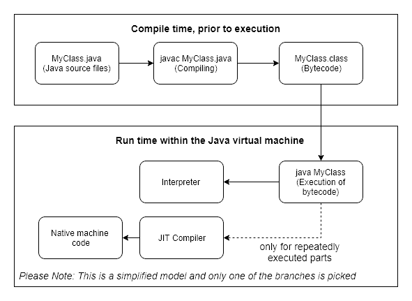
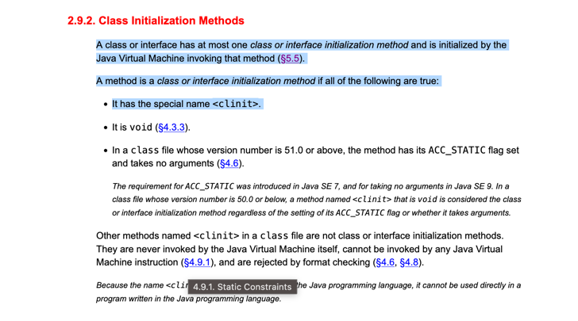
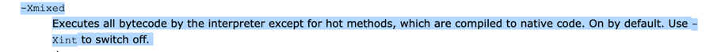
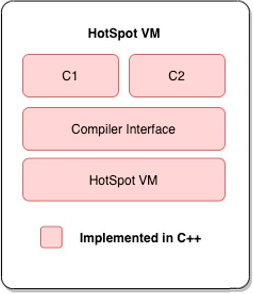
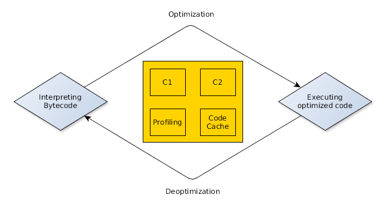
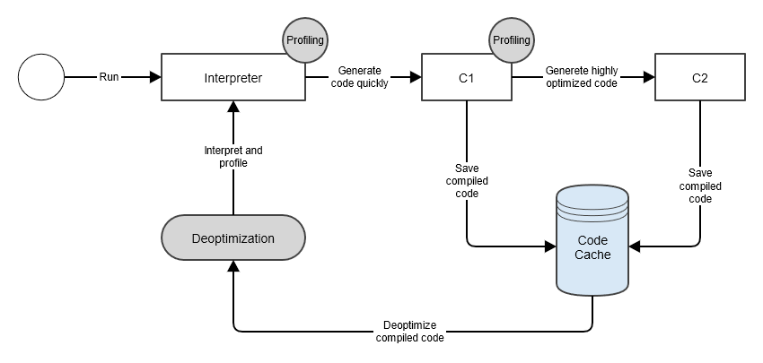
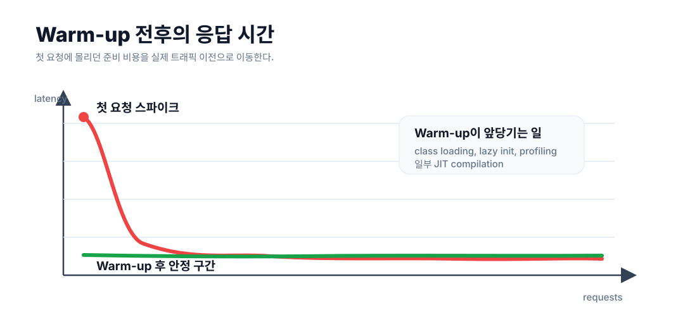

Java 기반 애플리케이션에서 첫 요청만 유독 느린 경우가 있다.
서버는 정상적으로 떠 있고, 헬스 체크도 통과했는데 실제 사용자의 첫 API 요청에서 응답 시간이 튀는 식이다.
이 현상은 보통 하나의 원인으로만 설명되지 않는다.
그중 JVM 관점에에서 큰 축은 **JIT 컴파일러와 JVM Warm-up**이다.
Java 애플리케이션은 처음부터 최고 성능으로 실행되는 것이 아니라, 실행 중에 프로파일링 정보를 모으고 자주 실행되는 코드를 점점 더 최적화한다.
그래서 서버가 "시작됨" 상태가 되었더라도 JVM 입장에서는 아직 충분히 달궈지지 않은 상태일 수 있다.

## Java 언어의 동작 방식

C, C++, Go, Rust 같은 언어는 컴파일 과정에서 바로 기계어로 번역하고 실행 파일을 만들어낸다.
컴파일 시에 코드 최적화까지 진행하여 처리 성능이 상당히 뛰어나다.
대신 생성된 기계어가 일반적으로 빌드 시점에 특정 플랫폼(운영체제와 하드웨어)에 종속적이라서 플랫폼이 바뀐다면 다시 빌드해야 하는 문제가 있다.

Java는 이러한 플랫폼 종속적인 문제를 해결하고자 JVM을 도입하였고, 그래서 동작 과정에 차이가 있다.
Java를 실행하면, 자바 코드는 컴파일러인 `javac`를 통해 JVM이 이해하는 `.class` 바이트코드로 컴파일된다.
이렇게 생성된 바이트코드는 CPU가 직접 실행하는 기계어가 아니라 JVM을 위한 중간 표현 언어이다.
이러한 구조 덕분에 Java는 플랫폼 독립성을 얻을 수 있다.



하지만 실행 시에 바이트 코드를 기계어로 번역하는 작업 때문에 성능이 느려졌다.
그래서 이러한 문제를 해결하고자 바이트 코드를 기계어로 컴파일하는 JIT(Just-In-Time) 컴파일러가 JVM에 도입되었다.
JIT 컴파일러의 목적은 빠른 컴파일 및 특정 환경에 맞춤화된 최적화를 제공하는 것이며, 이를 위해 실행 프로파일 정보를 활용한다.

## JVM이 클래스를 실행하기까지

JVM은 필요한 클래스를 발견하면 보통 **로딩(Loading) -> 링킹(Linking) -> 초기화(Initialization)** 과정을 거친다.

로딩은 클래스 이름에 해당하는 `.class` 바이너리를 찾아 JVM 내부 표현으로 만드는 과정이다.
JVM 명세에서는 클래스 로딩이 JVM과 클래스 로더의 공동 작업이며, 클래스 로더가 직접 바이트 배열을 가져오거나 다른 클래스 로더에게 위임할 수 있다고 설명한다.

링킹은 다시 검증, 준비, 해석으로 나뉜다.
검증은 바이트코드가 JVM 제약을 만족하는지 확인하고, 준비는 `static` 필드에 필요한 저장 공간을 만들고 기본값을 넣는다.
해석은 상수 풀의 심볼릭 레퍼런스를 실제 클래스, 필드, 메서드 참조인 다이렉트 레퍼런스로 바꾸는 과정이다.

초기화에서는 `static` 필드의 명시적 초기값과 `static` 블록이 실행된다.

[JVM 명세에서는 클래스 또는 인터페이스 초기화가 클래스 초기화 메서드인 `<clinit>` 실행으로 구성된다고 설명한다.](https://docs.oracle.com/javase/specs/jvms/se16/html/jvms-2.html#jvms-2.9.2:~:text=Methods-,A%20class%20or,clinit%3E%2E)

이 과정은 모든 클래스를 애플리케이션 시작 시점에 한 번에 끝내는 방식이 아니다.
실제로 어떤 요청 경로에서 처음 사용되는 클래스라면, 그 요청을 처리하는 도중에 로딩, 링킹, 초기화가 발생할 수 있다.
배포 직후 첫 요청이 느린 이유 중 하나가 바로 이 지연 로딩(lazy loading) 때문이다.

## 인터프리터와 JIT는 왜 같이 있을까



JVM은 기본적으로 **mixed mode**로 실행된다.
[Oracle의 `java` 명령 문서에서도 `-Xmixed`는 기본값이며, 대부분의 바이트코드는 인터프리터로 실행하되 hot method는 네이티브 코드로 컴파일한다고 설명한다.](https://docs.oracle.com/en/java/javase/17/docs/specs/man/java.html#extra-options-for-java:~:text=%2DXmixed,off%2E0)

처음부터 모든 바이트코드를 네이티브 코드로 컴파일하면 시작이 늦어진다.
반대로 끝까지 인터프리터만 사용하면 같은 바이트코드를 매번 해석해야 하므로 장기 실행 성능이 떨어진다.
그래서 ava 1.3부터는 Hotspot VM이 추가되었고, Hotspot VM에는 2개의 JIT 컴파일러가 포함되어 있다.
HotSpot JVM은 우선 인터프리터로 빠르게 실행을 시작하고, 실행 중에 자주 호출되는 메서드와 루프를 찾아 JIT 컴파일 대상으로 올린다.



- c1
  - 클라이언트 컴파일러(Client Compiler)
  - 코드 최적화는 덜하지만 즉시 시작되는 속도는 빠름
  - 즉시 실행되는 데스크톱 애플리케이션 등에 적합함
- c2
  - 서버 컴파일러(Server Compiler)
  - 즉시 시작되는 속도는 느리지만 최적화는 많이 되어 warm-up 후에는 빠름
  - 장기 실행되는 서버 애플리케이션 등에 적합함


Java 6에서는 c1 컴파일러와 c2 컴파일러 중 하나를 선택해야 했지만, 
Java 7부터는 계층형 컴파일을 사용할 수 있는 옵션이 추가되었고, 
Java 8부터는 이것이 JVM의 기본 동작이 되었다. 
이 접근 방식은 c1 컴파일러와 c2 컴파일러를 모두 사용한다.



HotSpot VM은 초기에 인터프리터를 사용해서 최적화 없이 코드를 실행하지만,
각 메서드의 호출 여부를 계속해서 주시한다.
각 메서드의 호출 회수를 추적하고,
호출 횟수가 C1 컴파일러의 임계값을 초과하면 해당 메서드를 C1 컴파일러 대기열에 넣고 재컴파일하여 최적화한다.
이후에도 계속 각 메서드의 호출 횟수를 추적하여 동일하게 최적화를 진행하는데,
C1 컴파일러 이후에는 C2 컴파일러를 사용한다.
이렇듯 컴파일러를 단계적으로 적용하는 방식을 계층형 컴파일(Tired Compilation이라고 한다.
Oracle의 HotSpot 성능 문서에 따르면 단계별 컴파일은 인터프리터뿐 아니라 클라이언트 컴파일러를 함께 사용해 프로파일링 정보를 모으고, 
이후 서버 컴파일러가 더 강한 최적화를 적용할 수 있게 한다.


Java SE 7에서 도입되었고, 서버 VM에서는 기본 모드다.

단순화하면 흐름은 다음과 같다.



1. 인터프리터가 바이트코드를 실행하며 호출 빈도, 루프 반복, 타입 정보 같은 프로파일을 모은다.
2. C1 컴파일러가 비교적 빠르게 네이티브 코드를 만든다.
3. 충분히 자주 실행되는 코드는 C2 컴파일러가 더 공격적인 최적화를 적용한다.
4. 컴파일된 네이티브 코드는 Code Cache에 저장되고 이후 호출에서 재사용된다.

JDK에서 실제 플래그도 확인할 수 있다.

```bash
java -XX:+PrintFlagsFinal -version \
  | grep -E 'TieredCompilation|Tier4CompileThreshold|ReservedCodeCacheSize|MaxInlineSize|FreqInlineSize|DoEscapeAnalysis'
```

로컬 JDK 21 환경에서는 다음과 같은 값이 보였다.

```text
bool  TieredCompilation     = true
intx  Tier4CompileThreshold = 15000
uintx ReservedCodeCacheSize = 251658240
intx  MaxInlineSize         = 35
intx  FreqInlineSize        = 325
bool  DoEscapeAnalysis      = true
```

중요한 점은 JIT 컴파일도 공짜가 아니라는 것이다.
바이트코드를 네이티브 코드로 바꾸는 동안 컴파일러 스레드가 CPU를 사용하고, 생성된 코드는 Code Cache에 저장된다.
Oracle의 `java` 명령 문서에서도 `ReservedCodeCacheSize`가 JIT 컴파일된 코드의 최대 Code Cache 크기를 정한다고 설명한다.
Code Cache가 부족하면 더 이상 컴파일하지 못해 장기 실행 성능에 영향을 줄 수 있다.

## JIT가 하는 최적화

JIT 컴파일러는 단순히 바이트코드를 기계어로 번역하는 것에서 끝나지 않는다.
실행 중에 모은 프로파일을 바탕으로 현재 애플리케이션에 맞는 최적화를 적용한다.

대표적인 예시는 **메서드 인라이닝(Method Inlining)** 이다.
작고 자주 호출되는 메서드의 호출부를 실제 메서드 본문으로 바꿔 호출 비용을 줄인다.
Oracle의 `java` 명령 문서에서도 `-XX:+Inline`은 기본 활성화 옵션이며, `MaxInlineSize`와 `FreqInlineSize` 같은 옵션이 인라이닝 대상 크기와 관련되어 있음을 확인할 수 있다.

또 다른 예시는 **탈출 분석(Escape Analysis)** 이다.
객체가 메서드나 스레드 바깥으로 빠져나가지 않는다고 판단되면, 객체 할당 자체를 더 가볍게 만들거나 스칼라 값으로 쪼개는 최적화가 가능해진다.
로컬 JDK 21에서도 `DoEscapeAnalysis = true`로 활성화되어 있었다.

다만 이런 최적화는 대부분 "지금까지 관측한 실행 패턴"에 근거한다.
예를 들어 어떤 인터페이스 호출이 지금까지 한 구현체로만 들어왔다면 JIT는 그 구현체를 가정하고 인라이닝할 수 있다.
나중에 다른 구현체가 로딩되어 가정이 깨지면 JVM은 기존 컴파일 코드를 폐기하고 다시 해석하거나 재컴파일할 수 있다.
이런 과정을 보통 디옵티마이제이션(deoptimization)이라고 부른다.

## 첫 요청이 느린 이유

첫 요청 지연은 다음 작업들이 한 요청 안에서 겹칠 때 커진다.

1. 아직 초기화되지 않은 Spring MVC 전략 객체, 메시지 컨버터, 검증기, 템플릿 엔진, 프록시 등이 실제 요청에서 처음 준비된다.
2. 해당 요청 경로에서 처음 만나는 클래스들이 로딩, 링킹, 초기화된다.
3. JVM은 아직 충분한 프로파일을 모으지 못했기 때문에 많은 코드가 인터프리터 또는 낮은 티어의 컴파일 코드로 실행된다.
4. 요청 처리 중 hot method가 감지되면 JIT 컴파일이 백그라운드에서 일어나며 CPU와 Code Cache를 사용한다.
5. DB 커넥션, 외부 API 클라이언트, 직렬화 라이브러리, 캐시 같은 애플리케이션 자원도 첫 사용 비용을 만들 수 있다.

즉 첫 요청은 사용자의 비즈니스 로직만 수행하는 요청이 아니다.
JVM과 프레임워크가 "앞으로 빠르게 처리하기 위한 준비 작업"을 같이 수행하는 요청이 될 수 있다.



## Warm-up은 무엇을 해결할까

Warm-up은 실제 사용자 트래픽을 받기 전에 중요한 코드 경로를 미리 실행해두는 작업이다.
목표는 크게 두 가지로 나눌 수 있다.

첫 번째는 **클래스 로딩과 프레임워크 초기화 비용을 사용자 요청 밖으로 밀어내는 것**이다.
실제 API를 내부적으로 한 번 호출하거나, 주요 서비스 메서드를 안전한 입력으로 실행하면 요청 경로에서 필요한 클래스와 빈이 미리 준비된다.
카카오페이 기술 블로그에서도 배포 직후 지연 원인을 분석하며, 실제 요청 전에 필요한 클래스 로딩을 유도하는 JVM 웜업을 적용한 사례를 소개한다.

두 번째는 **JIT 최적화가 진행될 만큼 충분히 반복 실행하는 것**이다.
다만 몇 번의 요청만으로 C2의 최고 티어까지 올라간다고 기대하면 안 된다.
로컬 JDK 21의 기본값에서도 `Tier4CompileThreshold = 15000`처럼 꽤 큰 임계값을 확인할 수 있다.
따라서 짧은 Warm-up은 주로 클래스 로딩과 lazy init 비용을 줄이고, JIT의 최고 성능 도달은 실제 트래픽을 받으며 점진적으로 진행된다고 보는 편이 현실적이다.

운영 환경에서는 보통 다음 흐름이 안전하다.

1. 애플리케이션을 시작한다.
2. Readiness는 아직 실패 또는 대기 상태로 둔다.
3. 내부 Warm-up 엔드포인트나 스크립트가 주요 조회 API, 직렬화, DB 접근, 캐시 접근을 안전하게 실행한다.
4. Warm-up이 끝난 뒤 Readiness를 성공으로 바꾸고 L7/LB 트래픽을 받는다.

Warm-up 엔드포인트는 반드시 멱등적이어야 한다.
결제, 주문 생성, 알림 발송처럼 외부 효과가 있는 동작을 그대로 호출하면 안 된다.
또한 Warm-up 결과를 맹신하기보다 APM, JFR, GC 로그, 클래스 로딩 로그, 컴파일 로그로 실제 병목이 어디인지 확인해야 한다.

## 직접 확인해보기

클래스 로딩은 다음처럼 볼 수 있다.

```bash
java -Xlog:class+load=info -version
```

로컬에서는 다음과 같은 로그가 출력되었다.

```text
[0.010s][info][class,load] java.lang.Object source: shared objects file
[0.010s][info][class,load] java.io.Serializable source: shared objects file
[0.010s][info][class,load] java.lang.String source: shared objects file
```

JIT 컴파일은 `-XX:+PrintCompilation`으로 관찰할 수 있다.
아래 예시는 일부러 같은 메서드를 반복 호출하는 작은 프로그램이다.

```java
public class JitWarmupDemo {
    private static long blackhole;

    public static void main(String[] args) {
        long first = runOnce();
        long last = 0;

        for (int i = 0; i < 20_000; i++) {
            last = runOnce();
        }

        System.out.println("first = " + first);
        System.out.println("last  = " + last);
        System.out.println("blackhole = " + blackhole);
    }

    private static long runOnce() {
        long startedAt = System.nanoTime();
        long sum = 0;

        for (int i = 0; i < 10_000; i++) {
            sum += hotMethod(i);
        }

        blackhole = sum;
        return System.nanoTime() - startedAt;
    }

    private static long hotMethod(int value) {
        return (value * 31L) ^ (value >>> 3);
    }
}
```

```bash
javac JitWarmupDemo.java
java -XX:+PrintCompilation JitWarmupDemo
```

로컬 JDK 21에서는 다음처럼 같은 메서드가 낮은 단계에서 컴파일된 뒤 더 높은 단계로 다시 컴파일되는 흐름을 볼 수 있었다.

```text
14    5       3       JitWarmupDemo::hotMethod (12 bytes)
14    6       4       JitWarmupDemo::hotMethod (12 bytes)
14    5       3       JitWarmupDemo::hotMethod (12 bytes)   made not entrant
15    9 %     4       JitWarmupDemo::runOnce @ 9 (41 bytes)
16   10       4       JitWarmupDemo::runOnce (41 bytes)
first = 168750
last  = 2792
```

여기서 `3`, `4`는 컴파일 레벨을 의미하고, `%`는 루프 실행 중 컴파일 코드로 갈아타는 OSR(On-Stack Replacement)과 관련이 있다.
`made not entrant`는 이전에 만들어둔 컴파일 코드가 더 이상 새 호출에 쓰이지 않게 되었다는 뜻이다.

단, 위 코드는 JIT 현상을 관찰하기 위한 장난감 예제일 뿐이다.
정확한 마이크로벤치마크가 필요하다면 직접 `System.nanoTime()`만으로 결론을 내리지 말고 JMH 같은 벤치마크 도구를 사용해야 한다.

## 정리

Java 애플리케이션의 첫 요청이 느린 이유는 "JVM이 느려서"가 아니다.
JVM은 플랫폼 독립성을 위해 바이트코드를 실행하고, 시작 속도와 장기 실행 성능을 함께 얻기 위해 인터프리터와 JIT 컴파일러를 함께 사용한다.
이 구조 덕분에 오래 실행되는 서버 애플리케이션은 시간이 지나며 더 좋은 최적화 상태에 도달할 수 있지만, 배포 직후에는 아직 클래스 로딩, 프레임워크 초기화, JIT 프로파일링과 컴파일이 남아 있을 수 있다.

따라서 첫 요청 지연을 줄이려면 단순히 "몇 번 호출해보자"에서 끝내기보다, 어떤 비용을 앞당기고 싶은지 분리해서 봐야 한다.
클래스 로딩과 lazy init 비용을 줄이려면 주요 요청 경로를 미리 실행하고, JIT 최고 성능까지 빠르게 도달해야 한다면 충분한 반복 횟수와 임계값, Code Cache, 실제 트래픽 패턴까지 함께 고려해야 한다.

## 참고한 글과 문서

- [Java Virtual Machine Specification, Chapter 2. The Structure of the Java Virtual Machine](https://docs.oracle.com/javase/specs/jvms/se25/html/jvms-2.html)
- [Java Virtual Machine Specification, Chapter 5. Loading, Linking, and Initializing](https://docs.oracle.com/javase/specs/jvms/se25/html/jvms-5.html)
- [Oracle Java SE 25, The java Command](https://docs.oracle.com/en/java/javase/25/docs/specs/man/java.html)
- [Oracle, Java HotSpot Virtual Machine Performance Enhancements](https://docs.oracle.com/javase/8/docs/technotes/guides/vm/performance-enhancements-7.html)
- [MangKyu, 스프링 첫 요청이 처리되는데 오래 걸리는 이유](https://mangkyu.tistory.com/232)
- [MangKyu, HotSpot VM의 한계와 GraalVM의 등장](https://mangkyu.tistory.com/301)
- [MangKyu, JIT 컴파일러의 다양한 최적화 기술들](https://mangkyu.tistory.com/343)
- [MangKyu, JIT 컴파일러의 최적화 과정 자세히 살펴보기](https://mangkyu.tistory.com/345)
- [카카오페이 기술 블로그, 배포 직후 발생하는 응답 지연을 해결하기 위한 여정](https://tech.kakaopay.com/post/jvm-warm-up/)
