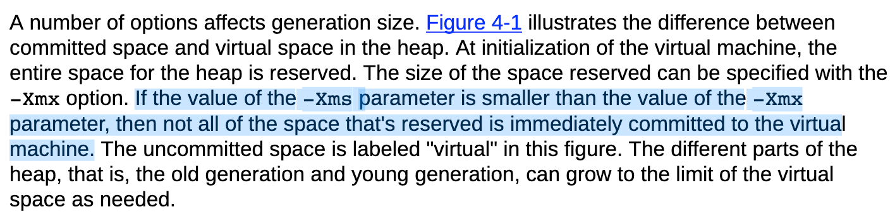
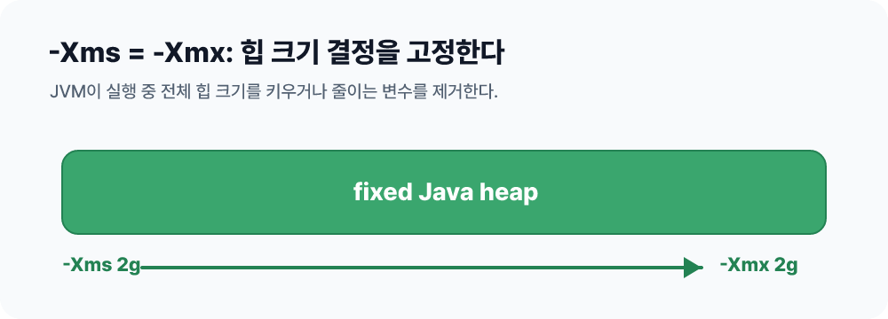

프로덕션 서버의 JVM 옵션을 보다가 다음과 같은 설정을 자주 만나게 됐다.

```bash
java -Xms2g -Xmx2g -jar app.jar
```

처음 보면 조금 이상하다.
`-Xmx`가 최대 힙 크기라면, 최대값만 넉넉하게 잡아두면 되는 것 아닐까?
왜 굳이 `-Xms`까지 같은 값으로 맞춰서 JVM이 시작하자마자 큰 힙을 갖게 만들까?

짧게 말하면, **힙 크기를 키우고 줄이는 결정을 JVM에게 맡기지 않고 예측 가능한 상태로 고정하기 위해서다.**
다만 이 설정은 모든 상황에서 정답은 아니다.
서버의 응답 지연을 안정적으로 유지하려는 선택일 수도 있고, 반대로 메모리를 낭비하는 선택일 수도 있다.

## -Xms와 -Xmx의 의미

`-Xms`는 JVM이 시작할 때 사용하는 Java heap의 최소값이자 초기값이다.
`-Xmx`는 Java heap이 커질 수 있는 최대값이다.

```bash
java -Xms512m -Xmx2g -jar app.jar
```

위 설정은 JVM이 처음에는 512MB 힙으로 시작하고, 필요하면 최대 2GB까지 힙을 늘릴 수 있다는 뜻이다.
반대로 다음처럼 두 값을 같게 두면 힙의 최소값과 최대값이 같아진다.

```bash
java -Xms2g -Xmx2g -jar app.jar
```

이때 중요한 점은 `-Xmx`가 **JVM 프로세스 전체 메모리의 최대값이 아니라 Java heap의 최대값**이라는 것이다.
JVM 프로세스에는 heap 외에도 Metaspace, thread stack, code cache, direct buffer, GC 내부 구조, 네이티브 라이브러리 메모리 등이 존재한다.

그래서 컨테이너 메모리 제한이 2GB라고 해서 `-Xmx2g`를 그대로 주면 안전하지 않을 수 있다.
heap 밖의 메모리가 추가로 필요하기 때문이다.

## Xms와 Xmx가 다르면 JVM은 힙을 조절한다



Oracle의 HotSpot GC 튜닝 가이드는 JVM이 시작할 때 `-Xmx` 크기만큼 힙 주소 공간을 예약하고, `-Xms`가 더 작으면 전체 공간을 즉시 커밋하지 않는다고 설명한다.
즉, `-Xms512m -Xmx2g`라면 JVM은 최대 2GB까지 커질 수 있는 공간을 염두에 두지만, 처음부터 2GB 힙을 모두 쓰는 것은 아니다.

)

JVM은 GC가 발생할 때마다 살아있는 객체와 여유 공간의 비율을 보고 힙을 키우거나 줄일 수 있다.
예를 들어 객체 할당량이 늘어나고 GC 이후 여유 공간이 부족하면 힙을 확장한다.
반대로 여유 공간이 지나치게 많으면 힙을 축소할 수 있다.

문제는 이 조절 과정도 비용이라는 점이다.
힙 확장은 메모리 커밋을 동반할 수 있고, 힙 축소는 메모리를 운영체제에 돌려주는 작업을 포함할 수 있다.
또한 힙이 작은 상태에서 애플리케이션이 빠르게 많은 객체를 만들면, JVM은 힙을 늘리기 전까지 더 자주 GC를 수행할 수 있다.

## 같은 값으로 두면 무엇이 좋아질까

`-Xms`와 `-Xmx`를 같은 값으로 두면 힙 크기 조절이라는 변수가 사라진다.



Oracle의 HotSpot GC 튜닝 가이드도 서버 애플리케이션에서 두 값을 같게 두면 JVM의 중요한 크기 결정 하나를 제거해서 예측 가능성이 높아진다고 설명한다.
Oracle WebLogic 튜닝 문서 역시 GC를 줄이기 위한 일반 규칙으로 초기 힙 크기와 최대 힙 크기를 같게 두는 방식을 제시한다.

효과를 조금 더 나누어 보면 다음과 같다.

1. **힙 리사이징 비용을 줄인다.**
   JVM이 실행 중에 힙을 키우고 줄이는 판단을 덜 하게 된다.
   특히 애플리케이션이 정상 상태에서 결국 최대 힙에 가까운 메모리를 사용할 것이라면, 작은 힙으로 시작해서 단계적으로 커지는 과정은 별 이득 없이 GC 압박만 늘릴 수 있다.

2. **GC 패턴이 예측 가능해진다.**
   힙 크기가 계속 바뀌면 같은 트래픽에서도 GC 빈도와 pause time이 달라질 수 있다.
   힙을 고정하면 튜닝할 때 관찰해야 할 변수가 줄어든다.

3. **서버 용량 산정이 단순해진다.**
   `-Xms2g -Xmx2g`는 이 JVM이 heap으로 2GB를 사용하도록 설계했다는 명확한 선언에 가깝다.
   여러 Java 프로세스를 한 서버에 올리거나 Kubernetes에서 pod memory limit을 정할 때 계산이 쉬워진다.

4. **초기 트래픽이나 warm-up 구간의 흔들림을 줄일 수 있다.**
   시작 직후 캐시 로딩, 클래스 로딩, 배치성 초기화가 몰리는 애플리케이션은 작은 힙으로 시작하면 초반부터 GC가 바빠질 수 있다.
   처음부터 목표 힙 크기로 시작하면 이 구간이 더 안정적일 수 있다.

## 로컬 테스트로 확인한 차이

실제로 어떤 차이가 나는지 로컬에서 간단히 확인해봤다.
테스트 환경은 OpenJDK 21.0.11 Corretto이고, GC는 기본값인 G1을 사용했다.

테스트 코드는 256KB짜리 byte 배열을 480개 만들어 약 120MB를 할당하고, 할당 전후의 heap 상태를 출력한다.

```java
import java.util.ArrayList;
import java.util.List;

public class HeapSizingProbe {
    private static final long MB = 1024L * 1024L;

    private static void printHeap(String label) {
        Runtime runtime = Runtime.getRuntime();
        long total = runtime.totalMemory() / MB;
        long max = runtime.maxMemory() / MB;
        long free = runtime.freeMemory() / MB;
        long used = total - free;
        System.out.printf("%s total=%dMB max=%dMB used=%dMB free=%dMB%n", label, total, max, used, free);
    }

    public static void main(String[] args) {
        printHeap("before");

        List<byte[]> chunks = new ArrayList<>();
        long started = System.nanoTime();

        for (int i = 0; i < 480; i++) {
            chunks.add(new byte[256 * 1024]);
        }

        long elapsedMs = (System.nanoTime() - started) / 1_000_000;
        printHeap("after ");
        System.out.printf("allocated=120MB elapsed=%dms%n", elapsedMs);
    }
}
```

먼저 `-Xms64m -Xmx256m`처럼 초기 힙과 최대 힙을 다르게 두고 실행했다.

```bash
javac HeapSizingProbe.java
java -Xms64m -Xmx256m -Xlog:gc HeapSizingProbe
```

결과는 다음과 같았다.

```text
before total=66MB max=256MB used=3MB free=63MB
GC(0) ... 23M->22M(66M)
GC(1) ... 34M->33M(66M)
GC(2) ... 42M->42M(66M)
GC(4) ... 60M->60M(82M)
GC(5) ... 75M->75M(160M)
GC(6) ... 115M->115M(160M)
GC(7) ... 149M->151M(196M)
after  total=196MB max=256MB used=164MB free=32MB
allocated=120MB elapsed=35ms
```

처음에는 `total=66MB`로 시작했고, 할당이 진행되면서 GC log의 heap 크기가 `(66M) -> (82M) -> (160M) -> (196M)`처럼 커졌다.
즉, 애플리케이션 실행 중에 JVM이 heap을 확장했다.

이번에는 `-Xms256m -Xmx256m`처럼 두 값을 같게 두고 실행했다.

```bash
java -Xms256m -Xmx256m -Xlog:gc HeapSizingProbe
```

```text
before total=256MB max=256MB used=3MB free=253MB
GC(0) ... 23M->22M(256M)
GC(1) ... 36M->36M(256M)
GC(2) ... 60M->60M(256M)
GC(3) ... 92M->91M(256M)
GC(4) ... 133M->133M(256M)
after  total=256MB max=256MB used=162MB free=94MB
allocated=120MB elapsed=20ms
```

이번에는 시작부터 `total=256MB`였고, GC log에서도 heap 크기가 계속 `(256M)`로 유지됐다.
이 테스트에서는 Young GC pause도 7번에서 5번으로 줄었고, 할당 시간도 35ms에서 20ms로 줄었다.

물론 이 수치만으로 `-Xms == -Xmx`가 항상 몇 퍼센트 더 빠르다고 말할 수는 없다.
작은 로컬 테스트는 OS 상태, CPU 상태, GC 종류, 객체 크기, allocation pattern에 따라 흔들린다.
하지만 이 테스트로 확인할 수 있는 이점은 분명하다.

**`-Xms`와 `-Xmx`를 같게 두면 실행 중 heap 확장이라는 변수가 사라진다.**
그래서 초반 할당 구간에서 heap resizing과 그에 따라 달라지는 GC 패턴을 줄일 수 있다.
성능 향상 자체보다 운영 관점의 예측 가능성이 핵심 이점이다.

다만 `-Xms == -Xmx`라고 해서 물리 메모리가 항상 시작 즉시 전부 점유된다고 단정하면 안 된다.
운영체제와 JVM 옵션에 따라 실제 페이지 접근은 지연될 수 있다.
정말 시작 시점에 힙 페이지를 미리 만지고 싶다면 `-XX:+AlwaysPreTouch` 같은 옵션을 함께 검토하지만, 그만큼 시작 시간이 길어질 수 있다.

## 그래도 항상 같은 값이 정답은 아니다

`-Xms`와 `-Xmx`를 같게 두는 방식은 예측 가능성을 얻는 대신 유연성을 포기한다.
Oracle 문서도 두 값을 같게 두면 JVM이 잘못된 선택을 보정할 수 없다고 주의한다.

예를 들어 `-Xms4g -Xmx4g`로 고정했는데 실제 애플리케이션의 live set이 700MB 수준이라면, 다른 프로세스가 쓸 수 있는 메모리를 불필요하게 붙잡을 수 있다.
반대로 실제로 6GB가 필요한 애플리케이션에 `-Xms4g -Xmx4g`를 주면 JVM은 더 커질 수 없고 `OutOfMemoryError`로 이어질 수 있다.

특히 다음 환경에서는 두 값을 다르게 두는 편이 나을 수 있다.

- 개발 환경처럼 메모리를 아끼는 것이 더 중요한 경우
- 트래픽이 시간대별로 크게 출렁이는 서비스
- 유휴 시간이 길고, 그동안 메모리를 운영체제나 다른 프로세스에 돌려주고 싶은 서비스
- Kubernetes처럼 메모리 비용과 pod density가 중요한 환경
- G1, ZGC처럼 사용하지 않는 heap memory를 운영체제에 반환하는 기능을 활용하고 싶은 경우

OpenJDK의 JEP 346은 G1이 유휴 상태에서 사용하지 않는 committed heap memory를 운영체제에 반환하는 기능을 다룬다.
또 JEP 351은 ZGC의 unused memory uncommit 기능을 설명하면서, 최소 힙(`-Xms`)과 최대 힙(`-Xmx`)이 같으면 이 기능이 사실상 비활성화된다고 설명한다.
즉, 최신 GC를 사용하면서 메모리 탄력성이 중요하다면 `-Xms == -Xmx`가 오히려 손해일 수 있다.

## 어떻게 결정하면 좋을까

무작정 블로그 설정을 복사하기보다, 먼저 애플리케이션의 실제 메모리 사용량을 봐야 한다.

```bash
java -Xms1g -Xmx1g \
  -Xlog:gc*:file=gc.log:time,uptime,level,tags \
  -jar app.jar
```

GC log, JFR, APM, container memory metric을 함께 보면서 다음을 확인한다.

- 정상 트래픽에서 live set이 어느 정도인지
- 순간 allocation rate가 얼마나 높은지
- Full GC나 evacuation failure 같은 위험 신호가 있는지
- pause time 목표를 만족하는지
- heap 밖 메모리를 포함한 프로세스 RSS가 container limit에 얼마나 가까운지

일반적인 서버 애플리케이션이라면 처음에는 `-Xmx`를 실제 live set보다 충분히 크게 잡고, heap 밖 메모리까지 고려해 container limit보다 낮게 둔다.
그 다음 응답 지연의 예측 가능성이 중요하고 메모리 여유가 있다면 `-Xms`를 `-Xmx`와 같게 맞춰본다.
반대로 메모리 사용량을 탄력적으로 줄이는 것이 더 중요하다면 `-Xms`를 낮게 두거나, `-XX:InitialRAMPercentage`, `-XX:MaxRAMPercentage` 같은 비율 기반 옵션을 검토할 수 있다.

## 결론

`-Xms`와 `-Xmx`를 같은 값으로 두는 이유는 JVM을 더 똑똑하게 만들기 위해서가 아니라, **JVM이 힙 크기를 조절하는 상황 자체를 줄여서 운영자가 예측 가능한 메모리 조건을 만들기 위해서**다.

서버 애플리케이션에서 힙 크기가 충분히 검증되었고, 응답 지연의 일관성이 중요하며, 메모리 여유가 있다면 `-Xms == -Xmx`는 좋은 선택이 될 수 있다.
하지만 메모리 비용이 중요하거나 유휴 시 메모리를 반환해야 하는 환경이라면 두 값을 다르게 두는 것도 충분히 합리적이다.

결국 핵심은 하나다.
`-Xms == -Xmx`는 성능을 올려주는 마법 주문이 아니라, **측정된 힙 크기를 고정해서 런타임의 변수를 줄이는 튜닝 선택지**다.

## 참고

- [Oracle Java SE 25 - The java Command](https://docs.oracle.com/en/java/javase/25/docs/specs/man/java.html)
- [Oracle HotSpot Virtual Machine Garbage Collection Tuning Guide](https://docs.oracle.com/en/java/javase/25/gctuning/hotspot-virtual-machine-garbage-collection-tuning-guide.pdf)
- [Oracle WebLogic Server - Tuning Java Virtual Machines](https://docs.oracle.com/cloud/latest/as111170/PERFM/jvm_tuning.htm)
- [OpenJDK JEP 346 - Promptly Return Unused Committed Memory from G1](https://openjdk.org/jeps/346)
- [OpenJDK JEP 351 - ZGC: Uncommit Unused Memory](https://openjdk.org/jeps/351)
- [IBM Semeru Runtime - -Xms / -Xmx](https://www.ibm.com/docs/en/semeru-runtime-ce-z/17.0.0?topic=options-xms-xmx)
