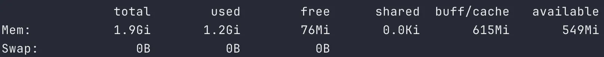

## 서버가 응답이 없다
운영 서버(t3.small)에 Docker 기반 무중단 배포를 시도하는 과정에서, 신규 컨테이너와 기존 컨테이너가 공존하는 시점에 메모리와 CPU 사용량이 임계치를 초과하는 현상 발생하고 있었다. 이로인해 배포 진행 중 SSH 접속 불가, 간헐적 서비스 타임아웃 발생했다.


## 메모리 누수인가? 범인 찾기
먼저 top을 통해 어플리케이션이 얼마나 메모리를 잡고 있는지 확인했다.


현재 메모리 점유율 수치는 약 880MB로 전체 메모리의 약 45%를 차지하고 있었다. 현재 t3.small(2GB) 환경에서 Spring Boot 애플리케이션이 초기 구동 시 힙 메모리와 메타스페이스를 사전 확보하려는 특성을 고려했을때, 배포 시 두 개의 컨테이너가 공존하면 메모리 한계를 초과할 것으로 판단했다. 이를 해결하기 위해 일시적인 리소스 부족 현상을 방어할 스왑 메모리 설정을 고려했다. 하지만 그전에 현재의 880MB라는 이 수치가 기본 사용량인 정상 수치인지, 아니면 메모리 누수로 인한 비정상적 수치인지 확인이 필요하다고 생각했다.

만약 여기서 메모리 누수로 인한 수치면 힙 덤프를 통해 메모리 속을 정밀하게 분석하고, 문제 지점을 파악해서 따로 해결을 할 필요가 있다고 생각했다. 그래서 먼저 메모리 누수인지 확인해야 했다. 덤프 생성 시 STW(Stop The World)장애 위험을 고려해 우선 힙 덤프 없이 가볍게 jstat으로 확인했다.

```bash
docker exec dd26 jstat -gcutil 1 1000
```


지표에 대한 내용은 다음과 같다.

- O(Old Generation): 46.00%

  오랫동안 살아남은 객체들이 저장되는 곳으로 여기가 100%차면 OOM이 발생한다.
  만약 메모리 누수였다면, 이 수치가 80%는 찍었을 것이다.

- YGCT(Young GC Time)가 0.01초 대

  YGC(횟수) 232회 / YGCT(총 시간) 3.244초로 계산해봤을 때, 3.244 / 232 = 약 0.013초 (13ms)

  GC를 한 번 할 때마다 0.013초밖에 안 걸렸다는 것을 알 수 있었다. 이는 GC 과정에서 순식간에 끝났다는 거고, 서버가 전혀 힘들어하지 않고 있다는 것을 의미한다.

- FGC(Full GC) = 0

  Full GC도 0회로 한 번도 메모리가 부족했던 적은 없다는 것이다.

- M(Metaspace) = 99.28%

  여기서 99.28%라는 수치에 저게 뭐지 할 수도 있는데, Metaspace는 클래스 정보가 저장되는 곳으로 힙과 다르게 동작한다. JVM은 처음에 Metaspace를 아주 작게 잡았다가 클래스가 로딩될 때마다 필요한 만큼만 딱 잘라서(Committed) 늘려나간다.
  즉, 저 99%는 지금까지 확보한 공간(Committed) 중 99%를 쓰고 있다는 뜻이지, 더 이상 늘어날 공간이 없다는 뜻이다. MaxMetaspaceSize를 따로 설정 안 했으면, 필요한 만큼 물리 메모리가 허락하는 데까지 계속 늘어난다. 지금은 더 로딩할 클래스가 없어서 안정된 상태이다.


분석해본 결과, Old 영역 사용률이 안정적이고 Full GC가 발생하지 않음을 확인하여 메모리 누수가 아님을 확인했다.

솔직히 말하면 이때 약간 김이 샜다. 뭔가 엄청난 메모리 릭을 발견해서 힙 덤프를 분석하고 코드를 뜯어고치는 그런 **진짜 트러블슈팅**을 기대했는데, 그냥 단순히 메모리가 부족해서 생긴 문제라니.

아무튼 원인이 명확해졌으니 해결을 해야 한다. 당장 EC2 인스턴스 사양을 올리면 해결되겠지만, 토이 프로젝트에 비용을 더 태우긴 싫었다. 그래서 선택한 방법은 **스왑(Swap) 메모리** 설정이다.

우선 현재 스왑 메모리를 설정한 사항이 있는지  free -h로 확인했다.



## 스왑(Swap) 메모리와 JVM 튜닝으로 해결
스왑 메모리가 없다는 것을 확인했고, 메모리가 부족할 때를 대비한 스왑을 만들기로 확정 지었다. 단, 평소에는 안 쓰도록 계획을 했다. 이 부분은 실제 운영하는 환경에서 스왑될 때 속도가 저하 되는 것을 방지하기 위함이었다.

```bash
sudo dd if=/dev/zero of=/swapfile bs=128M count=16
sudo chmod 600 /swapfile
sudo mkswap /swapfile
sudo swapon /swapfile
```

- sudo dd if=/dev/zero of=/swapfile bs=128M count=16: 0으로 채워진 2GB 파일 생성
  > "그냥 bs=1M count=2048 해도 되고, bs=2G count=1 해도 되는 거 아닌가?"라고 생각할 수도 있다. 맞는 말이지만 서버 성능 관점에서는 완전히 다르다.<br>
  > bs=1M count=2048이면 1MB씩 2048번 디스크에 쓰라고 명령하면 디스크에 시스템 콜을 2000번이나 보내야 한다.<br>
  > 그럼 bs=2G count=1이면 어떨까? 2GB를 한 번에 올리려고 하면 현재 RAM이 2GB인 t3.small 환경에선 서버가 다운 될 것이다.<br>
  > 그래서 실용적인 관점에서 생각하여 128MB씩 16번으로 쪼개어 설정했다.   
- sudo chmod 600 /swapfile: root만 읽고 쓸 수 있게 설정
- sudo mkswap /swapfile: 해당 파일을 스왑 공간으로 포맷팅
- sudo swapon /swapfile: 스왑 활성화 (이제 시스템이 이걸 메모리처럼 사용)

재부팅 후에도 유지되도록 설정 /etc/fstab 등록해서, 서버가 재부팅되면 스왑 설정이 날아갈 수 있어서 영구적으로 설정하는 명령어도 같이 해줬다.

```bash
sudo sh -c 'echo "/swapfile swap swap defaults 0 0" >> /etc/fstab'
```
그리고 swappiness 튜닝도 했다. 이 설정은 메모리가 넉넉할 땐 디스크를 쓰지 않게 해서 성능 저하를 막는 역할을 한다.

```bash
sudo sysctl vm.swappiness=10
sudo sh -c 'echo "vm.swappiness=10" >> /etc/sysctl.conf'
```

- **bash sudo sysctl vm.swappiness=10**: 현재 시스템에 즉시 적용
- **sudo sh -c 'echo "vm.swappiness=10" >> /etc/sysctl.conf'**: 재부팅 후에도 유지되도록 설정 파일 수정

설정이 됐는지 확인해보자.

```bash
free -h
```

Swap: 부분에 2.0GB가 잡혀있으면 성공이다.

이제 도커 배포 스크립트도 수정해보자.
docker run 부분에서 아래 옵션을 추가했다.

```bash
docker run -d \
	--name my-server \
	-p 8080:8080 \
	--memory="900m" \
	--memory-swap="2g" \
	-e JAVA_OPTS="-XX:MaxRAMPercentage=75.0" \
	server-image:latest


- --memory="900m": 물리 메모리 900MB
- --memory-swap="2g": 스왑 포함 2GB
- -e JAVA_OPTS="-XX:MaxRAMPercentage=75.0": JVM 옵션으로 컨테이너 메모리의 75%만 힙으로 사용
```

## 다시 가능해진 무중단 배포
설정을 다했으니, 배포 테스트를 해봤다.

스왑 메모리와 도커 리소스 제한 설정을 마친 후, 다시 배포과정을 watch 명령어로 지켜본 결과, 이전과 달리 SSH 접속이 유지되었고 서버는 멈추지 않았다. 스왑 사용으로 인한 약간의 딜레이는 있었지만, 배포가 완료되고 기존 컨테이너가 내려가자 메모리는 즉시 회복되었고 시스템은 안정화되었다.

이번 이슈를 통해 배운 핵심은 무조건적인 스펙 업(Scale-up)만이 정답은 아니라는 점이다. 단순히 인스턴스를 스케일업 했다면 문제는 쉽게 해결됐겠지만, 매달 발생하는 인프라 비용은 증가했을 것이다. 나는 메모리 누수가 발생했는지부터 분석을 해서 확인했고, 이를 바탕으로 스왑 메모리라는 차선책을 적용해 문제를 해결했다.

하지만 모든 기술적 선택에는 트레이드 오프가 따른다. 메모리 안정성을 얻은 대신 2GB라는 적지 않은 디스크 공간을 스왑 파일에 할당해야 했고, 이는 t3.small의 제한된 스토리지 환경에서 또 다른 부담으로 다가왔다. 이 간극을 메꾸기 위해 나는 현재 디스크의 대부분을 차지하고 있는 로그 데이터에 주목하게 되었다. 다음 글에서는 이 로그를 어떻게 최적화하여 저장 공간을 효율적으로 관리했는지에 대해 다뤄보려 한다.