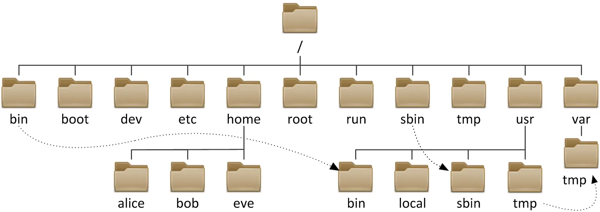

## 리눅스

리눅스는 리눅스 커널을 기반의 유닉스 계열의 오픈 소스 운영체제이다.

오픈소스이다보니 자신들의 목적에 맞게 자유롭게 커스텀마이징된 다양한 버전들이 있다.

Ubuntu, Debian, CentOS, Fedora 등이 이에 속하고 이들을 리눅스 배포판이라고 부른다.

그렇기에 리눅스 배포판들은 각각의 장단점을 가진다. 리눅스를 잘 이해한하게 된다면 상황에 따른 리눅스 배포판을 고를 수도 있을 것 같다.

예를 들자면,

- Red Hat Linux:  가장 널리 알려진 리눅스 배포판
    - RPM(Red Hat Package Manager)을 지원한다.
    - 바이너리, 설정파일, 라비브러리, 문서 등의 일괄 관리 기능
    - 패키지에 필요한 파일, 의존성 유무 등을 조사하는 기능
- CentOS: Red Hat Linux로 부터 파생
    - 서버용으로 많이 사용된다.
- Rocky Linux: 기존 CentOS 리눅스의 대체판
    - RHEL과 실행 코드가 호환된다.
    - 엔터프라이즈 환경에서 안정적이고 신뢰성있는 운영 환경 제공을 목표로 한다.
- Slackware Linux: SLS Linux로부터 파생
    - 가장 먼저 대중화된, 현존하는 가장 오래된 배포판
    - 간결함을 설계 철학으로 하여 유닉스 자체 학습에 자주 사용된다고 한다.
- SuSE Linux: Slackware Linux로부터 파생
    - 독일에서 만든 배포판으로, 유럽에서 많이 사용한다.
    - 풍부한 기능과 안정성, 보안 기능을 포함한다.
- Ubuntu Linux: Debia Linux로부터 파생
    - 사용 편의성에 중점을 두어 개인 사용자에게 인기 있는 리눅스 배포판이다.

보통의 경우, 우분투(Ubuntu)를 사용하는 것 같다. 레퍼런스가 많기 때문이다.

범용성과 다중 작업 지원 그리고 오픈소스라 이렇게 대중화가 된 것 같다.

본인도 개발을 처음 했을 때 Virtual Box에서 우분투로 설치해 본 경험이 있다.

이 글 또한 우분투를 중심으로 정리하고 있다.

## 터미널

```bash
ubuntu@ip-172-31-19-121:~$
```

- `ubuntu`: 유저 이름
- `@ip-172-31-19-121`: 호스트 이름
- `:`: 현재 경로
- `~`: 루트 디렉터리를 의미
- `$`: 명령어 대기 상태

터미널에서 주로 사용하는 명령어들이다.

- `Opt` + `⬅︎`, ︎: 단어 단위 커서
- `Ctrl` + `C` : 작업 중단 또는 취소
- `clear` : 터미널 초기화
- `Cmd` + `V` , `Cmd` + `C`:  복사 붙여넣기(Mac)
    - `Ctrl` + `Insert`, `Shift` + `Insert` : 복사 붙여넣기(Windows)

## 쉘

- 명령어 해석기 또는 인터페이스로 사용자와 커널 사이에서 명령어를 해석하여 처리
- `alias`: 자주 사용되는 명령의 다눅 명령을 만든다.
    - `alias rm = ‘rm -i’`
- `type`: 명령이 어떻게 해석되는지 알려준다.
    - `type cd`
- `which`: 실행 프로그램을 환경변수 PATH를 기초로 찾아 경로를 출력한다.
    - `which rm`

## 경로

- 절대 경로: 루트 디렉터리를 기준으로 파일 위치를 표현
    - 경로가 `/`로 시작하면 절대 경로
- 상대 경로: 현재 디렉터리를 기준으로 파일 위치를 표현
    - 경로가 `/` 이외의 문자로 시작
    - `.`: 현재 디렉터리 경로를 의미
    - `..`: 상위 디렉터리 경로를 의미
- `~bash: cd: No such file or directory`: 존재하지 않는 경로로 접근할 경우 발생

## 디렉터리



리눅스 표준 디렉터리

- `/`: 최상위 디렉터리인 루트 디렉터리를 의미한다.
- `bin`, `sbin`: 바이너리 디렉터리로, 기본적인 명령의 실행 파일을 포함한다.
    - 부팅 과정이나 시스템 관리에 필요한 명령의 실행 파일을 포함한다.
- `boot`: 부트 디렉터리로, 커널 이미지(vmlinuz)와 부트 로더의 설정 파일을 포함한다.
- `dev`: 디바이스 디렉터리로, 장치를 접근하는데 사용되는 디바이스 파일이 위치한다.
- `etc`: 시스템 설정 파일 디렉터리로, 시스템의 중요한 환경 설정 파일이 위치한다.
- `home`: 사용자 계정 디렉터리로, 사용자 게정의 홈 디렉터리가 만들어지는 디렉터리이다.
    - 사용자의 홈 디렉터리는 해당 사용자만 사용할 수 있는 독립적인 공간이다.
- `lib`: 공유 라이브러리 디렉터리로, 프로그램들이 사용하는 시스템 라이브러리 파일이 위치한다.
- `medis`: 미디어 디렉터리로, 이동식 저장 장치가 마운트될 때 마운트 지점을 제공하는 디렉터리이다.
- `proc`: 시스템 정보 디렉터리로, 커널이 사용하는 가상의 파일 시스템들이 포함된다.
- `root`: root 계정의 홈 디렉터리를 의미한다.
- `usr`: 사용자 디렉터리로를 의미한다.
- `var`: 가변 자료 저장 디렉터리
    - 시스템 운영 중에 필요한 가변 자료가 저장되는 디렉터리
    - 시스템 작동 로그, 사용자 메일 박스 등이 포함된다.

디렉터리 관련한 명령어들이다.

- `pwd`: 현재 티렉터리 경로 조회
- `cd`(change directory): 특정 디렉터리 경로로 이동
    - `cd ..`: 현재 경로를 기준으로 상위 디렉터리로 이동
    - `cd ~`: 루트 디렉터리로 이동
    - `~bash: cd: Not a directory`: 디렉터리가 아닌 대상으로 `cd`을 한 경우 발생
- `ls`(list): 현재 디렉터리 내부의 파일 조회

## 파일

파일 관련한 명령어들이다.

- `ls -l`: 현재 디렉터리 내부의 파일을 상세 조회
    - `drwxr-x—-`, `-rw-r—r—` 같은 내용들이 조회 항목 앞에 추가로 조회된다.
    - 맨 앞 한글자가 파일 종류를 나타낸다.
        - `d`: 디렉토리임을 의미
        - `-`: 일반 파일임을 의미
- `ls -a` : 현재 디렉터리 내부의 숨김 파일을 포함하여 조회
    - 리눅스에서는 `.env`처럼 점(`.`)으로 시작하는 파일명을 가진 파일은 숨김 파일로 인식된다.
- `ls -al`: 현재 디렉터리 내부의 숨김 파일을 포함하여 상세 조회(본인이 자주 쓰는 명령어이다.)
- `head`: 파일의 맨 앞 부분을 출력하는 명령(기본은 10라인)
    - `head [*option*] [*files*]`
        - 옵션 `-n 숫자` 또는 `- 숫자` 를 사용하면 보고 싶은 라인 수를 변경할 수 있음
        - `head -n 5 /etc/passwd`
        - `head -3 /etc/passwd`
- `tail`: 파일의 마지막 부분을 출력하는 명령(기본은 10라인)
    - `tail [*option*] [*files*]`
        - 옵션 `-n 숫자` 또는 `- 숫자` 를 사용하면 보고 싶은 라인 수를 변경할 수 있음
        - `tail -n 5 /etc/passwd`
        - `tail -3 /etc/passwd`

## 파일 및 디렉터리 접근 권한

- 사용자 부류에 따라 읽기/쓰기/실행 권한을 각각 설정할 수 있다.
    - 사용자 부류: 소유자(u), 그룹(g), 기타 사용자(o)
- 권한
    - `r`: 읽기 권한
    - `w`: 쓰기 권한
    - `x`: 실행 권한
- `chmod`: 파일의 접근 권한을 변경
    - `-R`: 디렉터리에 적용하면 포함된 모든 파일과 디렉터리의 권한을 일괄로 변경
- 접근 권한은 기호모드나 8진수로 설정할 수 있다.
- 8진수 모드
    - 읽기(r)는 4, 쓰기(w)는 2, 실행(x)은 1
    - `-rwxrw-r--`이면,
    - `rwx`: 7 (소유자 권한)
    - `rw-`: 6 (그룹 권한)
    - `r--`: 4 (기타 사용자 권한)
    - `rwxrw-r--` = 764
- 자주 사용되는 권한 설정
    - `777`: 모두에게 모든 권한 부여
        - ex) 테스트 디렉터리
    - `755`: 소유자만 모든 권한을 갖고, 나머지는 읽기와 실행만 가능하다.
        - ex) 웹서버 루트 디렉터리
    - `644`: 소유자는 읽기와 쓰기, 나머지는 읽기만 가능
        - ex) 일반 텍스트 파일
    - `600`: 소유자만 읽기 쓰기, 나머지는 접근 불가
        - ex) 환경 설정 파일 (.env 등)
    - `400`: 소유자만 읽기 가능
        - ex) 공개키 파일, SSH
- `sudo`: 어떠한 제약 없이 모든 기능을 사용할 수 있는 관리자 권한

## 파일 및 디렉터리 생성/삭제

- 생성
    - `touch`: 빈 파일을 생성
        - `touch config-file`
    - `mkdir`: 디렉터리 생성
        - `mkdir configs`
- 삭제
    - `rm` : 파일을 삭제
        - `rm config-file`
    - `rm: cannot remove Is a directory`: 디렉터리를 rm으로만 삭제할 경우 예외 발생
    - `rmdir`: 비어있는 디렉터리만 삭제할 수 있다.
    - `rm -r`  : 디렉터리와 디렉터리 내부 파일들을 삭제
        - `-r`: 디렉터리와 파일들 상관없이 삭제
    - `rm -rf`: 파일과 디렉터리 상관 없이
        - `-f`: 권한의 상관없이 삭제
    - 그래서 보통 삭제를 할 떄 `rm -rf`를 사용한다.
        - `alias rm = ‘rm -rf’`로 하면 좋을 것 같다.

## 파일 및 디렉터리 복사/이동/이름

- 복사
    - `cp`(copy): 파일을 복사
        - `cp a.txt ./app`: 현재 경로의 `a.txt` 파일을 현재 경로에 있는 `app` 디렉터리 내부로 복사
        - `cp a.txt b.txt`: 현재 경로의 `a.txt` 파일을 현재 경로에 `b.txt`로 이름을 변경하여 복사
    - `cp: -r not specified; omitting directory`:  `cp` 또한 `rm` 처럼 디렉터리를 대상으로 할 때 그대로 사용하면 예외가 발생한다.
    - `cp -r`: 디렉터리를 복사
- 이동
    - `mv`(move): 파일이나 디렉터리를 이동
        - `mv a.txt ./app`: 현재 경로의 `a.txt` 파일을  `app` 디렉터리 내부로 이동
        - `mv ./bin ./app`: 현재 경로의 `bin` 디렉터리를  `app` 디렉터리 내부로 이동
- 이름
    - `mv`: 파일이나 디렉터리의 이름을 변경
        - `mv a.txt b.txt`: 현재 경로의 `a.txt` 파일을  `b.txt`로 이름을 변경
        - `mv ./app ./env`: 현재 경로의 `app` 디렉터리를  `env`로 이름을 변경

## 추가적인 편의 기능

- `Tab`: 자동으로 커맨드를 완성
- `⬆︎`: 이전에 썼던 명령어 불러오기

## 파일 및 디렉터리 권한

## vim 에디터

UNIX 계열에서 가장 보편적인 텍스트 에디터이다. 윈도우의 메모장이라고 보면 된다.

- 기본적으로 `vi`는 `vim`으로 `alias` 처리가 되어있다.
- `vi`: 파일을 생성하거나, 기존 파일을 vim 에디터로 열 수 있다.
    - `vi README.md`: 기존에 없었으면 생성을 해서 vim으로 열고, 있었으면 해당 파일을 vim으로 연다.

vim은 두 가지 모드가 존재한다.

- `INSERT`: 텍스트를 입력할 수 있는 모드
- `COMMAND`: vimd에 명령을 시킬 수 있는 모드

`INESRT` 모드인 경우에만 텍스트를 입력할 수 있다. vim을 구동하면 기본으로 `COMMAND` 모드이기에 `i`를 입력해 `INSERT`  모드로 전환할 수 있다.

이후 `INSERT` 모드에서 작성한 내용을 저장하고자 한다면,

- `Esc` 를 사용해서 `COMMAND` 모드로 전환한다.
- `:w` 를 입력한다.
- 만일 저장을 하고 나가고자 한다면, `:wq`를 입력한다.
    - 그냥 나가고 싶으면, `:q`이나 `Shift` + `Z` + `Z`을 하면 된다.
- `cat` 으로 `vi`를 사용하지 않아도 파일의 내용 출력하여 확인할 수 있다.
    - `cat`은 파일의 내용이 많아지면 출력 시간이 많이 소요되므로, `vi`로 확인하는 것이 더 빨라 효율적이다.

### 커서 이동

- `Shift` + `G`: 파일의 끝 지점으로 커서 위치를 이동시킨다.
- `G` + `G`: 파일의 처음 지점으로 커서 위치를 이동시킨다.
- `Ctrl` + `F`, `B`: 스크롤 단위로 커서 위치를 이동시킨다.
    - `PgUp`, `PgDn`: 같은 기능을 한다.
- `w`: 다음 단어의 첫 자로 이동
- `b`: 앞 단어의 첫 자로 이동
- `o`: 현재 라인의 첫 칸으로 이동
- `$`: 현재 라인의 마지막 칸으로 이동
- **`:n`**: n번째 라인으로 이동

### 텍스트 삭제

- **`X`**: 커서 위치의 한 문자를 삭제
- **`D`** + **`W`**: 커서의 위치부터 다음 단어 전까지 삭제
- **`Shift`** + **`D`**: 커서의 위치부터 현재 라인의 끝까지 삭제
- **`D`** + **`D`**: 현재 라인을 삭제
- **`D`** + **`Shift` + `G`**: 현재 라인부터 파일의 끝까지 삭제

### 텍스트 복사

- **`Y`** + **`Y`** : 현재 라인을 복사
- **`Y`** + **`0`** : 커서의 왼쪽부터 라인의 앞까지 복사
- **`Y`** + **`$`** : 커서의 위치부터 라인의 끝까지 복사
- **`Y`** + **`Shift`** + **`G`** : 현재 라인붙 파일의 끝까지 복사
- **`Y`** + **`)`** : 커서의 위치부터 한 문장을 복사
- **`Y`** + **`}`** : 커서의 위치부터 한 문단을 복사

### 텍스트 검색

- **`/`** + **`hello`**: 순방향으로 단어 hello를 검색하여 커서를 이동
- **`grep`**: 파일에서 특정 키워드 라인을 찾아 출력
    - **`grep root /etc/passwd`**
    - **`ip addr show | grep inet`**

### 명령 취소

- **`U`**: 이전 변경 작업을 취소(undo)
- **`Ctrl`** + **`R`**: 앞서 취소했던 작업을 취소

## 서버 운영

- `nohup`: 스스로 종료될 때까지 계속 수행(no hang up)
    - 백그라운드에서 실행하고자 하는 경우 `&`를 붙여야 한다.
        - `nohup java -jar app.jar &`
    - `cat nohup.out`: 로그를 확인할 수 있다.
- 표준 출력과 표준 에러
    - `0`: 표준 입력
    - `1`: 표준 출력
    - `2`: 표준 에러
    - `$ nohup nohup java -jar app.jar 1 > app.out 2 > app.err &`
        - 표준 출력(`1`)은 `app.out` 파일로 리다이렉션하고, 표준 에러(`2`)는 `app.err` 파일로 리다이렉트 한다라는 의미다.
    - `$ nohup nohup java -jar app.jar > app.log 2>&1 &`
        - 표준 출력(`1`)과 표준 에러(`2`)을 `app.log` 파일로 리다이렉션 한다라는 의미다.
- 프로세스 종료
    - `ps -ef | grep app.jar`: 프로세스 아이디(pid)를 찾는다.
    - `kill -9 <pid>`: 프로세스를 종료한다.
- `lsof`: 특정 대상을 사용 중인 프로세스를 찾는다.
    - `sudo apt install lsof`: 설치 명령어(ubuntu)
    - `lsof +D /home/user/logs`: 특정 디렉터리를 사용 중인 프로세스 찾기
    - `lsof -i :8080`: 특정 포트를 점유하고 있는 프로세스 찾기
    - `lsof -p <pid>`: 특정 pid에 열려있는 파일 확인
- `curl`: API 요청를 보낸다.
    - `curl -v <url>`: 요청 시 자세한 정보 표시
    - `curl -X POST <url>`: post 요청을 보낸다.
    - `curl -X POST --data "name=john&age=10" <url>`: post 요청을 data와 함께 보낸다.
    - `curl -d name=”john” -d age=”10” <url>`: post 요청을 form과 함께 보낸다.
    - `curl -d ‘{”name”:”john”}’ -H “Content-Type: application/json” <url>`: post 요청을 json과 함께 보낸다.
- IP 확인
    - `hostname -I`: IP 정보를 확인할 수 있다.
    - `ifconfig`: IP 정보와 관련한 정보들도 확인할 수 있다.
- `top`: 시스템의 상태를 전반적으로 가장 빠르게 파악 가능(CPU, Memory, Process)
    - 옵션 없이 입력하면 interval 간격(기본 3초)으로 갱신
    - `Shift` + `P`: CPU 사용률 내림차순
    - `Shift` + `M`: Memory 사용률 내림차순
    - `Shift` + `T`: 프로세스 실행시간 내림차순
    - `K`: `K`를 누른 후, PID 번호 입력하면 해당 프로세스가 killed된다.
    - `A`: 메모리 사용량에 따라 정렬
    - `1`: CPU 코어별로 사용량

  

    - `3:58`: 3시간 58분 전에 서버가 구동
    - `load average`: 현재 시스템이 얼마나 일을 하는지를 나타냄. 3개의 숫자는 1분, 5분, 15분 간의 평균 실행/대기 중인 프로세스의 수. CPU 코어수 보다 적으면 문제 없음
    - `Tasks`: 프로세스 개수
    - `KiB Mem,` `Swap`: 각 메모리의 사용량
    - `PR`: 실행 우선순위
    - `VIRT`, `RES`, `SHR`: 메모리 사용량으로 누수 확인 가능
        - `VIRT`: 프로세스에 할당된 가상 메모리 전체(`SWAP` + `RES`)
        - `RES`: 현재 프로세스가 사용하고 있는 실제 물리 메모리의 양
        - `SHR`: 다른 프로세스와 공유하고 있는 Shared Memory의 양
    - `S`: 프로세스 상태(작업중, I/O 대기, 유휴 상태 등)